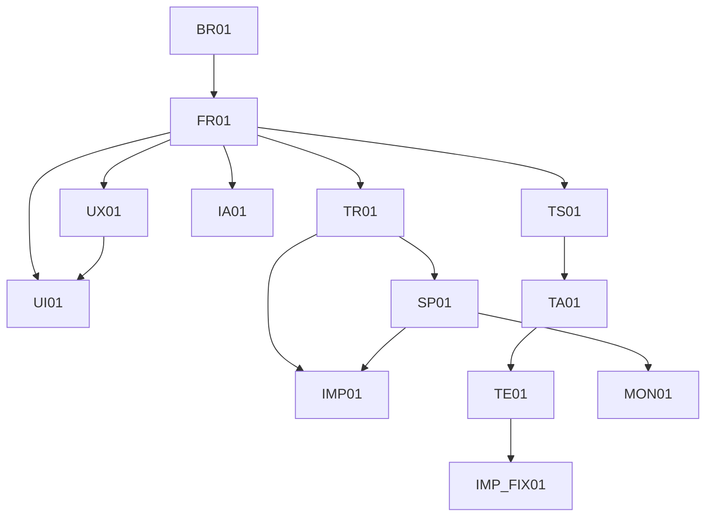

# Evidence Graph — MODxx

Distinct from the Workflow Table: this file carries the *why* behind each
link, not just which IDs connect. The Workflow Table answers "what maps to
what" — this file answers "what evidence justifies that mapping." Every
agent adds its own edges here as it creates traceable links (a UI item
citing dual parents, an ER entity citing its source FR, etc.).

## Graph (Mermaid — kept as a true DAG; multi-parent edges like
UI ← FR + UX are expected, not an error)

## Edge rationale

| From | To | Why this link exists |
|---|---|---|
| BR01 | FR01 | FR01 decomposes BR01's stated business need into a testable behavior |
| FR01, UX01 | UI01 | UI01 traces to both — see Step 4's fidelity check for why dual-parent tracing is required here |
| TR01 | SP01 | SP01's STRIDE analysis is performed against this specific technical requirement's components/data flows |

## Orphan check (run whenever the graph is updated)

| Check | Result |
|---|---|
| Every node has at least one outgoing edge, unless it's a terminal step (Deploy Docs) | Pass/Fail |
| Every node has at least one incoming edge, unless it's BR (the root) | Pass/Fail |
