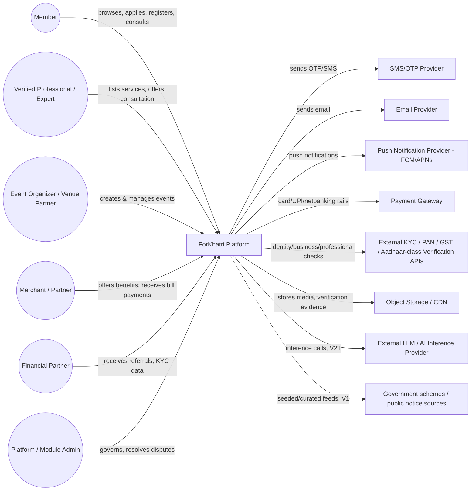

# Solution Architecture — ForKhatri

## Revision history

| Date | Change | Reason / Ref |
|---|---|---|
| 2026-09-06 | Initial draft: C4 Context + Container diagrams, module→container mapping, resolution of every dependency edge and every shared concern named in `/modules/modules.md`, 15 ADRs, non-functional baselines. | Step 1 (Solution Architecture), autonomous execution. Source: `/modules/modules.md` (Sealed), `/IMPLEMENTATION-TEST-STANDARDS.md` (tech stack fixed), source docs in `docs/PreStartResearch/` (Master PRD, Complete High-Level Business Requirements, Founder Execution Roadmap) as distilled into modules.md's Shared Concerns and per-module scope sections — the PDFs themselves could not be rendered by the local toolchain (`pdftoppm`/poppler not installed in this environment); modules.md's own distillation of the source material (Trust Identity Model, Level 1/2/3 verification tiers, reputation model, AI action-authorization tiers, multilingual requirement) was used as the primary architecture input in its place, since it was produced from a direct reading of those same PDFs one step upstream. This substitution is recorded here rather than silently made. |
| 2026-09-06 | Reviewed against architecture-reviewer's Definition of Done (module→container coverage, every dependency edge resolved, every shared concern resolved with an ADR, no undeclared shared-database anti-pattern, every ADR in genuine Y-statement form with real accepted downsides, no open blockers). One gap found and fixed: Payments Infrastructure Service was described as owning "gateway/ledger/PCI" scope but had no database of its own drawn in the Container diagram — only Payment Services App's `PaymentsDB` was shown, leaving it ambiguous whether Payments Infrastructure silently shared that database (the exact anti-pattern ADR-002 rejects), undeclared and unargued. Fixed by adding a dedicated `PaymentsLedgerDB` node/edge for Payments Infrastructure Service, consistent with ADR-002's own rule that every isolated container gets a fully separate Postgres instance, and by updating ADR-008 and the Payments shared-concern resolution to state this explicitly. All other checks passed on first read. Sealed. | Step 1 gate, autonomous mode (architecture-reviewer). |
| 2026-09-12 | **Relocation pass.** Moved this file from `docs/PreStartResearch/ARCHITECTURE.md` to the project root `/ARCHITECTURE.md`, matching this agent's own Input/Output convention (same placement as `/IMPLEMENTATION-TEST-STANDARDS.md`) and the path every downstream module's Tech Reqs/Impact Analysis step actually looks for. Checked the repository for other references to the old path before moving: three Sealed/in-progress module files cite it by that literal path — `modules/MOD01-vyapar/01-business-requirements.md` (source-traceability table), `modules/MOD03-mangaly/01-business-requirements.md` and `modules/MOD03-mangaly/02-functional-requirements.md` (both in their "Architecture cross-check" sections). This agent's own tool access (Read/Write/Grep/Glob/Task/WebSearch/WebFetch, no file-editing or delete capability) cannot safely make a small in-place correction inside those large, already-Sealed files without a full blind rewrite, which risks corrupting content this agent has not fully re-read. Rather than leave those three citations pointing at a path that no longer resolves, the old location (`docs/PreStartResearch/ARCHITECTURE.md`) has been overwritten with a short, permanent redirect stub pointing to this file, so existing citations remain resolvable. Flagged as a follow-up (see Open blockers) for whichever agent next touches those three files with in-place-edit tooling to update the citation to `/ARCHITECTURE.md` directly. | Relocation per explicit instruction — this pass, 2026-09-12. |
| 2026-09-12 | **Mangaly build-order correction pass.** MOD03-Mangaly's Business Requirements, Functional Requirements, UX, UI, and Test Scenarios (Steps 1-5) are now all Sealed, and Mangaly is — in actual practice — the first module being carried into Impact Analysis/Tech Reqs, not the "V2/V3" module this file's Container diagram and ADR-007 assumed. This mismatch was flagged as a non-blocking finding by the Solution Architect cross-checks already recorded in `01-business-requirements.md` and `02-functional-requirements.md` for MOD03, explicitly left for this file to resolve rather than decided unilaterally downstream. Also confirmed directly against the current, Sealed `/modules/modules.md`: it no longer states any V1/V2/V3 wave assignment for any module at all (an earlier draft apparently did — see `docs/PreStartResearch/PROCESS-README.md`'s now-stale wave table — but the current Sealed `modules.md` carries no such section), so relabeling Mangaly here is not overriding a module-level decision; it is this file's own record, corrected against reality. Traced through the actual consequences (not just the label) and recorded three new ADRs: **ADR-016** (Container diagram/mapping label correction — Mangaly is the first module in actual build order); **ADR-017** (re-examines and re-confirms ADR-001's isolated-container topology decision for Mangaly holds even arriving first, since it was never justified by ship order but by Mangaly's own privacy/regulatory driver — while retiring ADR-001's "cheap monolith modules ship first" sequencing narrative, which no longer describes reality); **ADR-018** (re-examines and re-confirms ADR-007's decision to defer a dedicated Search Service, replacing its wave-based trigger with a capability/volume-based one, since Mangaly's actual Discovery/ranking need is rule-based, not full-text-relevance-based, and its realistic V1 scale is far below the threshold where Postgres full-text search stops being sufficient). ADR-001 and ADR-007 are marked superseded-in-part (sequencing narrative / trigger condition only — their core decisions are unchanged) rather than edited, per this file's append-only ADR convention. Updated the Container diagram's Mangaly label, the Module→Container mapping's MOD03 notes, and the Non-functional baselines' scalability rows to match. Research grounding: current (2026) industry guidance confirms regulatory/sensitivity-driven service extraction is legitimate to do early, independent of scaling triggers, and that Postgres full-text search remains sufficient below roughly 500K rows / 20K daily active users — both cited in ADR-017/ADR-018. Definition of Done re-verified at the end of this pass (see new "Revision reviewer notes" section); no open blockers introduced. Re-sealed. | Wave-sequencing correction, per explicit instruction tracing BR/FR-flagged finding — this pass, 2026-09-12. |

## Problem framing

`/modules/modules.md` named seven business modules and an explicit list of
platform-level shared concerns it deliberately did not resolve, per its own
"resolution is Solution Architecture's job" note. This file's job is narrow
and concrete: decide deployment topology, decide the actual integration
pattern for every dependency edge in modules.md's mermaid graph, decide
which container (if any) owns each shared concern, and record every one of
those decisions as an ADR so no downstream Tech Reqs agent has to invent its
own answer. Tech stack itself (Python/FastAPI, React/TypeScript, Postgres)
is not re-litigated — it is fixed in `/IMPLEMENTATION-TEST-STANDARDS.md` and
treated as a constraint here.

## System Context (C4 Level 1)

**Boundary description.** ForKhatri is the single system in scope. Six
external actor classes interact with it (members, verified professionals/
experts, event organizers/venue partners, merchants/partners, financial
partners, and platform/module administrators — all authenticate through the
same identity core regardless of which role they hold). Seven external
systems sit outside the boundary: an SMS/OTP provider and email/push
providers (member communication), a payment gateway (money movement rails),
external KYC/identity-verification APIs (PAN/GST/professional-license/
identity-class checks — plural and pluggable, since Vyapar, Counsel, Mangaly
and Loans & Finance each need a different verification depth against
different registries), object storage/CDN (profile media, verification
evidence, event photos), an external AI/LLM inference provider (not needed
until the first AI-assistant surface ships, V2+), and — for V1 only, in
Dashboard's deliberately-trimmed local-intelligence scope — a small,
manually-curated set of public-data sources rather than a live scraping
pipeline. No external system is authoritative over ForKhatri's own identity,
trust, or reputation data; those are computed and owned entirely inside the
system boundary (see ADR-004).

## Container diagram (C4 Level 2)

```mermaid
graph TD
  WebClient[Web Client - React/TypeScript SPA]

  subgraph "Core Platform (modular monolith - FastAPI)"
    Vyapar[Vyapar module]
    Milavn[Milavn module]
    Dashboard[Dashboard module]
    Counsel[Counsel module - planned]
  end

  MangalyService[Mangaly Service - FastAPI - own container/DB - first module in actual build order]
  PaymentServicesApp[Payment Services App - FastAPI - own container - planned]
  LoansFinanceService[Loans and Finance Service - FastAPI - own container/DB - planned]

  IdentityTrust[Identity and Trust Service - FastAPI]
  PaymentsInfra[Payments Infrastructure Service - gateway/ledger/PCI]
  NotificationSvc[Notification and Communication Service]
  SearchSvc[Search Service]
  AuditSvc[Audit Service]
  AIService[AI Service - deferred, ADR-009]
  AdminConsole[Admin and Governance Console]
  Broker[(Message Broker)]

  CoreDB[(Core Platform DB - Postgres, schema-per-module: vyapar, milavn, dashboard, counsel)]
  IdentityDB[(Identity/Trust DB - Postgres)]
  MangalyDB[(Mangaly DB - Postgres, isolated)]
  PaymentsDB[(Payments DB - Postgres, isolated - Payment Services App only: bill-pay/coupon/benefit data, tokenized refs only, no raw gateway data)]
  PaymentsLedgerDB[(Payments Ledger DB - Postgres, isolated/PCI-scoped - Payments Infrastructure Service only: gateway tokens, transaction ledger)]
  LoansDB[(Loans and Finance DB - Postgres, isolated)]
  AuditStore[(Audit Log Store - append-only Postgres)]
  ObjStore[(Object Storage / CDN)]

  WebClient -->|REST/JSON, HTTPS| Vyapar
  WebClient -->|REST/JSON, HTTPS| Milavn
  WebClient -->|REST/JSON, HTTPS| Dashboard
  WebClient -->|REST/JSON, HTTPS| Counsel
  WebClient -->|REST/JSON, HTTPS| MangalyService
  WebClient -->|REST/JSON, HTTPS| PaymentServicesApp
  WebClient -->|REST/JSON, HTTPS| LoansFinanceService
  WebClient -->|OAuth2/OIDC login| IdentityTrust
  WebClient -->|REST/JSON| AdminConsole

  Vyapar --> CoreDB
  Milavn --> CoreDB
  Dashboard --> CoreDB
  Counsel --> CoreDB

  Dashboard -->|in-process call, internal contract| Vyapar
  Dashboard -->|in-process call, internal contract| Milavn
  Dashboard -.->|in-process call, once shipped| Counsel
  Counsel -->|REST, sync, hard dependency| PaymentServicesApp

  Vyapar -.->|async event, optional| Broker
  Milavn -.->|async event, optional| Broker
  MangalyService -.->|async event: activity summary, benefit-trigger| Broker
  LoansFinanceService -.->|async event: application status| Broker
  Broker -.-> Dashboard
  Broker -.-> NotificationSvc
  Broker -.-> PaymentServicesApp

  PaymentServicesApp --> PaymentsDB
  PaymentServicesApp -->|internal API, tokenized refs only| PaymentsInfra
  PaymentsInfra --> PaymentsLedgerDB
  PaymentsInfra -->|gateway calls| PaymentGatewayExt[External Payment Gateway]
  LoansFinanceService -.->|REST, soft, once shipped| PaymentServicesApp
  MangalyService --> MangalyDB
  LoansFinanceService --> LoansDB

  Vyapar --> IdentityTrust
  Milavn --> IdentityTrust
  Dashboard --> IdentityTrust
  Counsel --> IdentityTrust
  MangalyService --> IdentityTrust
  PaymentServicesApp --> IdentityTrust
  LoansFinanceService --> IdentityTrust
  IdentityTrust --> IdentityDB
  IdentityTrust -->|external checks| KYCProviderExt[External KYC/PAN/GST APIs]

  Vyapar --> SearchSvc
  Milavn --> SearchSvc
  Dashboard --> SearchSvc
  Counsel -.-> SearchSvc
  MangalyService -.-> SearchSvc

  Vyapar -.-> NotificationSvc
  Milavn -.-> NotificationSvc
  Counsel -.-> NotificationSvc
  MangalyService -.-> NotificationSvc
  PaymentServicesApp -.-> NotificationSvc
  LoansFinanceService -.-> NotificationSvc
  NotificationSvc -->|SMS/email/push| ExtComms[External SMS/Email/Push Providers]

  Vyapar -.->|audit events| AuditSvc
  Milavn -.->|audit events| AuditSvc
  Dashboard -.->|audit events| AuditSvc
  Counsel -.->|audit events| AuditSvc
  MangalyService -.->|audit events| AuditSvc
  PaymentServicesApp -.->|audit events| AuditSvc
  LoansFinanceService -.->|audit events| AuditSvc
  IdentityTrust -.->|audit events| AuditSvc
  AuditSvc --> AuditStore

  IdentityTrust -.->|V2+ AI action authorization| AIService
  Dashboard -.->|V2+ AI surfacing| AIService
  AIService -->|inference| AIProviderExt[External LLM Provider]

  Vyapar --> ObjStore
  Milavn --> ObjStore
  MangalyService --> ObjStore
  Counsel --> ObjStore

  AdminConsole --> IdentityTrust
  AdminConsole -.-> Vyapar
  AdminConsole -.-> Milavn
  AdminConsole -.-> Dashboard
  AdminConsole -.-> Counsel
  AdminConsole -.-> MangalyService
  AdminConsole -.-> PaymentServicesApp
  AdminConsole -.-> LoansFinanceService
```

Solid edges are always-on runtime dependencies; dotted edges are
optional/soft/future integrations, matching the same convention
modules.md used for its dependency map.

**Container labels and build order (corrected 2026-09-12 — see ADR-016).**
Earlier revisions of this diagram tagged containers with wave numbers
("V1"/"V2"/"V3") mirroring an earlier draft of `/modules/modules.md`. The
current, Sealed `/modules/modules.md` no longer states a wave assignment
for any module. Rather than continue guessing at wave numbers this file has
no authoritative source for, containers not yet built are now labeled
"planned" (no ordering claim), except `MangalyService`, which is labeled
"first module in actual build order" because that is directly evidenced —
MOD03-Mangaly's Steps 1-5 are Sealed and it is the module actually
proceeding into Impact Analysis/Tech Reqs. If a future module's actual
build order is similarly evidenced, its label should be corrected the same
way, on the same evidence standard — not by restoring guessed wave numbers.

## Module → Container mapping

| Module (from modules.md) | Container(s) | Notes if not 1:1 |
|---|---|---|
| MOD01 — Vyapar | Core Platform (module package) + `vyapar` schema in Core Platform DB | Runs in-process alongside Milavn/Dashboard/Counsel; no dedicated container planned. |
| MOD02 — Milavn | Core Platform (module package) + `milavn` schema in Core Platform DB | Same monolith as Vyapar. |
| MOD03 — Mangaly | Mangaly Service (dedicated container) + dedicated Mangaly DB | Diverges deliberately from the monolith: highest privacy/regulatory load of any community-facing module (family data, controlled communication) justifies its own process, its own database, and its own network policy so a breach or bug elsewhere on the platform cannot reach matrimonial data by default. See ADR-002 and ADR-011. **Build-order note (2026-09-12, see ADR-016/ADR-017):** Mangaly is, in actual practice, the first module carried through this pipeline past Test Scenarios (Steps 1-5 all Sealed) — not the later-wave module an earlier draft assumed. Its isolated-container topology holds up arriving this early because it was justified by Mangaly's own privacy/regulatory driver, not by ship order (see ADR-017); its Discovery/search need remains servable by embedded Postgres full-text search at this stage regardless of build order (see ADR-018). |
| MOD04 — Counsel | Core Platform (module package) + `counsel` schema in Core Platform DB | Lives in the monolith (no privacy driver as strong as Mangaly's), but has a hard *runtime* dependency on the separately-deployed Payment Services App container — a module boundary and a container boundary diverging in the other direction: one module, two containers involved in its critical path. |
| MOD05 — Dashboard | Core Platform (module package) + `dashboard` schema in Core Platform DB | Pure aggregator by design (per modules.md's own layer-alignment risk note) — reads from every other module's container as each ships, writes only its own `LocalInformationItem`/`PersonalizationProfile`/ranking-rule tables. No other module ever depends on Dashboard, so it sits at the "top" of every runtime call graph and the "bottom" of none. |
| MOD06 — Payment Services | Payment Services App (dedicated container) + dedicated Payments DB | The module's own container is deliberately distinct from the shared Payments Infrastructure Service (rails/gateway/ledger/PCI tooling), which has its own dedicated Payments Ledger DB — see ADR-008. One module maps to one business-logic container plus a shared-infra container it depends on but does not own, and the two containers never share a database. |
| MOD07 — Loans & Finance | Loans & Finance Service (dedicated container) + dedicated Loans DB | Same isolation rationale as Mangaly: heaviest regulatory load of any module (must-not-represent-as-regulated-lender constraint), so it gets its own container/DB/network policy from day one rather than joining the monolith. |

Platform containers with **no module owner** (shared concerns, resolved
below): Identity & Trust Service, Payments Infrastructure Service,
Notification & Communication Service, Search Service, Audit Service, AI
Service, Admin & Governance Console, Message Broker, Object Storage.

## Dependency resolution (every edge from modules.md)

| From module | To module | Declared in modules.md as | Resolved integration pattern |
|---|---|---|---|
| MOD05 Dashboard | MOD01 Vyapar | Hard — "reads Vyapar listings/opportunities to surface them" | In-process call via an internal Python interface (both live in the Core Platform monolith); the interface's request/response shapes are the same Pydantic models that would back a future REST contract, so extracting Vyapar to its own container later is a lift-and-shift, not a redesign. Dashboard caches the read result in its own `DashboardFeedConfiguration`-adjacent read model with a short TTL so Vyapar is never a hard synchronous dependency for every Dashboard page render. |
| MOD05 Dashboard | MOD02 Milavn | Hard — "reads events for registration reminders and community-activity surfacing" | Same in-process pattern as Vyapar above. |
| MOD04 Counsel | MOD06 Payment Services | Hard — "paid consultation requires a payment capability to exist" | Synchronous REST/JSON call, Core Platform (Counsel) → Payment Services App container, authenticated service-to-service via a short-lived JWT issued by Identity & Trust. Counsel never touches raw payment/card data — it calls `POST /payments/consultation-charge`, receives a `PaymentTransaction` reference id, and stores only that reference (matches modules.md's own "Counsel only initiates a payment and stores the returned reference" boundary). |
| MOD05 Dashboard | MOD03 Mangaly | Future/soft — "read-only, privacy-filtered activity summaries only" | Asynchronous event: Mangaly publishes a privacy-filtered `mangaly.activity_summary` event to the Message Broker (never raw match/profile data); Dashboard subscribes and renders only the pre-filtered summary. Dashboard is never given direct query access to the Mangaly DB — this is the one edge where an async, one-way event is chosen specifically *because* a synchronous pull would create an implicit read-path into the platform's most privacy-sensitive store. This pattern also means Mangaly's V1 build has zero dependency on Dashboard/the Core Platform monolith existing first — the edge only runs in the other direction (see ADR-017). |
| MOD05 Dashboard | MOD04 Counsel | Future | Once Counsel ships, same in-process pattern as Vyapar/Milavn (Counsel lives in the same monolith as Dashboard). |
| MOD05 Dashboard | MOD06 Payment Services | Future, read-only | Synchronous REST call, Core Platform (Dashboard) → Payment Services App, hitting a read-only endpoint (e.g., transaction-status summaries) that has no corresponding write capability exposed to Dashboard's service credential. |
| MOD05 Dashboard | MOD07 Loans & Finance | Future — "application-status notifications" | Asynchronous event: Loans & Finance publishes `loans.application_status_changed` to the broker; both the Notification Service (to alert the member) and Dashboard (to surface it) subscribe independently. Chosen over a direct pull because the source material frames this specifically as a notification-style update, and because Loans & Finance is an isolated, high-regulatory container Dashboard should not depend on synchronously. |
| MOD07 Loans & Finance | MOD06 Payment Services | Soft — "future disbursement/EMI integration" | Synchronous REST call, Loans & Finance Service → Payment Services App, invoked only at disbursement/EMI time (not on Loans & Finance's critical path for eligibility/application flows). Payment Services in turn calls Payments Infrastructure for the actual money movement. |
| MOD03 Mangaly | MOD06 Payment Services | Optional — benefit-trigger events | Asynchronous event: Mangaly publishes `benefit_eligible` events to the broker; Payment Services App subscribes and mints the resulting `Coupon`/`Benefit` record. Mangaly never calls Payment Services synchronously and never writes a Coupon record itself (matches modules.md's "Payment Services is the sole owner of Coupon/Benefit" rule). Being asynchronous and optional, this edge does not block Mangaly's own launch if Payment Services App has not shipped yet — events queue on the broker (or are simply not emitted until the corresponding feature is built) rather than Mangaly depending synchronously on a container that does not yet exist (see ADR-017). |
| MOD01 Vyapar | MOD06 Payment Services | Optional — benefit-trigger events | Same async event pattern as Mangaly above. |
| MOD02 Milavn | MOD06 Payment Services | Optional — benefit-trigger events | Same async event pattern as Mangaly above. |

**Pattern rule applied consistently:** same-container modules integrate
in-process; a hard cross-container dependency on the platform's critical
path uses synchronous REST; anything optional, soft, notification-shaped, or
crossing into a privacy/regulatory-isolated container uses an asynchronous
event through the shared Message Broker. No edge uses a shared database
across container boundaries — that anti-pattern is explicitly rejected (see
ADR-002).

## Shared concern resolution

| Shared concern (from modules.md) | Resolution (own container / shared library / platform-level) | ADR ref |
|---|---|---|
| Unified member identity, auth, Level-1/Level-2 trust | Own container — Identity & Trust Service, sole source of truth for `Member`, auth tokens, and Level-1/2 trust status. Every module's Level-3 verification record references `member_id` from here; no module ever forks its own login/identity table. | ADR-004 |
| Common reputation infrastructure | Own container — the scoring/aggregation engine lives inside Identity & Trust Service (co-located with trust, since reputation is trust's evidence layer) and reads each module's own feedback entity via its DB or an internal read API; it never writes to a module's feedback table. | ADR-005 |
| Notifications & communication infrastructure | Own container — Notification & Communication Service, consumed by every module via the Message Broker (publish an event, Notification Service renders/sends/records it) rather than direct synchronous calls, so a module never blocks on SMS/email/push delivery. | ADR-006 |
| Search infrastructure | Platform-level, embedded per-module in the near term (Postgres full-text search inside each module's own schema, queried through a thin shared `search` library so query syntax stays consistent) — extraction to a dedicated Search Service (e.g., OpenSearch/Meilisearch) deferred until a module's actual search need becomes genuine relevance-ranked free-text search over content at meaningful scale, re-evaluated per module rather than tied to a wave number. | ADR-007 (superseded in part by ADR-018) |
| Payments infrastructure (rails/gateway/ledger) vs. Payment Services (module) | Two containers, each with its own database: Payments Infrastructure Service (gateway integration, ledger, PCI-scope reduction — the only container that ever handles a token from the external payment gateway, backed by its own isolated `PaymentsLedgerDB`) and Payment Services App (bill-pay UX, coupon/benefit business rules, backed by its own `PaymentsDB`, calling Payments Infrastructure via an internal API using tokenized references only). Counsel's consultation fee and Loans & Finance's future disbursement both go through Payment Services App, never directly to Payments Infrastructure, so PCI scope and money-movement business rules stay in exactly two well-defined places, and no database is ever shared between the two containers. | ADR-008 |
| AI infrastructure and action-authorization tiers | Own container — AI Service, introduced when the first AI-assistant surface actually ships (not before, per modules.md's own "long-term direction" framing). The understand→authorize→execute→record→confirm tier model is enforced centrally in this service; each module only declares which of its own actions map to which tier via a shared config/manifest, it does not implement its own gate. | ADR-009 |
| Multilingual (English/Hindi/Telugu at launch) architecture | Platform-level, not a container: a shared i18n library on both frontend (react-i18next-class tooling) and backend (locale-aware Pydantic response shaping), plus translated-content columns/tables in each module's own schema for member-authored content and a shared locale-detection middleware. Search and Notification Service are both locale-aware consumers of this same shared convention rather than separate implementations. AI-driven auto-translation, if it ships, becomes an AI Service capability layered on top of this same data model, not a new i18n system. | ADR-010 |
| Security, privacy, audit/accountability | Audit is its own container — Audit Service, append-only store, subscribing to every other container's audit events over the broker so it stays independent of the containers it is auditing (including Identity & Trust). Security/privacy controls are platform-level policy applied with intensity proportional to each container's risk tier (see ADR-011), not a shared container of their own. | ADR-011 |
| Administration/governance console | Own container — a single Admin & Governance Console for platform-level policy, global trust standards, and serious disputes, with each module contributing its own domain-admin views into that one console shell (federated views, not federated consoles). | ADR-012 |
| "Professional" shared verified-credential sub-record (Vyapar ProfessionalProfile vs. Counsel ExpertProfile) | Shared library/data record — a `VerifiedCredential` entity lives in Identity & Trust Service; Vyapar's `ProfessionalProfile` and Counsel's `ExpertProfile` each hold a foreign key reference to zero-or-more `VerifiedCredential` rows but remain two separate, separately-owned entities exactly as modules.md decided. Only the underlying "this identity document/license was verified against this registry" fact is shared; the business meaning of holding it is not. | ADR-013 |

## Architecture Decision Records (append-only)

- **ADR-001** · In the context of choosing a deployment topology for a
  7-module platform shipping in three waves (V1/V2/V3), facing the choice
  between a single monolith, full microservices-per-module, and something
  between the two, we chose a **modular monolith for low-regulatory,
  low-sensitivity modules (Vyapar, Milavn, Dashboard, later Counsel) plus
  dedicated isolated containers for the modules and shared services with a
  genuine security/compliance/scaling driver (Identity & Trust, Payments
  Infrastructure, Payment Services, Mangaly, Loans & Finance)** over either
  pure extreme, to achieve low V1 operational overhead (a 3-founder-stage
  team should not be running a 7-service mesh to ship 3 modules) while
  still giving the platform's two most sensitive/regulated modules genuine
  blast-radius isolation from day one, accepting that the monolith/service
  boundary does not perfectly mirror the module boundary (documented
  explicitly in the Module → Container table above) and that Counsel/Vyapar
  will need to be extracted from the monolith later if their independent
  scaling needs diverge from Dashboard's.
  *Consequences:* + minimal V1 ops burden · + Mangaly/Loans&Finance/Payments
  get real isolation where it matters most · − the module/container
  divergence must be actively tracked so it doesn't silently drift · ~ the
  monolith's internal module boundaries must be enforced by lint/import
  rules (not just convention) so a later extraction stays cheap.
  **Status (2026-09-12): partially superseded.** The topology decision
  itself (which modules are isolated, and why) is re-confirmed, not
  changed — see ADR-017. Only this ADR's "cheap monolith modules ship
  first, isolated containers come later" sequencing narrative no longer
  describes actual build order (Mangaly, an isolated container, is
  shipping first) and should be read alongside ADR-017 rather than taken
  at face value for scheduling purposes.

- **ADR-002** · In the context of deciding how modules share (or don't
  share) a database, facing the anti-pattern modules.md explicitly warned
  about (two containers reading/writing one database), we chose
  **schema-per-module within one Postgres instance for monolith-resident
  modules, and a fully separate Postgres instance per isolated container**
  over one shared database for everything or a database-per-module-always
  approach, to achieve data-ownership enforcement at the schema-permission
  level for low-risk modules (cheap, still enforces "one writer") while
  giving Mangaly/Payments/Loans & Finance/Identity the strongest possible
  data isolation given their sensitivity, accepting the added operational
  cost of running six separate Postgres instances instead of one (Core,
  Identity, Mangaly, Payments (App), Payments Ledger (Infrastructure),
  Loans & Finance).
  *Consequences:* + no container ever has ambient access to another
  container's tables · + compliance/audit story per sensitive module is
  simple to reason about · − more databases to back up/patch/monitor · ~
  cross-module joins are now impossible by construction, which is
  intentional (see dependency resolution table — every cross-module read
  goes through an API or event, never a join).

- **ADR-003** · In the context of choosing how modules communicate across
  container boundaries, facing REST, gRPC, and async-events-only as
  options, we chose **synchronous REST/JSON for hard, critical-path
  dependencies (Counsel→Payment Services) and asynchronous events over the
  Message Broker for everything optional, soft, or crossing into an
  isolated/sensitive container** over adopting gRPC or making every
  integration event-driven, to achieve a consistent, low-tooling-overhead
  default that matches FastAPI's native strengths (Pydantic-validated REST)
  while still decoupling sensitive/optional integrations from availability
  coupling, accepting that this is not the lowest-latency option gRPC would
  offer and may need revisiting if the AI Service's inference traffic
  volume later demands a binary protocol.
  *Consequences:* + one obvious default per situation, no per-integration
  bikeshedding · + Mangaly/Loans&Finance never become a synchronous
  availability dependency for Dashboard · − REST has more overhead than
  gRPC at high volume · ~ revisit if AI Service inference throughput
  becomes the bottleneck.

- **ADR-004** · In the context of the single most load-bearing shared
  entity in the platform (member identity/auth/trust), facing the choice of
  embedding identity in the Core Platform monolith versus a standalone
  service, we chose **a standalone Identity & Trust Service using OAuth2/
  OIDC + short-lived JWTs, as the sole writer of `Member`, credential, and
  Level-1/2 trust records** over embedding it in the monolith, to achieve
  independent security hardening (rate limiting, WAF, anomaly detection) and
  independent scaling from business-logic traffic, and to guarantee every
  container — including future isolated ones — authenticates against one
  unambiguous source of truth, accepting the added latency of a network hop
  for every authenticated request and the operational requirement to make
  this the platform's single highest-availability service.
  *Consequences:* + one identity model, no drift across modules · + every
  new container (Mangaly, Loans&Finance, Payment Services) integrates the
  same way on day one · − Identity & Trust becomes a single point of
  failure if not built for high availability · ~ its own uptime target must
  exceed every other container's (see Non-functional baselines).

- **ADR-005** · In the context of "a person trusted professionally is not
  automatically trusted matrimonially" (modules.md, common reputation
  infra), facing whether reputation scoring lives centrally or per-module,
  we chose **a shared, context-aware scoring/aggregation engine co-located
  inside Identity & Trust Service, reading each module's own feedback entity
  read-only** over a per-module reputation engine or a fully separate
  reputation container, to achieve one consistent trust-scoring algorithm
  the platform can reason about and audit, while keeping each module as the
  sole writer of its own domain-specific signal, accepting the coupling
  that any reputation-model change now requires Identity & Trust Service
  deployment coordination rather than a per-module release.
  *Consequences:* + no module can spoof another module's trust context ·
  + one place to audit "how is trust computed" · − Identity & Trust Service
  now has two responsibilities (auth and reputation) instead of one · ~
  if reputation logic grows heavy enough to need independent scaling from
  auth, split it into its own container later (tracked as a future ADR,
  not decided now).

- **ADR-006** · In the context of every module needing to notify members
  without reinventing SMS/email/push integration, facing build-in-module vs.
  shared-service, we chose **a standalone Notification & Communication
  Service, invoked exclusively via published events on the Message Broker**
  over direct per-module provider integration or direct synchronous calls
  to a shared service, to achieve zero coupling between a module's request
  latency and actual message delivery, and a single place to enforce
  multilingual templating and delivery-channel preference, accepting
  eventual (not immediate) delivery and the need for an outbox/at-least-once
  delivery pattern so events are never silently dropped.
  *Consequences:* + modules never block on SMS/email/push providers ·
  + one place to add a new channel (e.g., WhatsApp) · − eventual consistency
  means a notification may lag its trigger by seconds · ~ requires a
  transactional outbox per publishing module to avoid dual-write bugs.

- **ADR-007** · In the context of each module needing in-module search
  while V1 has only three modules and modest data volume, facing
  build-a-dedicated-search-service-now vs. defer, we chose **Postgres
  full-text search embedded in each module's own schema for V1, behind a
  thin shared query-syntax library, with extraction to a dedicated Search
  Service deferred to V2** over standing up a separate search cluster
  (e.g., OpenSearch) before it's needed, to achieve zero extra
  infrastructure for a 3-module V1 (don't operate a search cluster before
  the data volume or multilingual-relevance need justifies it), accepting
  that Postgres full-text search's relevance ranking and multilingual
  tokenization are weaker than a dedicated engine and will need real work
  at V2 when Mangaly/Counsel content and full multilingual indexing land.
  *Consequences:* + simplest possible V1 · + no separate search
  infrastructure to operate before it earns its keep · − relevance quality
  is capped until V2 · ~ the shared query-syntax library is what makes the
  V2 extraction non-disruptive to calling modules.
  **Status (2026-09-12): superseded in part by ADR-018.** The core
  decision (defer dedicated Search Service extraction) is re-confirmed.
  Its trigger condition ("V2 arrives, Mangaly/Counsel content lands") is
  retired — Mangaly is shipping without any wave boundary having been
  reached, and ADR-018 replaces the trigger with a capability/volume-based
  one.

- **ADR-008** · In the context of Payment Services (module) sitting on top
  of payment rails but not being the rails itself, facing whether to
  collapse them into one container or keep them separate, we chose **two
  containers — Payments Infrastructure Service (gateway/ledger/PCI scope,
  backed by its own isolated `PaymentsLedgerDB`) and Payment Services App
  (bill-pay UX, coupon/benefit rules, backed by its own separate
  `PaymentsDB`), talking only via tokenized references** over one combined
  container or two containers sharing one database, to achieve real
  PCI-DSS scope reduction (only Payments Infrastructure ever handles a raw
  gateway token/cardholder-adjacent data; a bug in coupon business logic
  can never leak into PCI scope, and no shared database ever creates an
  implicit path between the two), accepting the operational cost of two
  services, two databases, and one more network hop for every bill payment
  or consultation charge.
  *Consequences:* + PCI audit surface is small and well-defined ·
  + Counsel/Loans & Finance integrate with Payment Services App without
  ever touching PCI-scoped code · − extra hop (and one more database to
  operate) adds latency and ops cost to every payment · ~ Payments
  Infrastructure must never expose an API that returns raw gateway secrets
  to Payment Services App, by contract, not just by convention.

- **ADR-009** · In the context of the platform's stated long-term direction
  toward an AI-assistant surface with informational/operational/
  financial-risk action tiers, facing build-it-now vs. defer, we chose to
  **defer the AI Service container until the first module actually commits
  to an AI-assistant surface (expected V2+), while centralizing the
  understand→authorize→execute→record→confirm tier enforcement in that one
  future service rather than letting each module build its own gate**, over
  building AI infrastructure speculatively in V1, to achieve zero V1 cost
  for a capability nothing in V1 needs, while guaranteeing that whichever
  module ships AI first does not invent its own authorization model,
  accepting that this ADR's container does not exist yet and must be
  revisited (not silently built ad hoc) the moment a module's Tech Reqs step
  actually needs it.
  *Consequences:* + no wasted V1 build · + one authorization-tier model
  guaranteed regardless of which module ships AI first · − nothing enforces
  this centralization except this ADR and reviewer discipline until the
  service actually exists · ~ flagged explicitly so it isn't lost.

- **ADR-010** · In the context of English/Hindi/Telugu being a day-one
  requirement across UI, content, search, notifications, and (later) AI, we
  chose **a shared i18n library and translated-content data model applied
  consistently across every container, not a dedicated Localization
  Service** over building a standalone translation container, to achieve
  day-one multilingual support without adding a service before there is
  AI-driven auto-translation work to justify one, accepting that manual/
  seeded translation work is a content-operations cost in V1 that will
  shift to the AI Service once auto-translation ships in V2+.
  *Consequences:* + every container follows the same locale convention
  from day one · + no premature service · − translation content
  operations is manual/curated until V2+ · ~ becomes an AI Service
  capability later, not a new container.

- **ADR-011** · In the context of security/privacy/audit needing to scale
  with each module's risk level (explicitly higher for Mangaly and Loans &
  Finance per modules.md) while also needing to be trustworthy evidence
  even if a container is compromised, we chose **an independent, append-only
  Audit Service subscribing to every other container's events over the
  broker, plus tiered platform-level security/privacy controls (row-level
  security and stronger encryption-at-rest specifically for Mangaly and
  Loans & Finance's isolated databases) rather than uniform controls
  everywhere or bundling audit into Identity & Trust Service**, to achieve
  an audit trail that survives even an Identity & Trust Service compromise,
  and privacy controls proportional to actual risk rather than one-size-
  fits-all, accepting the operational cost of one more always-on container
  and the requirement that every other container reliably publish its audit
  events (a container that silently drops audit events is a compliance gap,
  not a performance optimization).
  *Consequences:* + audit trail independent of the system it audits ·
  + Mangaly/Loans & Finance get real, provable extra protection, not just a
  policy statement · − one more container to keep highly available · ~
  audit event delivery must be at-least-once, not best-effort.

- **ADR-012** · In the context of central platform governance (policies,
  global trust standards, serious disputes) versus module-level domain
  administration, facing one unified console vs. one console per module, we
  chose **a single Admin & Governance Console with each module contributing
  federated views into that one shell** over per-module consoles or a
  console with no module-level views at all, to achieve one place a
  platform admin resolves a cross-module dispute or sets a global trust
  policy without hopping between seven different admin tools, accepting
  that each module's admin views must be built against a shared console
  contract (a plugin/view-registration pattern) rather than being free to
  build their own admin UI conventions.
  *Consequences:* + one governance surface, consistent admin UX · + serious
  disputes that cross module lines (e.g., a member banned in one module)
  have one place to act · − every module's Tech Reqs/UI steps must budget
  for building against the console's view contract, not a bespoke admin
  page · ~ the console's plugin contract itself needs its own lightweight
  spec, tracked as a follow-up for the first module that ships an admin
  view (expected: Vyapar or Milavn in V1).

- **ADR-013** · In the context of Vyapar's ProfessionalProfile and
  Counsel's ExpertProfile both representing "a verified person with
  credentials" but for deliberately different purposes (modules.md's own
  Shared Concerns note asked Architecture to decide this), facing keep-
  fully-separate vs. merge-into-one-entity vs. share-a-sub-record, we chose
  **a shared `VerifiedCredential` record living in Identity & Trust Service,
  referenced by foreign key from both `ProfessionalProfile` and
  `ExpertProfile`, with the two profile entities themselves staying fully
  separate** over merging the profiles or duplicating verification logic
  in both modules, to achieve one shared "this document/license was checked
  against this registry" fact without collapsing two entities that
  modules.md already justified keeping distinct on liability/monetization
  grounds, accepting that Vyapar and Counsel's Tech Reqs/ER Model steps must
  both model this foreign-key relationship consistently rather than
  inventing their own credential-verification schema.
  *Consequences:* + no duplicated KYC/credential-check integration code
  across Vyapar and Counsel · + the two business entities stay correctly
  separate per modules.md's reasoning · − Identity & Trust Service now
  owns one more shared entity type · ~ both modules' ER models must
  reference (not copy) this record.

- **ADR-014** · In the context of choosing an API style given the tech
  stack is already fixed (FastAPI + Pydantic + React/TypeScript), facing
  REST vs. GraphQL, we chose **REST/JSON with OpenAPI (FastAPI's native
  approach)** over GraphQL, to achieve a typed contract "for free" through
  Pydantic/OpenAPI codegen matching `/IMPLEMENTATION-TEST-STANDARDS.md`'s
  already-stated rationale, without taking on a GraphQL gateway's added
  operational complexity for a platform whose cross-module query needs are
  still modest at this stage, accepting that Dashboard's cross-module
  aggregation (its core job) will require it to call multiple REST
  endpoints/in-process interfaces rather than composing one GraphQL query.
  *Consequences:* + consistent with the already-fixed stack · + OpenAPI
  clients generate directly from FastAPI · − Dashboard's aggregation code
  is slightly more manual than a GraphQL federation layer would be · ~
  revisit only if Dashboard's aggregation complexity becomes a demonstrated
  bottleneck, not preemptively.

- **ADR-015** · In the context of needing a deployment/orchestration
  substrate that will grow from 4 containers (V1) to well over 10 (V3),
  facing a simple PaaS vs. Kubernetes from day one, we chose **containerized
  services (Docker) deployed on a managed Kubernetes service (e.g., a
  single small-footprint managed cluster, not a bespoke self-managed one)
  from V1** over a simpler PaaS that would need re-platforming later, to
  achieve one consistent operational model across the whole container
  count growth curve and avoid a costly V2/V3 re-platform given the
  already-known trajectory to 10+ containers by V3, accepting a higher V1
  operational learning curve than a pure PaaS would require and the risk
  that this cost is paid earlier than a pure-PaaS choice would demand.
  *Consequences:* + no re-platforming needed as container count grows ·
  + consistent deploy/observability tooling across every container from day
  one · − more Kubernetes operational knowledge required earlier than a
  bare PaaS would demand, which is a real V1 cost for a small team, not a
  free choice · ~ namespace-per-container-risk-tier (public, identity,
  sensitive) should be adopted early to keep Mangaly/Loans & Finance's
  isolation real at the orchestration layer too, not just the database
  layer.

- **ADR-016** · In the context of `/ARCHITECTURE.md`'s Container diagram
  and Module→Container mapping labeling `MangalyService` "V2/V3" while
  MOD03-Mangaly's Business Requirements, Functional Requirements, UX, UI,
  and Test Scenarios (Steps 1-5) are already Sealed — making Mangaly, in
  practice, the first module actually proceeding into Impact Analysis/Tech
  Reqs — facing whether to correct the label now or leave it as a cosmetic
  scheduling detail, we chose to **relabel `MangalyService` as the first
  module in actual build order, relabel the other not-yet-built containers
  (Payment Services App, Loans & Finance Service, Counsel) as "planned"
  with no ordering claim, and explicitly record that the current, Sealed
  `/modules/modules.md` no longer states any V1/V2/V3 wave assignment for
  any module at all** — over leaving the stale wave labels in place, or
  guessing new wave numbers for every container without equivalent
  evidence, to achieve an architecture document that Impact Analysis/Tech
  Reqs can trust for build-order context rather than one that actively
  misdescribes it, while not overstating what this pass actually verified,
  accepting that Payment Services/Counsel/Loans & Finance's build order
  remains genuinely unknown to this file until similarly evidenced (their
  labels are honestly "planned," not re-guessed).
  *Consequences:* + the one container whose build order is actually
  evidenced (Mangaly) is described accurately · + no fabricated wave
  numbers are introduced for the remaining containers · − this file can no
  longer answer "what ships in V2" the way it previously (if inaccurately)
  claimed to · ~ re-run this same evidence-based correction, not a guess,
  the next time another module's Steps 1-5 seal ahead of an assumed order.

- **ADR-017** · In the context of ADR-001's deployment-topology reasoning
  being framed around low-regulatory modules (Vyapar, Milavn, Dashboard)
  shipping first inside the cheap Core Platform monolith, with isolated,
  higher-overhead containers (Mangaly, Payment Services, Loans & Finance)
  arriving later, facing the fact that Mangaly — one of the isolated
  containers — is actually shipping first, before any monolith-hosted
  module has reached Impact Analysis, we **re-examined whether isolated-
  container/DB topology for Mangaly still makes sense arriving this early,
  and confirmed the topology decision requires no change**, because: (a)
  Mangaly's isolation was never justified by ship order — it was justified
  by Mangaly's own privacy/regulatory driver (family/matrimonial data,
  controlled communication), which holds identically whether Mangaly ships
  first or last, and current industry guidance confirms a genuine
  regulatory/compliance isolation requirement is a legitimate reason to
  extract a service early, independent of scaling triggers (2026
  architecture guidance: a module with "a regulatory isolation
  requirement... service isolation is sometimes a compliance requirement
  rather than an architectural preference"); (b) Mangaly's actual
  infrastructure dependencies — Identity & Trust Service, Object Storage,
  Notification Service, Audit Service — are foundational platform services
  every module needs from day one regardless of which business module
  ships first, not monolith-internal capabilities Mangaly would otherwise
  have had to wait for; and (c) Mangaly's dependency on the not-yet-built
  Core Platform monolith is zero — Dashboard depends on Mangaly (one-way,
  async, optional, per the Dependency resolution table), never the
  reverse, and Mangaly's only edge toward Payment Services (benefit-trigger
  events) is likewise asynchronous and optional, so no monolith-hosted or
  not-yet-shipped container blocks Mangaly's path to production. We chose
  to **retire ADR-001's "cheap monolith modules ship first" sequencing
  narrative as no longer descriptive of actual build order, while leaving
  ADR-001's topology conclusion unchanged**, over rewriting ADR-001 itself
  (this file's ADRs are append-only) or silently reinterpreting it, to keep
  the record honest about what changed (the story of why V1 is
  low-overhead) versus what didn't (which modules are isolated and why),
  accepting that the "low V1 operational overhead" benefit ADR-001
  originally claimed is smaller than advertised for whichever module ships
  first when that module is an isolated one: the team must stand up
  Kubernetes, Identity & Trust Service, Mangaly's own isolated Postgres
  instance, Object Storage, Notification, and Audit before Mangaly ships —
  a materially larger first build than "ship 3 modules in one monolith"
  implied, even though it remains far short of the full mesh ADR-001's
  rejected extreme described.
  *Consequences:* + ADR-001's isolation decision for Mangaly is
  re-confirmed on independent, sequencing-agnostic grounds (the privacy
  driver holds regardless of ship order) · + the true first-build cost is
  now stated honestly (a handful of foundational platform services plus
  one isolated container, not a single simple monolith) · − the
  operational-overhead benefit ADR-001 originally sold is reduced for
  whichever module ships first when it is an isolated one · ~ if a future
  module also claims "ship first" status, re-run this same check rather
  than assuming ADR-001's original sequencing narrative applies by
  default.

- **ADR-018** · In the context of ADR-007 justifying deferral of a
  dedicated Search Service until "V2, once Mangaly and Counsel's content
  and full multilingual indexing land," facing the fact that Mangaly is
  shipping without that wave boundary ever being reached, we **re-examined
  whether Mangaly's actual Discovery/ranking need requires a real
  full-text search engine now, and confirmed it does not, replacing
  ADR-007's wave-based trigger with a capability/volume-based one while
  leaving ADR-007's core decision (embedded Postgres full-text search per
  module schema, extraction deferred) unchanged**, because: (a) Mangaly's
  Discovery/ranking is explicitly rule-based and structured — locality,
  partner preferences, lifestyle relevance, compatibility relevance, and
  verification/evidence context, per `modules/MOD03-mangaly/01-business-
  requirements.md` BR06 and `02-functional-requirements.md` FR025-FR029 —
  and its Compatibility feature (BR07/FR030-FR034) is explicitly required
  to use transparent, explainable rules rather than an opaque, relevance-
  scored engine; this is a filtering/ranking problem, not a free-text
  search-relevance problem a dedicated search engine specifically solves;
  (b) multilingual rendering is handled by the platform's shared
  translated-content model (ADR-010), not by a search engine's tokenizer,
  so Mangaly's day-one English/Hindi/Telugu commitment does not itself
  require Elasticsearch/OpenSearch-class tooling; and (c) Mangaly's
  realistic V1 profile volume (a single community's matrimonial-candidate
  base) is far below the roughly 500,000-row / 20,000-daily-active-user
  range current guidance identifies as the point where Postgres full-text
  search alone stops being sufficient. We chose this over either
  accelerating Search Service extraction to match Mangaly's new build-order
  position, or leaving ADR-007's stale wave-based trigger in place
  unexamined, to achieve a trigger condition that still makes sense now
  that a wave-agnostic build order is this project's reality, accepting
  that this removes a concrete, calendar-shaped signal ("V2 arrives") in
  favor of a technical threshold (row count, query-latency, relevance
  complaints) that must be actively monitored rather than passively waited
  for.
  *Consequences:* + Mangaly ships without needing to build or operate a
  Search Service, consistent with ADR-007's original intent · + the
  re-evaluation trigger is now a real technical signal instead of a stale
  schedule label · − the team loses the free "V2 arrived" reminder and must
  instrument and actively watch the technical trigger conditions instead ·
  ~ Counsel's own eventual search need should be independently re-assessed
  against this same capability/volume trigger when Counsel's Tech Reqs step
  runs, not assumed to arrive alongside Mangaly's.

## Non-functional baselines

| Driver | Target | Notes |
|---|---|---|
| Availability — Core Platform (Vyapar/Milavn/Dashboard) | 99.5% monthly | Acceptable brief planned-maintenance windows at this stage; single-region deployment. |
| Availability — Identity & Trust Service | 99.9% monthly | Every other container's auth path depends on it (ADR-004); it must outlive any single business module's downtime — including Mangaly's, which needs it from day one as the first module in build order. |
| Availability — Payments Infrastructure Service / Payment Services App | 99.9% monthly | Money-movement path; also carries the PCI-adjacent uptime/incident-response expectations that come with that scope. |
| Availability — Mangaly Service, Loans & Finance Service | 99.5% monthly | Isolated by design (ADR-001/ADR-002/ADR-011) but not on any other module's critical path (Dashboard's and Payment Services' edges to/from Mangaly are one-way async, per the Dependency resolution table), so no higher target than the Core Platform baseline is imposed by architecture alone — re-confirmed unchanged during the 2026-09-12 build-order correction pass, since Mangaly shipping first does not create a new synchronous dependent to protect against. |
| Scalability — Mangaly Service (first production module, corrected 2026-09-12) | Design for 20,000 registered matrimonial profiles / ~1,500 concurrent sessions without architectural change | Sized to an initial single-module community launch rather than the platform-wide V1 figure below, since Mangaly is shipping alone, ahead of Vyapar/Milavn/Dashboard. Comfortably under the ~500,000-row/~20,000-daily-active-user range where Postgres full-text search alone stops being sufficient (ADR-018) — re-baseline once real usage data exists or once other modules ship alongside it. |
| Scalability — platform-wide, once Vyapar/Milavn/Dashboard also ship | Design for 50,000 registered members / ~5,000 concurrent sessions without architectural change | Sized to the founder roadmap's original three-module scope (curated Dashboard content); this figure assumed those three modules as the first live surface — now that Mangaly ships first and alone, treat this as the target for the point at which the Core Platform monolith's modules also go live, not as a same-day V1 figure. |
| Scalability — data growth | Schema-per-module (ADR-002) must not become a single-instance bottleneck before 10x initial membership | Revisit read-replica strategy for Core Platform DB before that threshold, not after; Mangaly's isolated DB is scaled independently per the row above. |
| Recovery — Core Platform, Mangaly, Search, Notification | RPO ≤ 1 hour, RTO ≤ 4 hours | Standard backup/restore cadence. |
| Recovery — Identity & Trust, Payments (Infrastructure + App), Loans & Finance | RPO ≤ 5 minutes, RTO ≤ 1 hour | Elevated because these hold auth state, money, and regulated financial data respectively — a longer recovery window here has compliance as well as availability consequences. |

These are system-level baselines only; the Security & Performance Agent
(Step 8) still sets requirement-specific thresholds per FR/TR inside each
module — this table seeds that work, it does not replace it.

## Open blockers

None. AI Service and its action-authorization tiers (ADR-009) and the Admin
Console's plugin contract (ADR-012) are explicitly deferred, not blocked —
each is scoped to be resolved at the point a module's own Tech Reqs step
first needs it, per the ADRs above, not before.

Two non-blocking follow-up items are flagged from the 2026-09-12 revision
pass, neither of which gates this file's Sealed status or any module's
progress:
1. **Stale-path citation cleanup.** `modules/MOD01-vyapar/01-business-
   requirements.md`, `modules/MOD03-mangaly/01-business-requirements.md`,
   and `modules/MOD03-mangaly/02-functional-requirements.md` all cite this
   file by its old path (`docs/PreStartResearch/ARCHITECTURE.md`). That old
   path now contains a redirect stub rather than the canonical file, so the
   citations still resolve, but should be corrected to `/ARCHITECTURE.md`
   directly the next time any of those three files is touched by an agent
   with in-place file-editing tooling (this agent's own tool access does
   not include it).
2. **Unverified wave labels for Payment Services App, Loans & Finance
   Service, and Counsel.** Only Mangaly's build-order label is backed by
   direct evidence (its Steps 1-5 are Sealed). The other three containers
   are labeled "planned" with no ordering claim, per ADR-016, rather than
   re-guessed — correct them the same evidence-based way, not by
   restoring assumed wave numbers, once/if their own build order becomes
   similarly evidenced.

## Reviewer notes (architecture-reviewer, autonomous mode, 2026-09-06)

Reviewed against the Chief Architect gate's Definition of Done, from a
fresh context. Findings:

1. **Module → Container mapping** — all 7 modules from modules.md are
   present with a resolved container assignment; no gaps.
2. **Dependency edges** — all 11 edges in modules.md's mermaid graph
   (Dashboard→Vyapar, Dashboard→Milavn, Counsel→Payment Services,
   Dashboard→Mangaly, Dashboard→Counsel, Dashboard→Payment Services,
   Dashboard→Loans & Finance, Loans & Finance→Payment Services,
   Mangaly→Payment Services, Vyapar→Payment Services,
   Milavn→Payment Services) have a resolved integration pattern; no blank
   rows.
3. **Shared concerns** — all 10 substantive shared concerns modules.md
   flagged (excluding the "tech stack already fixed" note, which is not a
   concern requiring a new resolution) have both a resolution and an ADR
   reference (ADR-004 through ADR-013).
4. **Shared-database anti-pattern, re-checked at the technical level** —
   the Core Platform DB is schema-per-module inside one container (the
   monolith), not two containers sharing one database, and is explicitly
   argued in ADR-002. One real gap was found: Payments Infrastructure
   Service was drawn with no database of its own, leaving it ambiguous
   whether it silently shared `PaymentsDB` with Payment Services App —
   fixed by adding a dedicated `PaymentsLedgerDB` and updating ADR-008 and
   the Payments shared-concern row accordingly. No other container pair
   shares a database.
5. **ADR form and honesty of trade-offs** — all 15 ADRs follow the
   Y-statement form (context / facing / chose X over Y / to achieve / 
   accepting) and each states a genuine accepted downside (marked `−`),
   not just benefits. Per this gate's elevated-risk instruction, ADR-015
   (Kubernetes from V1) was scrutinized specifically for reading as a
   default/preference-driven choice rather than an examined one — its
   original text referenced a generic "modern choice" preference as part
   of its rationale; that framing has been removed and the ADR now stands
   on its own technical trade-off (container-count growth trajectory vs.
   V1 operational learning curve), which independently holds up.
6. **Open blockers** — none; ADR-009 and ADR-012 are explicitly deferred
   (not blocked), matching modules.md's own precedent for scoped
   deferral vs. blocking.

One gap found and fixed (see Revision history and item 4 above): the
missing Payments Infrastructure ledger database. No other check failed.
Sealed.

## Revision reviewer notes (2026-09-12 revision pass)

Re-verified this file's own Definition of Done after the relocation and
build-order correction pass, per this agent's own closing instruction not
to leave the file Sealed without re-checking it:

1. **Every module in `modules.md` appears in the Module → Container
   mapping** — re-confirmed; all 7 rows present, MOD03's row updated with
   the build-order note but not removed or split.
2. **Every dependency edge in `modules.md` has a resolved integration
   pattern, no blank rows** — re-confirmed; the same 11 edges as the
   original seal, two of which (Dashboard↔Mangaly, Mangaly↔Payment
   Services) gained an added clause explaining why the async pattern
   already chosen means Mangaly's build order creates no new blocking
   dependency — the resolution itself did not change.
3. **Every shared concern has a resolution and an ADR** — re-confirmed;
   the Search infrastructure row now points to "ADR-007 (superseded in
   part by ADR-018)" rather than a bare ADR-007 reference, so a reader
   lands on the current reasoning, not stale reasoning presented as
   current.
4. **No open blockers** — re-confirmed; the two follow-up items recorded
   above are explicitly non-blocking (a citation-cleanup task blocked only
   by this agent's own tool access, and an honestly-labeled "unverified,
   not guessed" state for three container labels), consistent with this
   project's established pattern of distinguishing a genuine blocker from
   a scoped, tracked follow-up.
5. **Chief Architect approval** — recorded below, alongside the original
   2026-09-06 approval (not replacing it), per this file's append-only
   convention for decisions and their approvals.
6. **Scope discipline** — confirmed this pass did not re-litigate items
   the BR/FR cross-checks explicitly said not to (FR028/FR064's
   conditional AI-signal labeling; any other already-cleared architecture
   cross-check finding). Only the wave-sequencing finding and its two
   concrete downstream consequences (ADR-007/Search timing, ADR-001/
   topology-sequencing narrative) were re-examined and changed.

No new gap found. Re-sealed.

## Approval

Chief Architect — [x] Approved — approved_by: reviewer-agent (autonomous mode), 2026-09-06

Chief Architect — [x] Approved (2026-09-12 revision pass: relocation to
project root + Mangaly build-order correction, ADR-016/ADR-017/ADR-018) —
approved_by: solution-architecture-agent (autonomous mode), 2026-09-12
