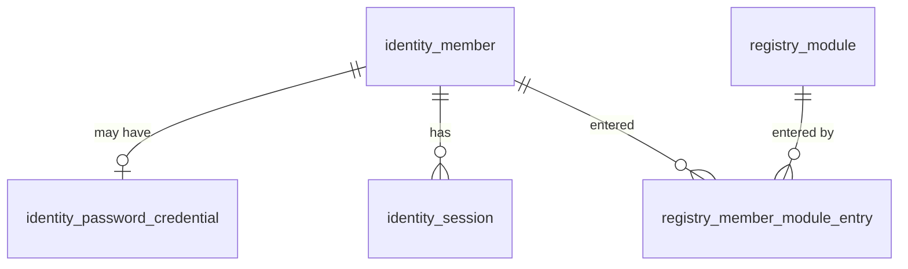

# Parent Application Data Model

## Revision history

| Date | Change | Reason |
|---|---|---|
| 2026-09-13 | Static page introduced no database; future parent records listed. | First reviewable parent slice. |
| 2026-09-14 | Replaced with the actual Identity & Trust Service schema in `platform/identity-service/db/migrations/001-initial.sql` and `002-module-registry.sql`. | Product-owner instruction, 2026-09-14; contract `07-tech-reqs.md` TR10–TR20. |

## Database

Postgres 18, `localhost:5433`, database `forkhatri_identity`. Owner role
`identity_owner` runs migrations; runtime role `identity_app` is non-owning.
Three schemas: `identity`, `registry`, `platform`. Migrations are idempotent.

`identity.otp_challenge` and `platform.rate_limit_counter` have no foreign keys:
a challenge is keyed by identifier because the member may not exist yet.

## Tables

| Table | Columns (key constraints) | Purpose |
|---|---|---|
| `identity.member` | `id` uuid PK; `display_name` 1–80 chars; `phone_e164` unique, E.164; `email` unique, lower-case; `preferred_language` `en`/`hi`/`te` (default `en`); `identity_level` 0–2 (default 1); `status` enum `active`/`suspended`/`deleted`; `created_at`, `updated_at`; check: phone or email present | TR10 canonical member. PII: phone, email. Level 1/2 trust only. |
| `identity.password_credential` | `member_id` PK → member (cascade); `password_hash` must start `$argon2id$`; timestamps | TR19 optional secondary credential. |
| `identity.otp_challenge` | `id` uuid PK; `identifier`; `channel` enum `sms`/`email`; `code_hmac`; `attempt_count` (0); `max_attempts` (5); `expires_at`; `verified_at`; `consumed_at`; `created_at`; index (`identifier`, `created_at` desc) | TR19 one-time codes, stored as HMAC only. |
| `identity.session` | `id` uuid PK; `member_id` → member (cascade); `token_hash` bytea unique; `auth_method` enum `otp`/`password`; `user_agent`; `created_at`; `last_seen_at`; `expires_at`; `revoked_at`; index on `member_id` | TR12 server-side session; only the SHA-256 digest of the token. |
| `platform.rate_limit_counter` | PK (`bucket_key`, `window_start`); `hit_count` | TR20 shared fixed-window rate limiter. |
| `registry.module` | `key` PK (`^[a-z][a-z0-9_]{1,30}$`); `name`; `tagline_en`/`tagline_hi`/`tagline_te`; `availability` `available`/`in_development`/`planned`; `accent` `#rrggbb`; `sort_order`; `updated_at` | TR18 module registry. Entry URLs are environment configuration, not columns. |
| `registry.member_module_entry` | PK (`member_id`, `module_key`); `member_id` → member (cascade); `module_key` → module; `first_entered_at`, `last_entered_at`, `entry_count` | TR18 entry index for hub ordering. Not an access list. |

> **2026-09-14:** `home_locality` removed by migration `003-member-basic-identity-only.sql`. Product-owner rule: the platform member holds basic identity only; location and every other profile detail live in module tables.

## Reference data (002)

`registry.module` rows, upserted in every environment (not development seed):
`mangaly` available (10), `milavn` available (20), `vyapar` in_development (30),
`counsel` planned (40), `payments` planned (50), `finance` planned (60). Dashboard
has no row: it is the hub itself.

## Grants

`identity_app`: `SELECT, INSERT, UPDATE` on member, password_credential,
otp_challenge, session and member_module_entry; `SELECT, INSERT, UPDATE, DELETE`
on rate_limit_counter; `SELECT` only on `registry.module`. No `DELETE` on members
and no DDL.

## No row-level security

Unlike the module schemas, this database has no RLS. Its core operations
(sign-in, code verification, internal session resolution) look up by identifier
or token digest before any member context exists, so every query would need a
`SECURITY DEFINER` bypass, which is the privilege RLS is meant to remove.
Protection comes from isolation (own database, only this service connects), the
least-privilege runtime role, and digests-not-secrets storage.

## Module member-link tables (not in this database)

| Module | Member-link table | Keyed by |
|---|---|---|
| Mangaly | `mangaly_identity.account` (database `mangaly`) | canonical `member_id` (existing ids preserved) |
| Milavn | `milavn_profile.member_profile` (`forkhatridb`) | canonical `member_id` |
| Vyapar | `vyapar.members` (`forkhatridb`) | canonical `member_id` |

The platform never reads or writes these tables; modules create their rows
just-in-time (TR11). Module records such as matrimonial profiles, events,
listings, payments and loan applications are never duplicated here.
