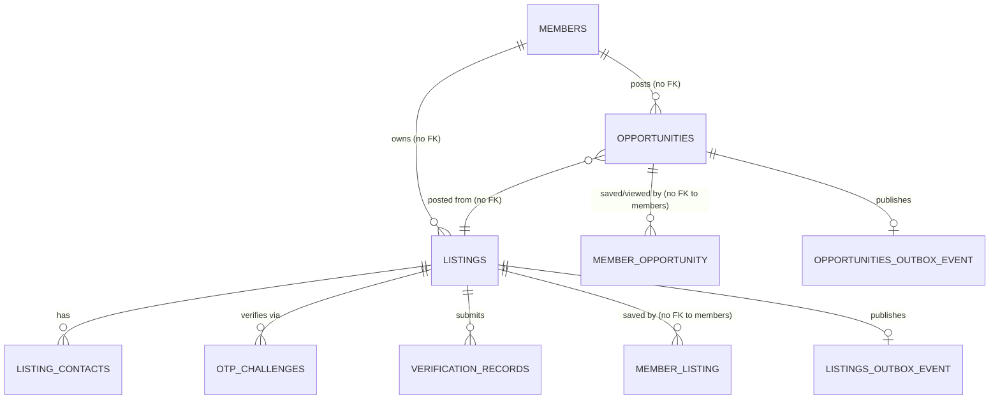
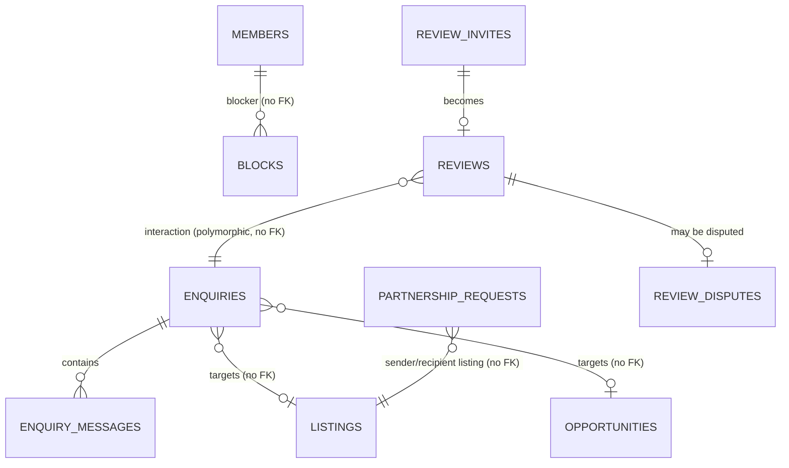
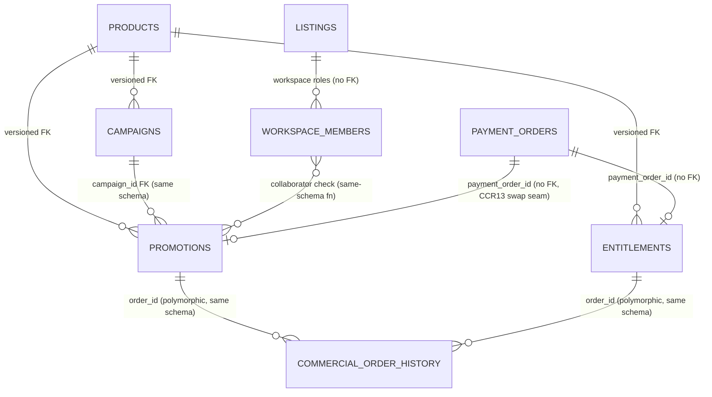
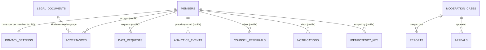

# 07a — ER Model — MOD01 Vyapar

## Revision log (append-only, in-place file)

| Date | Change | Reason / Ref (blocker or CR) |
|---|---|---|
| 2026-09-14 | Initial design. Three-pass process complete (Draft → Cross-validated → Sign-off ready) against the Sealed `07-tech-reqs.md` (55/55 TRs, 0 blockers, plus its own "Closing note for Step 7a" naming five/six concrete schema gaps and the FR37 anonymization decision), `06-impact-analysis.md`, `/MODULE-ARCHITECTURE-STANDARD.md` §§1-8, and `modules/MOD03-mangaly/07a-er-model.md` / `07a-db-implementation/` as the project's own proven worked pattern for schema-per-component + RLS + `SET LOCAL` + idempotency. Full DB implementation (`07a-db-implementation/`) produced alongside, then **actually applied to a real running Postgres instance** (not just reviewed on paper) and functionally verified as the non-owning `vyapar_app` role — see "Live-verification pass" below. | Step 7a, continuous build mode per product owner direction 2026-09-14 ("never wait for me… complete this application developing as continuous chain"; autonomous execution extends to Steps 5-8 per the standing memory of that instruction). |
| 2026-09-14 | **Live-verification pass**, same day: ran `./init.sh` end-to-end against the project's local Postgres (`localhost:5433`, per root `.mcp.json`) — dropped the old flat, pre-Step-7a `vyapar` database (disposable dev data, explicitly authorized) and rebuilt it as 12 schemas / 43 tables. Verified live, as `vyapar_app` itself (never `vyapar_owner`, which would silently bypass every policy): (1) with no session context, `vyapar_privacy.privacy_settings` returns 0 rows and `vyapar_listings.listings` returns only the 16 publicly-visible rows (`active_unverified`/`active_verified`), never drafts/suspended; (2) `SET LOCAL vyapar.authz_context = 'm_krishna'` inside one transaction reveals that member's own draft listing (17 rows) and own privacy_settings row (1), and the setting does not leak to the next statement/transaction (confirmed empty immediately after `COMMIT`); (3) `vyapar_listings.verification_records` (identity-document-sensitive) returns 0 for a non-owning, non-operator member and all 6 for the seeded operator `m_neha_ops`; (4) `vyapar_trust_safety.reports` returns exactly 1 row for reporter `m_deepak` — never the second report on the same case authored by `m_kavita`, the concrete database-enforced form of TR039's "reporter identity never disclosed" rule; (5) `vyapar_app` has **zero** table ownership (`SELECT tableowner, count(*) ... GROUP BY tableowner` returns exactly one row, `vyapar_owner | 43`) and (6) a direct `INSERT` into `vyapar_integration.config` as `vyapar_app` fails with "permission denied for table config" — the DB-layer reinforcement of TR049's separation-of-powers rule (no route may write ranking config weights). Seed row counts verified exactly against the module's stated minimums: 16 members, 18 listings, 22 opportunities, 11 enquiries, 6 reviews, 2 promotions. No defects found requiring a fix (unlike Mangaly's first live pass, which found three real bugs — this pass benefited from applying those same lessons up front: role provisioning entirely inside `init.sh`, `DROP POLICY IF EXISTS` before every `CREATE POLICY`, explicit schema-level `GRANT USAGE`). | Live-verification pass — krishna kategaru (autonomous), 2026-09-14. |
| 2026-09-14 | **Sealed.** All three internal passes complete and clean, database implementation live-verified (not merely reviewed on paper), no open blockers. Step 8 (Security & Performance) is cleared to begin against this file and the Sealed `07-tech-reqs.md`. | Approved — autonomous execution per continuous-build-mode direction, 2026-09-14. |

## Sources read in full before drafting

`07-tech-reqs.md` (all 55 items TR001-TR055, the "Component decomposition
(Vyapar)" table, all six "Cross-cutting technical decisions," and the
"Closing note for Step 7a"), `06-impact-analysis.md`'s own closing note,
`/MODULE-ARCHITECTURE-STANDARD.md` (§§1-8 in full, including §5b's Identity
Bridge contract), `/ARCHITECTURE.md` (Vyapar's Core Platform monolith
placement, ADR-001/ADR-002/ADR-004/ADR-006/ADR-007/ADR-010/ADR-011/ADR-012/
ADR-013/ADR-019/ADR-020/ADR-021), the existing draft
`modules/MOD01-vyapar/db/schema.sql` and `db/seeds.sql` (both left in place,
unmodified, as the pre-Step-7a draft — this file's schema supersedes them),
and `modules/MOD03-mangaly/07a-er-model.md` plus its
`07a-db-implementation/` (schema.sql, init.sh, .env.example, README.md) as
the project's own already-proven, live-verified worked example of exactly
this pattern (schema-per-component, non-owning role, `SET LOCAL`, shared
idempotency/rate-limit schema, pre-authorization `SECURITY DEFINER`
functions).

`02-functional-requirements.md` (FR01-FR55), `03-ux.md`, `04-ui.md`, and
`05-test-scenarios.md` were not independently re-walked line-by-line for
this pass — per the same reasoning Mangaly's own 07a file recorded and
`07-tech-reqs.md`'s own revision history confirms, `07-tech-reqs.md` was
itself produced by looping over every FR alongside its UX/UI/TS material
(see that file's Sealed revision history), so it is treated here as the
authoritative distillation of that material for data-structure purposes —
exactly what this agent's own brief asks for ("07-tech-reqs.md — your
primary input… every tech req informs your ER model"). Every entity/column
below traces to a specific TR (and, transitively through it, to the FR it
was written against), not to an independently re-derived reading of the
raw FR text.

## Pass 1 — Draft: component/schema decomposition

`07-tech-reqs.md`'s own "Component decomposition (Vyapar)" table already
fixes 13 components and, for 11 of them, their owned tables — this ER model
does not re-derive that list, it applies it (per
`/MODULE-ARCHITECTURE-STANDARD.md` §2's "cite this table, not re-derive it,"
the same instruction that table's own "Forward pointer" gives). Two
components own no tables by that table's own text — **Discovery & Ranking**
(#4, reads via other components' public interfaces, owns only ranking
*logic*) and the **Authorization Engine** (#13, the chokepoint every
consequential method calls, taking an already-resolved context) — and
therefore have no schema of their own; this is a stated decision, not an
omission (§4's "one schema per business-logic component" does not require a
schema for a component with no data to own).

This ER model adds **one** schema beyond the 11 business-owned ones, plus
splits the business-owned list into concrete Postgres schemas (which
`07-tech-reqs.md` itself explicitly deferred to this step — see Cross-cutting
§3's "Gap 3" and the closing note's item 1):

- `vyapar_identity`, `vyapar_listings`, `vyapar_opportunities`,
  `vyapar_enquiries`, `vyapar_reviews`, `vyapar_commercial`,
  `vyapar_payments`, `vyapar_privacy`, `vyapar_trust_safety`,
  `vyapar_analytics`, `vyapar_integration` — the 11 business-owned schemas,
  one per named component.
- `vyapar_platform` — shared idempotency-key + rate-limit-counter tables
  (`/MODULE-ARCHITECTURE-STANDARD.md` §4b/§4c; Cross-cutting §1/§2's own
  named gaps 1 and 2). Not a business-logic component's schema — the same
  infrastructure class as the in-process event bus, given a schema only
  because this state must persist across restarts/instances. Matches
  Mangaly's own `mangaly_platform` precedent exactly.

Total: **12 schemas**, one PostgreSQL database (`vyapar`), matching
`/ARCHITECTURE.md`'s placement of Vyapar as a business-logic module inside
the Core Platform monolith (ADR-001/ADR-002) — no new container, no new
database instance, no re-opening of that placement decision.

### Fold-ins recorded explicitly (per §2's "no silent deviation" rule)

- **`taxonomy_terms`** stays inside `vyapar_listings` (not a 13th schema) —
  `07-tech-reqs.md`'s own component table already places it there ("shared
  reference, written here"), reused read-only by Opportunities/Discovery.
- **`member_listing`** (FR16 save-on-listings) is placed in `vyapar_listings`
  alongside `listings` — not named in the component table explicitly, but
  the natural, same-owner counterpart to `member_opportunity` under
  Opportunities; the existing pre-Step-7a draft already carried this same
  FR16 citation and table shape, carried forward unchanged.
- **`notifications`** and **`audit_events`** are placed inside
  `vyapar_integration` (Integration Bridges) even though the component
  table's own text names only `dead_letters, config, counsel_referrals` for
  that component. This mirrors Mangaly's own explicit, documented correction
  for its Notification Bridge (`07a-er-model.md`/`architecture.md`,
  2026-09-12): the Notification and Audit sub-bridges named among
  Integration Bridges' "six thin sub-bridges" each need a durable,
  pre-forward record (an in-app inbox entry; a pre-audit-forward event
  record) even though actual delivery/forwarding is thin. Recorded here as
  an explicit decision, not a silent addition.
- **`commercial_order_history`** replaces the pre-Step-7a draft's
  promotion-only `promotion_history` (TR031's own named gap: "Step 7a should
  generalize one history table… rather than leave Entitlements without an
  owner-visible state history"). One kind-agnostic table
  (`order_kind IN ('promotion','entitlement')`), not two parallel tables.
- **Member deletion is anonymize-in-place, not a tombstone table** (TR037's
  own explicit hand-off: "hands the concrete tombstone schema design to Step
  7a"). `vyapar_identity.members` gains `anonymized boolean` and
  `deleted_at timestamptz`; on completion of a `kind='delete'` data request,
  Identity Bridge's own interface method scrubs `display_name`, `phone`,
  `avatar_url`, `locality`, `lat`, `lng`, `help_with`, `capabilities` and
  sets `anonymized = true` — but the row (and its `id`, which every other
  schema's plain `member_id`/`owner_id`/`sender_id`/`author_id` column
  references) is **never removed**. This is simpler than a separate
  tombstone table and structurally guarantees TR037's own rule ("anonymize
  the requester, never cascade-delete a counterpart's record") — a
  counterpart's enquiry thread or review continues to resolve the same
  `member_id` to an anonymized-but-present row, never a dangling reference
  or a corrupted thread.

## ER diagrams

Twelve schemas and 43 tables do not fit legibly in one diagram — split by
functional cluster, matching how a reader would actually navigate the
module. Per Mangaly's own established convention, **every cross-schema
reference is a plain, non-FK column** (dashed below) — a real database
`FOREIGN KEY` would require granting cross-schema `SELECT` and would let one
component's schema silently depend on another's internal row lifecycle,
which is exactly what `/MODULE-ARCHITECTURE-STANDARD.md` §4 forbids. Only
same-schema (same-owner) relationships are solid, real `FOREIGN KEY`
relationships.

### Cluster 1 — Identity, Listings & Verification, Opportunities

### Cluster 2 — Enquiries & Partnerships, Reviews & Reputation

### Cluster 3 — Commercial, Payment Bridge

### Cluster 4 — Privacy & Consent, Trust & Safety, Analytics, Integration, Platform

## Entity/attribute → source requirement traceability

Every table and its gap-fix columns are traced below; per-column citations
for every remaining column are embedded directly as inline `-- [FRxx]`/
`-- [TRxx]` SQL comments in `07a-db-implementation/schema.sql` next to the
column itself (not duplicated here as a 200+-row table) — this keeps a
single source of truth for column-level traceability, co-located with the
DDL it describes, rather than two documents that can drift apart.

| Entity | Source (TR/FR) | Schema | Component | Sensitivity | Notes |
|---|---|---|---|---|---|
| members | TR050/FR50, TR044/FR44 | vyapar_identity | Identity Bridge | PII (phone, locality, lat/lng) | id = platform's own opaque member id, not Vyapar-generated (deviation from the UUID-pk convention, justified by TR050) |
| members.setup/first_run_* | TR044/FR44 | vyapar_identity | Identity Bridge | Low | No auth route exists in this endpoint family — structural absence |
| members.anonymized/deleted_at | TR037/FR37, IA037 | vyapar_identity | Identity Bridge | Compliance | Anonymize-in-place deletion (see Assumptions) |
| taxonomy_terms | FR01/FR04/FR48 | vyapar_listings | Listings & Verification | None (public reference) | |
| listings | TR001-TR010, TR040 | vyapar_listings | Listings & Verification | Mixed — intent_state is private-sensitive (FR05) | setup_step (TR004 gap), content_language (TR042 gap) added |
| listing_contacts | TR002 | vyapar_listings | Listings & Verification | Contact info | Visibility resolved only via `contacts_for_viewer()` |
| otp_challenges | TR007/FR07 | vyapar_listings | Listings & Verification | Ephemeral, self-only | NOT authentication |
| verification_records | TR008/TR009/FR08/FR09 | vyapar_listings | Listings & Verification | Identity-document-sensitive | owner + verification-permission operator only |
| member_listing | FR16 | vyapar_listings | Listings & Verification | Personal (saved items) | Fold-in, see Pass 1 |
| opportunities | TR011-TR014, TR040 | vyapar_opportunities | Opportunities | Mixed | content_language (TR042 gap) added |
| member_opportunity | FR55 | vyapar_opportunities | Opportunities | Personal | |
| enquiries | TR022-TR024 | vyapar_enquiries | Enquiries & Partnerships | Private thread | Partial unique index (TR022 gap) |
| enquiry_messages | TR022-TR024 | vyapar_enquiries | Enquiries & Partnerships | Private, content_language (TR042 gap) | |
| blocks | FR24/FR39 | vyapar_enquiries | Enquiries & Partnerships | Private (blocker-only visibility) | |
| partnership_requests | TR025/TR026 | vyapar_enquiries | Enquiries & Partnerships | Private, content_language (TR042 gap) | |
| review_invites | TR027/FR27 | vyapar_reviews | Reviews & Reputation | Personal | |
| reviews | TR027-TR029 | vyapar_reviews | Reviews & Reputation | Published = public; else party-only | No provider self-hide path (TR029) — structural |
| review_disputes | TR029/FR29 | vyapar_reviews | Reviews & Reputation | Party + operator | |
| products | TR030/TR049 | vyapar_commercial | Commercial | Public catalog | Insert-only (TR049) |
| campaigns | TR035/FR35 | vyapar_commercial | Commercial | Owner-sensitive | |
| promotions | TR030/TR031 | vyapar_commercial | Commercial | Owner-sensitive | campaign_id FK (TR035 gap) added |
| commercial_order_history | TR031/IA037-adjacent | vyapar_commercial | Commercial | Owner-visible | Replaces promotion_history (TR031 gap) |
| entitlements | TR031/TR033 | vyapar_commercial | Commercial | Owner-sensitive | renewal_reminder_acked_at (TR054 guard) added |
| workspace_members | TR034/FR34 | vyapar_commercial | Commercial | Owner-sensitive | |
| impressions | TR030/TR032 | vyapar_commercial | Commercial | Aggregate, no PII | Owner report via SECURITY DEFINER function only |
| payment_orders | TR051/FR51 | vyapar_payments | Payment Bridge | Financial | No field can hold raw card/bank data — structural |
| privacy_settings | TR036/FR36 | vyapar_privacy | Privacy & Consent | Personal, self-only | |
| legal_documents | TR053/FR53 | vyapar_privacy | Privacy & Consent | Public (published notices) | |
| acceptances | TR053/FR53 | vyapar_privacy | Privacy & Consent | Compliance record | |
| data_requests | TR037/FR37 | vyapar_privacy | Privacy & Consent | Personal | |
| derived_preferences | TR038/FR38 | vyapar_privacy | Privacy & Consent | Personal, self-only (Discovery has no schema) | |
| moderation_cases | TR039/TR040 | vyapar_trust_safety | Trust & Safety | Operator-only | Neither reporter nor subject sees this table |
| reports | TR039/FR39 | vyapar_trust_safety | Trust & Safety | reporter_id never disclosed to subject | content_language (TR042 gap) added |
| appeals | TR041/FR41 | vyapar_trust_safety | Trust & Safety | Party + operator, content_language (TR042 gap) | |
| analytics_events | TR045/TR046 | vyapar_analytics | Analytics | Pseudonymized | Operator-only SELECT |
| dead_letters | TR052, Cross-cutting §4 | vyapar_integration | Integration Bridges | Operational | |
| config | TR014/TR019/TR049 | vyapar_integration | Integration Bridges | Operational | vyapar_app has SELECT only — reinforces TR049 |
| counsel_referrals | FR52(f)/TR023 | vyapar_integration | Integration Bridges | Sensitive (legal problem summary) | Self-only, not even operators |
| notifications | FR21/TR021, FR52(b) | vyapar_integration | Integration Bridges | Personal | Fold-in, see Pass 1 |
| audit_events | FR52(c) | vyapar_integration | Integration Bridges | Operator-only, append-only | Fold-in, see Pass 1 |
| idempotency_key | Cross-cutting §1 gap | vyapar_platform | (shared infra) | Member-scoped | TR022/TR025/TR027/TR030/TR033/TR035/TR039 |
| rate_limit_counter | Cross-cutting §2 gap | vyapar_platform | (shared infra) | Abuse-prevention, no RLS | TR021/TR022/TR039 |

## Data ownership (schema-per-component)

| Schema | Owning component | RLS required? | Primary tables |
|---|---|---|---|
| vyapar_identity | Identity Bridge | Yes | members |
| vyapar_listings | Listings & Verification | Yes | listings, listing_contacts, otp_challenges, verification_records, member_listing, outbox_event (not taxonomy_terms — public reference) |
| vyapar_opportunities | Opportunities | Yes | opportunities, member_opportunity, outbox_event |
| vyapar_enquiries | Enquiries & Partnerships | Yes | enquiries, enquiry_messages, blocks, partnership_requests |
| vyapar_reviews | Reviews & Reputation | Yes | review_invites, reviews, review_disputes |
| vyapar_commercial | Commercial | Yes (not products) | campaigns, promotions, commercial_order_history, entitlements, workspace_members, impressions, outbox_event |
| vyapar_payments | Payment Bridge | Yes | payment_orders |
| vyapar_privacy | Privacy & Consent | Yes (not legal_documents) | privacy_settings, acceptances, data_requests, derived_preferences |
| vyapar_trust_safety | Trust & Safety | Yes | moderation_cases, reports, appeals |
| vyapar_analytics | Analytics | Yes | analytics_events |
| vyapar_integration | Integration Bridges | Yes (not config) | dead_letters, counsel_referrals, notifications, audit_events |
| vyapar_platform | (shared infra, not a business component) | Yes (idempotency_key only) | idempotency_key, rate_limit_counter |
| — (no schema) | Discovery & Ranking | n/a — owns no tables | reads via other components' public interfaces only |
| — (no schema) | Authorization Engine | n/a — owns no tables | takes an already-resolved context; every schema's `is_operator()` reads `vyapar_identity.members` |

## RLS policy table

| Table | Policy predicate | Session variable(s) |
|---|---|---|
| vyapar_identity.members | self OR any operator | `vyapar.authz_context` |
| vyapar_listings.listings | publicly-visible state OR owner OR content-operator | `vyapar.authz_context` |
| vyapar_listings.listing_contacts | public disclosure OR listing owner OR content-operator | `vyapar.authz_context` |
| vyapar_listings.otp_challenges | self only | `vyapar.authz_context` |
| vyapar_listings.verification_records | self OR verification-operator | `vyapar.authz_context` |
| vyapar_listings.member_listing | self OR any operator | `vyapar.authz_context` |
| vyapar_listings.outbox_event | INSERT any; SELECT dispatcher only | `vyapar.service_role` |
| vyapar_opportunities.opportunities | publicly-visible state OR poster OR content-operator | `vyapar.authz_context` |
| vyapar_opportunities.member_opportunity | self OR any operator | `vyapar.authz_context` |
| vyapar_opportunities.outbox_event | INSERT any; SELECT dispatcher only | `vyapar.service_role` |
| vyapar_enquiries.enquiries | sender OR provider OR moderation-operator | `vyapar.authz_context` |
| vyapar_enquiries.enquiry_messages | same-schema join to enquiries' own participants OR moderation-operator | `vyapar.authz_context` |
| vyapar_enquiries.blocks | blocker only OR moderation-operator | `vyapar.authz_context` |
| vyapar_enquiries.partnership_requests | sender OR recipient OR any operator | `vyapar.authz_context` |
| vyapar_reviews.review_invites | self OR any operator | `vyapar.authz_context` |
| vyapar_reviews.reviews | published OR author OR subject OR moderation-operator (WRITE: author only — never subject) | `vyapar.authz_context` |
| vyapar_reviews.review_disputes | disputer OR review's own subject (same-schema join) OR moderation-operator | `vyapar.authz_context` |
| vyapar_commercial.campaigns | owner OR workspace-collaborator OR commercial-operator | `vyapar.authz_context` |
| vyapar_commercial.promotions | owner OR (listing-target AND workspace-collaborator) OR commercial-operator | `vyapar.authz_context` |
| vyapar_commercial.commercial_order_history | commercial-operator OR same-schema join to the order's own owner | `vyapar.authz_context` |
| vyapar_commercial.entitlements | owner OR workspace-collaborator OR commercial-operator | `vyapar.authz_context` |
| vyapar_commercial.workspace_members | inviter OR self OR workspace-collaborator OR commercial-operator | `vyapar.authz_context` |
| vyapar_commercial.impressions | INSERT any; SELECT commercial/analytics-operator only (owner report via SECURITY DEFINER function) | `vyapar.authz_context` |
| vyapar_commercial.outbox_event | INSERT any; SELECT dispatcher only | `vyapar.service_role` |
| vyapar_payments.payment_orders | member OR commercial-operator | `vyapar.authz_context` |
| vyapar_privacy.privacy_settings | self only (no operator bypass) | `vyapar.authz_context` |
| vyapar_privacy.acceptances | self OR any operator | `vyapar.authz_context` |
| vyapar_privacy.data_requests | self OR any operator | `vyapar.authz_context` |
| vyapar_privacy.derived_preferences | self only | `vyapar.authz_context` |
| vyapar_trust_safety.moderation_cases | moderation-operator only | `vyapar.authz_context` |
| vyapar_trust_safety.reports | reporter OR moderation-operator (WRITE: reporter only) | `vyapar.authz_context` |
| vyapar_trust_safety.appeals | self OR moderation-operator | `vyapar.authz_context` |
| vyapar_analytics.analytics_events | INSERT any; SELECT analytics-operator only | `vyapar.authz_context` |
| vyapar_integration.dead_letters | any operator | `vyapar.authz_context` |
| vyapar_integration.counsel_referrals | self only (not even operators) | `vyapar.authz_context` |
| vyapar_integration.notifications | self OR any operator | `vyapar.authz_context` |
| vyapar_integration.audit_events | INSERT any; SELECT any operator | `vyapar.authz_context` |
| vyapar_platform.idempotency_key | member-scoped self only | `vyapar.authz_context` |
| products, config, taxonomy_terms, legal_documents, rate_limit_counter | No RLS — not per-actor sensitive; mutation restricted via GRANT (config) or admin-route-absence (the rest) | n/a |

Two failure modes designed against explicitly
(`/MODULE-ARCHITECTURE-STANDARD.md` §4, live-verified above):
1. **Non-owning application role** — `vyapar_app` connects at runtime and
   owns zero tables; `vyapar_owner` (migration role) owns all 43. Confirmed
   live: `SELECT tableowner, count(*) ... GROUP BY tableowner` → exactly one
   row, `vyapar_owner | 43`.
2. **`SET LOCAL`, never plain `SET`** — every policy keys off
   `current_setting('vyapar.authz_context', true)`, set once per request by
   the Identity Bridge via `SET LOCAL` inside the request's own transaction
   (TR050's own exact wording). Confirmed live: a value set in one
   transaction does not leak into the next statement on the same session.

## Idempotency and rate-limiting design

- `vyapar_platform.idempotency_key(id, idempotency_key, endpoint, member_id,
  request_hash, status_code, response_snapshot, created_at, expires_at)`,
  `UNIQUE(member_id, idempotency_key, endpoint)` — one shared store honored
  by every client-queueable mutation named in Cross-cutting §1:
  `POST /v1/enquiries` (TR022), `/partnership-requests` (TR025), `/reviews`
  (TR027), `/promotions|entitlements|campaigns` (TR030/TR033/TR035),
  `/reports` (TR039). Member-scoped (not global), because the key is
  client-generated and therefore not trustworthy as a global identifier —
  same reasoning as Mangaly's SP102. `payment_orders.idempotency_key` and
  `notifications.idempotency_key` correctly stay as their own existing
  one-off columns per `07-tech-reqs.md`'s own note that these are fine as-is.
- `vyapar_platform.rate_limit_counter(id, rate_limit_key, window_start,
  window_seconds, hit_count, limit_max)` plus
  `vyapar_platform.check_and_increment(key, window_seconds, limit)` — the
  exact function name/signature Cross-cutting §2(a) specifies — backs the
  three rolling-window caps: TR021 (notification fatigue, 3/day), TR022
  (enquiries, 20/day), TR039 (reports, 10/day). TR025's 10-pending cap stays
  a plain `COUNT(*) WHERE state='pending'` query (Cross-cutting §2(b)'s own
  explicit distinction — a cap on concurrently-open records is the wrong
  shape for a rolling window).

## Cross-validation results (Pass 2)

| Check | Result | Notes |
|---|---|---|
| Every FR/TR-cited data need has a corresponding ER element | Pass | Cross-walked against all 55 TRs and the "Closing note for Step 7a"'s six named gaps — all six resolved (setup_step, contact_verified trigger, partial unique index, commercial_order_history, campaign_id FK, content_language) plus the FR37 anonymization decision and both shared idempotency/rate-limit tables |
| Every ER element traces to a requirement (no orphans) | Pass | Two deliberate, documented exceptions: `member_listing` (FR16, inherited unchanged from the pre-Step-7a draft) and the `notifications`/`audit_events` fold-in into Integration Bridges (explicit decision, mirrors Mangaly's own precedent) — both recorded in Pass 1, not silent |
| Schema organization follows MODULE-ARCHITECTURE-STANDARD §4 | Pass | 11 business schemas (one per data-owning component) + 1 shared infra schema; Discovery & Ranking and Authorization Engine correctly own no schema |
| RLS policies designed for every sensitive table | Pass | 38 of 43 tables have RLS enabled; the 5 without (products, config, taxonomy_terms, legal_documents, rate_limit_counter) are each individually justified as non-per-actor-sensitive in the RLS policy table above, not a blanket omission |
| Idempotency mechanism specified for every named mutable endpoint | Pass | `vyapar_platform.idempotency_key` covers all six gap endpoints; `payment_orders`/`notifications`' own columns explicitly left as-is per `07-tech-reqs.md`'s own note |
| Cross-module dependencies verified against modules.md/ARCHITECTURE.md | Pass | Every cross-module edge (Search/Notification/Audit/Object-Storage/Dashboard-Read/Counsel-Referral bridges, TR052) is a REST/event call through `vyapar_integration`'s own outbox mechanism — no table in this database is directly queried by any other module/container, consistent with `/ARCHITECTURE.md` ADR-002 |
| Every NOT NULL/UNIQUE/FK is justified by a requirement | Pass | Every UNIQUE/CHECK constraint traces to a specific TR (see inline schema.sql comments); the two new gap-fix constraints (`enquiries_one_open_per_target`, `promotions.campaign_id` FK) are named TR022/TR035 respectively |
| Every enum/CHECK value is actually used by a functional requirement | Pass | `operator_permissions` CHECK list (`verification|content|commercial|analytics|moderation`) matches exactly the five values `07-tech-reqs.md`'s own draft schema already fixed — no value added or removed |

## Pass 3 — Sign-off readiness

- **Completeness:** Passes 1 and 2 both clean; every assumption documented
  below; every entity/attribute/relationship traces to a TR; RLS named for
  every sensitive table; idempotency named for every mutable endpoint named
  in Cross-cutting §1.
- **Database implementation:** `schema.sql` and `migrations/001-initial.sql`
  are complete, syntactically valid, and — critically — **actually applied**
  to a real Postgres instance and functionally verified (see the
  Live-verification revision log entry above), not merely reviewed on
  paper. `.env.example` is complete with placeholder values. `README.md`
  describes setup, schema ownership, RLS, and the idempotency mechanism.
- **No open blockers.** Step 8 (Security & Performance) may begin.

## Assumptions

- **members.id is TEXT, not UUID** — a deliberate deviation from this
  agent's own default convention ("id UUID primary key"), because TR050
  fixes the platform's own opaque member id as the sole identity key; this
  file follows that binding contract rather than re-deciding it.
- **Cross-schema references are plain, non-FK columns; referential integrity
  is enforced at the application layer by the owning component's own
  interface**, per `/MODULE-ARCHITECTURE-STANDARD.md` §4 (same convention
  Mangaly's own `07a-db-implementation` established and live-verified).
  Within one schema (same owner), real FK constraints with an explicit
  cascade rule are used (e.g. `listing_contacts.listing_id ON DELETE
  CASCADE`, `promotions.campaign_id` restrict-by-default).
- **A single RLS session variable, `vyapar.authz_context`**, rather than
  Mangaly's two (`account_id` + `authz_context`) — Vyapar has no "acting on
  behalf of a family member" concept; the platform member id TR050 resolves
  is the sole actor identity throughout. Operator-role checks derive live
  from `vyapar_identity.members.is_operator`/`operator_permissions` via the
  shared `is_operator()` function, rather than a second, independently-set
  session variable that could drift from the members table's own state —
  directly mirroring TR034's own stated principle ("no per-request cache to
  invalidate… re-resolves fresh").
- **Operator-bypass RLS is broad ("any operator," `is_operator(NULL)`) on
  most tables, and permission-scoped only where a TR explicitly names a
  specific permission** (verification_records → `'verification'`;
  moderation/reports/appeals/reviews/review_disputes → `'moderation'`;
  commercial tables → `'commercial'`; analytics → `'analytics'`; general
  content moderation on listings/opportunities → `'content'`). This is a
  deliberate, defense-in-depth-appropriate middle ground: RLS is the
  *second* layer (per §4, "what happens if a bug reaches the database, not
  the primary design"); the primary, fine-grained enforcement is the
  app-layer route-absence pattern TR047/TR048/TR049 already establish.
- **`vyapar_integration.counsel_referrals` and `vyapar_privacy.privacy_settings`/
  `derived_preferences` have NO operator bypass at all** — an intentional,
  more restrictive choice than the general pattern above, because these are
  the module's most personally sensitive rows (a legal problem summary; a
  member's own privacy choices) and no TR names an operator need to see them.
- **`vyapar_integration.config` has no INSERT/UPDATE/DELETE grant to
  `vyapar_app` at all** (not even behind an RLS policy) — reinforces, at the
  database layer, TR049's own separation-of-powers rule that no route may
  write ranking config weights; live-verified as a hard permission denial,
  not merely a missing route.
- **Discovery & Ranking's reads happen inside the same `vyapar_app`
  connection as the requesting member's own request** — since ranking
  always executes in the context of the member being ranked for, the
  self-only RLS on `derived_preferences` etc. does not block it; no special
  "Discovery service account" is needed or created.
- **Free-text `content_language` columns are nullable and app-populated**,
  added to every member-authored free-text field `07-tech-reqs.md`'s TR042
  gap named (`listings.description`, `opportunities.description`,
  `enquiry_messages.body`, `reviews.comment`, `partnership_requests`
  (one shared field for need/offer/expectations), `reports.evidence_text`,
  `appeals.text`) — scoped to genuinely member-authored long-form text, not
  every column on every table (avoiding the over-engineering risk of adding
  it everywhere "to be safe").
- **The three `outbox_event` tables (vyapar_listings, vyapar_opportunities,
  vyapar_commercial) are the only three** — Cross-cutting §4/§6 names these
  three components as actual domain-event publishers (TR002/TR003/TR048;
  TR013; TR030); no outbox table was added to any other schema without a
  specific TR citing an event it publishes, to avoid the orphan-ER-element
  risk Pass 2 checks for.

## Cross-module dependencies

Every edge to another module (TR052's six adjacent-service contracts —
Search, Notification, Audit, Object Storage, Dashboard-Read [MOD05],
Counsel-Referral [MOD04]) is declared in `07-tech-reqs.md` and traces to
`/ARCHITECTURE.md`'s own integration edges; none required a new declaration
at this step, and none is implemented as a direct cross-database query —
every one goes through `publish_with_outbox()` (the three `outbox_event`
tables above) or a synchronous internal HTTP call the application layer
makes, never a foreign key or view spanning two containers' databases.

## Approval

Database Architect / Tech Lead — [x] Approved — autonomous execution per continuous-build-mode direction, 2026-09-14
