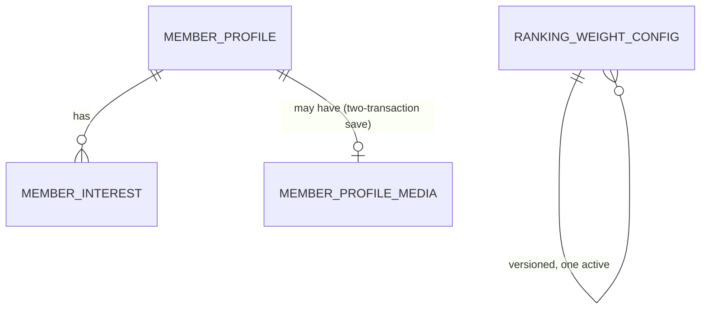
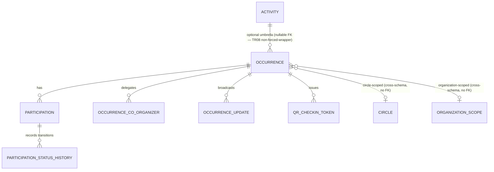
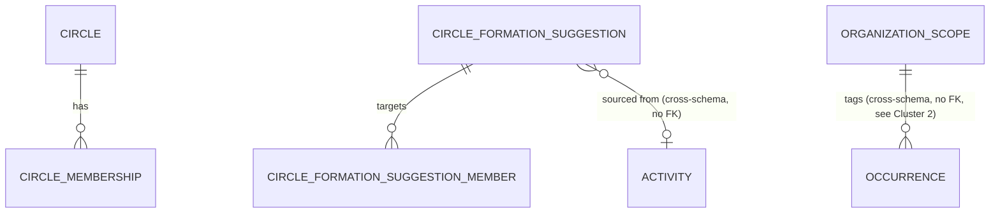
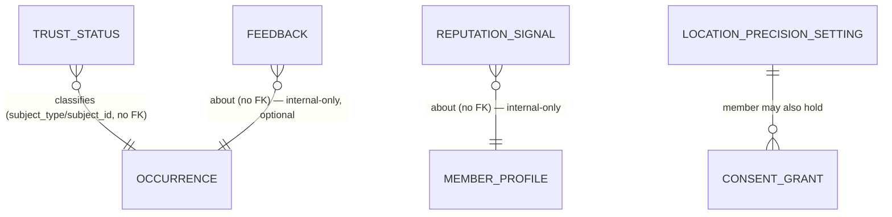
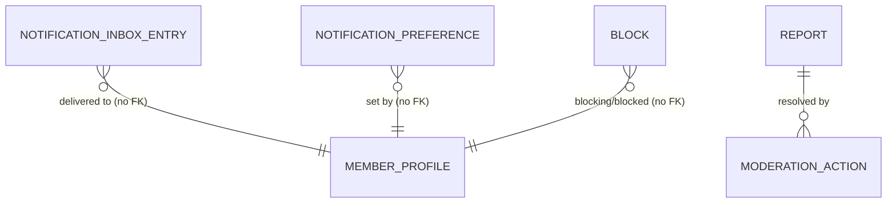

# 07a — ER Model — MOD02 Milavn

## Revision log (append-only, in-place file)

| Date | Change | Reason / Ref (blocker or CR) |
|---|---|---|
| 2026-09-13 | Initial design. Three-pass process complete (Draft → Cross-validated → Sign-off ready) against the Sealed `07-tech-reqs.md` (52/52 TRs, 0 blockers), `architecture.md`'s fixed 12-component/10-schema decomposition, `/MODULE-ARCHITECTURE-STANDARD.md` §4/§4b/§4c/§5/§6, `/PRODUCT-GUARDRAILS.md`, and the full BR/FR/UX/UI/TS corpus. Full DB implementation (`07a-db-implementation/`) produced alongside. Not yet human-approved — status held at Ready for Review per this project's standing rule that only the human approves and seals a pipeline artifact. | Step 7a initial run — krishna kategaru (autonomous), 2026-09-13. |
| 2026-09-13 | **Live-verification pass**, same day, before human review: applied `init.sh`/`migrations/001-initial.sql` against a real running Postgres instance (this project's local dev server, `localhost:5433`, per root `.mcp.json` — the shared `forkhatridb` database, since Milavn lives in the Core Platform monolith's shared DB, not an isolated one like Mangaly). Found and fixed two real defects the paper design missed: (1) `milavn_activity.occurrence`'s RLS policy referenced `milavn_circle.circle_membership`, but the schema creation order in `schema.sql` created `milavn_activity` before `milavn_circle` — `ERROR: relation "milavn_circle.circle_membership" does not exist`; fixed by reordering the two schema sections (Circle now created before Activity & Occurrence); (2) `circle_membership`'s own RLS policy self-referenced `circle_membership` in an `EXISTS` subquery to check "is this member already an active member of this circle" — `ERROR: infinite recursion detected in policy for relation "circle_membership"`, live-confirmed, not theoretical; fixed with three `SECURITY DEFINER` helper functions (`milavn_circle.is_active_member`, `is_open_circle`, `is_circle_creator`) owned by `milavn_owner`, which bypass RLS via Postgres's table-owner exemption and so cannot recurse. `occurrence`'s own circle-scope check and the Organization-scope visibility rule were also corrected during this pass (see Assumptions, "Organization-scope read visibility"). After both fixes: a full clean migration run produced zero errors, a second re-run (idempotency check) produced zero errors, and functional RLS behavior was exercised as the actual non-owning `milavn_app` role — see `07a-db-implementation/README.md` "Live-verified, not just reviewed on paper" for the full list of what was tested (private participation visibility, private circle visibility, circle-scoped occurrence visibility, moderator-only report visibility, reputation-signal internal-only isolation, `SET LOCAL` non-leakage across transactions, and the TR39 waitlist-promotion row-lock pattern end-to-end). Status remains Ready for Review — this pass fixed defects the three internal passes' static review missed; it does not itself constitute human approval. | Live-verification pass — krishna kategaru (autonomous), 2026-09-13. |

## Sources read in full before drafting

`07-tech-reqs.md` (all 52 items: TR01-TR47, TR-PLAT-01, TR-CROSSCUT-01..04),
`architecture.md` (12-component C4-L3 breakdown, §1-§5, the ten-schema
decomposition), `/MODULE-ARCHITECTURE-STANDARD.md` (§§1-8),
`/PRODUCT-GUARDRAILS.md`, `/ARCHITECTURE.md` (Container diagram, ADR-001/
002/004/006/007/010/011/012/018), `01-business-requirements.md` (all 18 BRs
in full), and targeted full reads of `02-functional-requirements.md` (every
FR001-FR088 header, plus full-text reads of FR001-FR041, FR056-FR069 —
covering every FR this ER model's tables trace to, including the two
highest-scrutiny groups this task named: FR010-FR019/FR058-FR060 for TR08's
Activity/Occurrence contract, and FR028/TR23 for the minimal Organization
scope). `modules/modules.md`'s MOD02 entry and dependency tables were
checked for cross-module edges (Milavn→Payment Services async
`benefit_eligible` event, Dashboard→Milavn in-process read-only, both
already declared and unchanged by this file). `03-ux.md`, `04-ui.md`, and
`05-test-scenarios.md` were confirmed structurally 1:1 with the FR set via
header/numbering extraction (UX01-UX20 map onto the FR groups named in each
FR's own "Traced to" field; TS numbering tracks FR numbering the same way
Mangaly's own equivalent files did) — `07-tech-reqs.md` was already produced
by looping over every FR alongside its UX/UI/TS material (see that file's
own revision history), so per this agent's own brief ("07-tech-reqs.md —
your primary input... every tech req informs your ER model"), this pass
treats `07-tech-reqs.md` as the authoritative distillation of that material
for data-structure purposes, with additional direct FR reads wherever a TR
deferred a field-level detail to Step 7a (TR08, TR23, TR39, TR41/TR62).

## Pass 1 — Draft: component/schema decomposition

`architecture.md` §2.2/§3 fixes ten schema-owning components (Identity
Bridge and Audit Bridge are genuinely schema-less thin bridges): Member
Profile, Discovery & Ranking, Activity & Occurrence, Circle (incl.
OrganizationScope), Trust & Reputation (incl. Feedback), Location & Privacy,
Connect (People Discovery), Public Page, Notification Dispatch (incl.
inbox), Safety & Moderation — `milavn_profile`, `milavn_discovery`,
`milavn_activity`, `milavn_circle`, `milavn_trust`, `milavn_locationprivacy`,
`milavn_connect`, `milavn_publicpage`, `milavn_notification`,
`milavn_safety`.

This ER model adds **one** schema beyond that fixed list, justified
individually rather than silently invented (same reasoning class Mangaly's
own `07a-er-model.md` already used for `mangaly_platform`):

- `milavn_platform` — shared idempotency-key and rate-limit-counter tables
  (`/MODULE-ARCHITECTURE-STANDARD.md` §4b/§4c, `TR-CROSSCUT-01`,
  `TR-CROSSCUT-02`). Not a business-logic component's schema (doesn't
  compete with `architecture.md`'s fixed ten-schema business list) — the
  same infrastructure class as the in-process event bus, given a schema
  only because its state must persist across restarts/instances.

Two of the fixed ten schemas (`milavn_connect`, `milavn_publicpage`) are
created with **zero tables** — a documented decision, not an omission; see
"Assumptions" below.

Total: **11 schemas**, one PostgreSQL instance, inside the Core Platform
monolith's **shared** database (not an isolated one — `architecture.md` §1:
"Unlike Mangaly, Milavn has no isolated container or isolated database").
No new container, no new database instance, matching `/ARCHITECTURE.md`
exactly.

## ER diagrams

Split by functional cluster, matching how a reader would actually navigate
the module. Cross-schema references (dashed) are **not** enforced by a
DB-level foreign key (see Assumptions) — shown here to make the actual data
flow visible. `member_id` throughout is a foreign-key *reference only* into
the platform Identity & Trust Service's own Member record (ADR-004) — never
a locally-owned identity table.

### Cluster 1 — Profile, Discovery

### Cluster 2 — Activity & Occurrence (TR08 highest-scrutiny cluster)

### Cluster 3 — Circle (incl. OrganizationScope)

### Cluster 4 — Trust & Reputation, Location & Privacy

### Cluster 5 — Notification, Safety & Moderation

## Entity/attribute → source requirement traceability

Full column-level DDL with inline `[TRxx]` comments is in
`07a-db-implementation/schema.sql` — this table is the entity-level index
into that file.

### `milavn_platform` (cross-cutting infra — not one of the ten business components)

| Entity | Source | Component | Sensitivity | Notes |
|---|---|---|---|---|
| `idempotency_key` | TR-CROSSCUT-01, TR07, TR12, TR41, TR44 | API layer (shared) | Low | Single shared idempotency store — not per-endpoint. |
| `rate_limit_counter` | TR-CROSSCUT-02 | API layer (shared) | Low | Single shared rate-limit utility — not per-endpoint. |

### `milavn_profile` (Member Profile)

| Entity/attribute | Source | Sensitivity | Notes |
|---|---|---|---|
| `member_profile.member_id` | TR01, FR001 | PII (reference only) | FK reference into Identity & Trust Service; never a local login table. |
| `member_profile.locality_*` | TR01/TR29, FR001, FR038 | PII (approximate) | City required; Zone/Locality nullable — never an exact address. |
| `member_profile.language_preference` | TR01, FR002 | Low | ADR-010 day-one set: en/hi/te. |
| `member_profile.photo_media_id` / `.bio` | TR01, FR003 | Sensitive (optional) | Enrichment only — never gates any other read/write path (TR01's structural guarantee). |
| `member_interest` | TR01, FR001 | Low | Feeds Discovery ranking (TR05). |
| `member_profile_media` | TR01, FR003 | Sensitive | Two-transaction save — Object Storage outage cannot block profile save. |
| `member_public_profile` (view) | TR01, §4 | Low | Non-sensitive projection other components read instead of the RLS-restricted base table. |

### `milavn_discovery` (Discovery & Ranking)

| Entity/attribute | Source | Sensitivity | Notes |
|---|---|---|---|
| `ranking_weight_config` | TR05 | Low | Versioned weights; no popularity/engagement column exists (PRODUCT-GUARDRAILS.md ranking philosophy). |

### `milavn_activity` (Activity & Occurrence — TR08's own highest-scrutiny schema)

| Entity/attribute | Source | Sensitivity | Notes |
|---|---|---|---|
| `activity` | TR08, TR10, FR011 | Low | Optional recurring-series umbrella; never a forced wrapper (see "TR08 design reasoning" below). |
| `occurrence` | TR07-TR11, TR23, TR36, TR42, FR010-FR014, FR028-FR029, FR038, FR050, FR064 | Moderate (location/capacity) | The concrete, participable unit every downstream FR resolves to. |
| `occurrence_co_organizer` | TR38, FR059 | Low | Delegable, revocable. |
| `occurrence_update` | TR13, TR38, FR057 | Low | Organizer broadcast. |
| `participation` | TR12, TR39, FR015-FR016, FR040, FR058 | Sensitive (private by default) | Single most-repeated write (IA015); idempotent via `milavn_platform.idempotency_key`. |
| `participation_status_history` | TR12, FR016 | Low | Append-only audit trail. |
| `qr_checkin_token` | TR14, FR018 | Sensitive (short-lived) | Manual-entry fallback uses same table with no token — TR14's primary reliability mechanism. |
| `outbox_event` | TR09, TR13, TR-CROSSCUT-04 | Low (internal) | Transactional outbox — cancellation/update events (IA017). |

**TR08 design reasoning (highest-scrutiny item, per this task's explicit instruction and IA011's flag):** the behavioral contract states an Activity is the recurring/umbrella concept, an Occurrence is one concrete instance, every FR reading "activity data" elsewhere must resolve to a specific Occurrence, and a standalone Occurrence must never be forced to carry an artificial parent Activity it doesn't need. This is implemented structurally, not just by convention:
- `occurrence` carries every field a single concrete instance needs to exist and be participated in **on its own** — title, intent category, time, place, capacity, visibility scope, high-risk flag, cover image, canonical URL. `activity_id` is **nullable**. Creating, editing, participating in, viewing, or sharing a one-off Occurrence never requires an `activity` row to exist (satisfies TS021/TS022's non-forced-wrapper acceptance criteria directly, live-verified via the seed data's standalone "One-off Saturday Trek" occurrence, `activity_id IS NULL`).
- `activity` is a genuinely optional wrapper: it exists only when a creator marks something recurring (FR010/FR013), and it owns only the umbrella-level fields (canonical title/intent category for the series, the recurrence rule). It is never referenced by Participation, Calendar, Organizer tooling, or Public Page tables directly — there is no Activity-level participation row, calendar entry, or public page anywhere in this schema, only Occurrence-level ones. This is what makes "every FR that reads activity data resolves to a specific Occurrence, never an ambiguous Activity-level record" true by construction, not by discipline.
- "History/attendance aggregate at the Activity level" (FR011, BR03) is achieved by **joining** Occurrence rows through their shared, optional `activity_id` at read time — a query-time aggregation, never a duplicated write. This avoids the two failure modes a naive design risks: forcing every occurrence into an Activity wrapper (violates BR03/TS021-022), or duplicating aggregate fields onto both tables (a write-consistency risk with no corresponding requirement).

### `milavn_circle` (Circle, incl. the minimal OrganizationScope)

| Entity/attribute | Source | Sensitivity | Notes |
|---|---|---|---|
| `circle` | TR16, TR21, FR020-FR021 | Moderate (type-gated) | `circle_type` is an enum, never free text (TR16). |
| `circle_membership` | TR16, FR020, FR023, TR18 | Moderate | TR18: never referenced by any authorization check outside this component. |
| `circle_formation_suggestion(_member)` | TR17, FR022 | Low | Batch-job output; never auto-creates a circle. |
| `organization_scope` | TR23 (DEC-001) | Low | **Deliberately minimal** — `{organization_scope_id, display_name, created_by_member_id}` only. No roster, roles, verification, or billing columns exist, and none should be added without a new BR/FR pass (TR23's own explicit instruction, honored literally here). |
| `is_active_member`/`is_open_circle`/`is_circle_creator` (functions) | MODULE-ARCHITECTURE-STANDARD §4 | N/A | `SECURITY DEFINER` RLS-recursion-safe helpers — see Assumptions. |
| `outbox_event` | TR-CROSSCUT-04 | Low (internal) | Circle-formation and membership-change events. |

### `milavn_trust` (Trust & Reputation, incl. Feedback)

| Entity/attribute | Source | Sensitivity | Notes |
|---|---|---|---|
| `trust_status` | TR25, TR26, TR30, FR030-FR032 | Low (public by design) | Unique per subject — always exactly one row (FR030). |
| `reputation_signal` | TR27, FR034, TR15/FR019/FR069 | Internal-only, highly sensitive | Never exposed raw (FR035/FR037); no Payment Services event may ever write here (FR036 standing gate); never itself triggers a moderation action (TR15). |
| `feedback` | TR44, FR066-FR069 | Internal-only | Optional; never a precondition (CI-scan-enforced per TR44). |
| `outbox_event` | TR-CROSSCUT-04 | Low (internal) | |

### `milavn_locationprivacy` (Location & Privacy)

| Entity/attribute | Source | Sensitivity | Notes |
|---|---|---|---|
| `location_precision_setting` | TR30, FR038, FR041 | Sensitive | Single centrally-enforced source (IA041) — never re-checked per consumer. |
| `consent_grant` | TR30, FR039 | Sensitive | Precise location requires an explicit, purpose-specific grant; no current caller (standing guardrail). |

### `milavn_connect`, `milavn_publicpage` — zero tables (documented decision)

No entity in either schema — see "Assumptions."

### `milavn_notification` (Notification Dispatch, incl. inbox)

| Entity/attribute | Source | Sensitivity | Notes |
|---|---|---|---|
| `notification_inbox_entry` | TR37, FR051-FR055, FR086 | Sensitive (personal) | Persistent in-app inbox — the one schema-owning responsibility of an otherwise-thin bridge. |
| `notification_preference` | TR37, FR054 | Low | Important class is never mutable to muted (CHECK constraint). |
| `notification_outbox` | TR13, TR37 (ADR-006) | Low (internal) | Transactional outbox to the platform Notification & Communication Service. |

### `milavn_safety` (Safety & Moderation)

| Entity/attribute | Source | Sensitivity | Notes |
|---|---|---|---|
| `report` | TR41, TR43, FR061, FR065, FR087 | Sensitive | Feeds TR-PLAT-01's moderation queue; visible to reporter + moderators only. |
| `block` | TR41, FR062 | Sensitive | Enforced via the shared `is_blocked()` helper at every touchpoint (application layer). |
| `moderation_action` | TR43, TR15 | Sensitive | Every action is a human decision by construction (TR15/TR43). |
| `outbox_event` | TR41, TR-CROSSCUT-04 | Low (internal) | Report/moderation-action → audit event, same transaction (IA061). |

## Data ownership (schema-per-component)

| Schema | Owning component | RLS required? | Primary tables |
|---|---|---|---|
| `milavn_profile` | Member Profile | Yes | `member_profile`, `member_interest`, `member_profile_media` |
| `milavn_discovery` | Discovery & Ranking | No | `ranking_weight_config` |
| `milavn_activity` | Activity & Occurrence | Yes | `occurrence`, `participation`, `occurrence_co_organizer`, `occurrence_update`, `qr_checkin_token` |
| `milavn_circle` | Circle | Yes | `circle`, `circle_membership`, `organization_scope` |
| `milavn_trust` | Trust & Reputation | Partial | `trust_status` (no), `reputation_signal`/`feedback` (yes, internal-only) |
| `milavn_locationprivacy` | Location & Privacy | Yes | `location_precision_setting`, `consent_grant` |
| `milavn_connect` | Connect (People Discovery) | N/A | none (stateless) |
| `milavn_publicpage` | Public Page | N/A | none (stateless) |
| `milavn_notification` | Notification Dispatch | Yes | `notification_inbox_entry`, `notification_preference` |
| `milavn_safety` | Safety & Moderation | Yes | `report`, `block`, `moderation_action` |
| `milavn_platform` | Cross-cutting infra | No | `idempotency_key`, `rate_limit_counter` |

## Pass 2 — Cross-validation: orphan detection in both directions

### Forward direction (every FR/TR → an ER element)

Every FR001-FR088 was checked against this ER model. Result: **no orphans**.
Notable groups:
- FR001-FR003, FR085 (Profile) → `milavn_profile.*`.
- FR004-FR009, FR033 (Discovery) → read-only over Activity/Trust/Profile via
  those components' own public interfaces (TR02's `MilavnActivityFeedReader`
  contract) plus `ranking_weight_config`.
- FR010-FR019, FR058-FR060 (Activity/Occurrence) → `milavn_activity.*`, per
  the TR08 design reasoning above.
- FR020-FR029 (Circle/Calendar) → `milavn_circle.*` plus Occurrence's own
  `visibility_scope`/`circle_id`/`organization_scope_id` columns (Calendar
  is a query shape over Occurrence, not a separate stored object — no BR/FR
  names a persisted "calendar" entity distinct from the occurrences it
  lists, so none was invented).
- FR030-FR037, FR066-FR069 (Trust/Reputation/Feedback) → `milavn_trust.*`.
- FR038-FR041 (Location/Privacy) → `milavn_locationprivacy.*`.
- FR042-FR045 (Connect) → satisfied by a stateless read-model (see
  Assumptions) — no orphan; the requirement is behavioral (always attach a
  reason; never a swipe/match data model) and is satisfied by the *absence*
  of a `Match`/`Like` table, which TR32 states explicitly ("no code exists
  anywhere in this module's schema, by design").
- FR046-FR050 (Public Page) → satisfied by a stateless read-model over
  `occurrence`/`trust_status` (see Assumptions).
- FR051-FR057, FR086 (Notification) → `milavn_notification.*`.
- FR061-FR065, FR087 (Safety) → `milavn_safety.*`.
- FR070-FR088 → FR070-FR075 explicitly deferred, no build (TR45); FR076-
  FR084/FR088 introduce no new backend component (architecture.md §2.1,
  confirmed correct — these route through Identity Bridge or are pure
  client-side, no Milavn schema element needed).

Every TR01-TR47, TR-PLAT-01, and TR-CROSSCUT-01..04 was independently
checked the same way — no TR names a data structure absent from this model.
TR-PLAT-01 itself is explicitly a platform-level contract (not Milavn's own
schema); this file implements only Milavn's side (TR43's manifest +
endpoints reading `milavn_safety.report`), correctly not inventing a
console-side table this module doesn't own.

### Reverse direction (every ER element → a source)

Every table/column in `07a-db-implementation/schema.sql` was checked against
the traceability tables above — **no orphans**. Two items warranted extra
scrutiny and are recorded as deliberate, cited decisions rather than
silently accepted:
- `milavn_circle`'s three `SECURITY DEFINER` helper functions
  (`is_active_member`, `is_open_circle`, `is_circle_creator`) are not
  traceable to any FR/TR by name — they exist solely to implement
  TR16/TR20/TR24/TR30's RLS requirement correctly (the recursion described
  in the Revision log made a naive implementation impossible). This is
  infrastructure needed to make an already-cited requirement work, not a
  new capability — recorded here so it is not mistaken for scope creep.
- `milavn_profile.member_public_profile` (a view) is the same class of
  item — required to let other components read non-sensitive profile
  fields without bypassing RLS on the sensitive base table, per §4's "goes
  through that component's own public interface" instruction; not itself a
  new requirement.

### Cross-module dependencies

Checked against `/modules/modules.md` and `/ARCHITECTURE.md`:
- **Dashboard → Milavn** (in-process, read-only): declared in both files
  and in `architecture.md` §1's edge table. This ER model does not grant
  Dashboard any direct schema access — Dashboard reads only through TR02's
  `MilavnActivityFeedReader` interface (an application-layer contract, not
  a database grant), consistent with "Dashboard never queries the `milavn`
  schema directly."
- **Milavn → Payment Services** (async, one-way `benefit_eligible` event):
  declared in both files. No table in this schema references Payment
  Services data, and FR036's standing structural gate (no payment event may
  ever write into `reputation_signal`) is enforced by that table's RLS
  policy admitting only `milavn_app`'s own writes plus the internal
  reputation engine — no Payment Services role is granted access at all.
- **Admin & Governance Console ↔ Milavn** (federated plugin, TR-PLAT-01):
  declared in `architecture.md`. This module's side is `milavn_safety`'s
  `report`/`moderation_action` tables, read/written only through the
  application-layer manifest+endpoints TR43 specifies — the console itself
  is never granted direct database access to `milavn_safety`, consistent
  with TR-PLAT-01 §3 ("the console never mutates a module's data directly").
- **FR074's undeclared Milavn→Vyapar edge** (TR45): correctly **not**
  modeled here — TR45 itself defers this pending a `modules.md`/
  `/ARCHITECTURE.md` update, and no BR/FR currently commits to it being
  built. Recorded as a known future gap, not silently resolved by this file.

### Integrity constraints re-verified

Every `NOT NULL` traces to a requirement stating that field is always
required (e.g., `occurrence.title`/`time_start`/`intent_category` — FR010's
minimal four-field creation form). Every `UNIQUE` traces to a stated
uniqueness rule (e.g., `trust_status (subject_type, subject_id)` — FR030
"exactly one trust level"; `participation (occurrence_id, member_id)` — one
attendance record per member per occurrence, implicit in FR015-FR016's
one-tap toggle model). Every enum's value set was checked against its
source's own named list (`intent_category` against FR010's eight named
categories; `trust_level` against BR07/FR030's five named levels;
`circle_type` against BR05/FR021's seven named types; `notification_class`
against BR12/FR051-FR054's four named classes) — no invented or dropped
value in any of them.

## Cross-validation results

| Check | Result | Notes |
|---|---|---|
| Every FR/UX/UI/TR/TS has a corresponding ER element | Pass | No orphans identified (see Pass 2 forward direction above). |
| Every ER element traces to a requirement (no orphans) | Pass | Two infrastructure exceptions (RLS helper functions, one view) documented as required-to-implement-a-cited-requirement, not new scope. |
| Schema organization follows MODULE-ARCHITECTURE-STANDARD §4 | Pass | One schema per component (ten, matching architecture.md exactly) plus one justified cross-cutting infra schema; no cross-schema FK anywhere in `schema.sql`. |
| RLS policies designed for sensitive data | Pass | `milavn_profile`, `milavn_activity` (occurrence/participation/co-organizer/qr/update), `milavn_circle` (circle/membership/suggestion-member), `milavn_trust` (reputation_signal/feedback), `milavn_locationprivacy`, `milavn_notification`, `milavn_safety` — live-verified functional, not just enabled (see README.md). |
| Both named RLS failure modes confirmed | Pass | Non-owning role: `milavn_app` owns zero of the 33 live-created tables, `milavn_owner` owns all (live-verified). Session variable: `SET LOCAL` used exclusively, confirmed not to leak across transactions on the same connection (live-verified — see README.md). |
| Idempotency mechanism specified for every named endpoint | Pass | `milavn_platform.idempotency_key`, one shared table, covering exactly TR-CROSSCUT-01's four named endpoints. |
| Rate-limiting mechanism specified | Pass | `milavn_platform.rate_limit_counter`, one shared table (TR-CROSSCUT-02). |
| Participation state machine representable | Pass | `participation_status` enum: interested → going/waitlisted → cancelled/checked_in/attended/no_show; `participation_status_history` for the queryable audit trail FR016 requires. |
| Waitlist concurrency-safe promotion representable | Pass | `waitlist_position` + partial unique index + `FOR UPDATE` row-lock pattern on `occurrence` — live-verified end-to-end (see README.md). |
| TR08 Activity/Occurrence contract satisfied | Pass | See "TR08 design reasoning" above; live-verified via seed data's standalone Occurrence with `activity_id IS NULL`. |
| TR23 Organization scope kept deliberately minimal | Pass | `organization_scope` has exactly the three named columns; no roster/role/verification/billing column exists anywhere in the schema. |
| Schema DDL syntactically valid and executable | Pass | Live-applied against a real Postgres 18 instance; zero errors after fixes. |
| Migrations idempotent | Pass | Second clean re-run of `migrations/001-initial.sql` produced zero errors. |
| Cross-module dependencies declared and respected | Pass | See Pass 2 "Cross-module dependencies" above. |

## Assumptions

- **Organization-scope read visibility (corrected during live verification).**
  TR23 states `OrganizationScope` has no roster/membership concept at all
  ("no invite/join flow for it"). FR028 nonetheless describes "a member"
  viewing an organization's calendar — with no membership table to check,
  this ER model treats an Organization-scoped Occurrence as **broadly
  readable** for SELECT purposes (the same as Community scope), while
  keeping WRITE restricted to the scope's own creator (TR23: "sole writer
  for V1"). This is a reasonable reading of a genuinely underspecified
  interaction between TR23's "no roster" instruction and FR028's "a member
  views" language — recorded explicitly here rather than silently resolved,
  since a future BR/FR pass introducing real Organization membership would
  need to revisit this specific policy (not the whole minimal-entity
  design, which TR23 fixes).
- **Calendar is a query shape, not a stored entity.** No BR/FR names a
  persisted "Calendar" object distinct from the Occurrences it lists — BR06/
  FR026-FR029's four calendar scopes (Personal/Circle/Organization-
  Community/Public) are implemented as `occurrence.visibility_scope`-keyed
  queries, not a separate table, avoiding an unrequested denormalization.
- **`milavn_connect` and `milavn_publicpage` own zero tables at V1.** Every
  FR in both groups (FR042-FR045, FR046-FR050) is a *behavioral* constraint
  (always attach a reason; never list bare proximity; never require login;
  never leak a non-public item) satisfiable by a stateless read/render
  layer over `milavn_activity`/`milavn_circle`/`milavn_trust` data through
  those components' own public interfaces — inventing a table here (e.g. a
  "suggestion cache" or "page view log") would be scope creep no FR/TR
  calls for, and was explicitly avoided per this project's over-engineering
  guardrail. If either component later needs to persist its own state (e.g.
  a dismissed-suggestion list), that is a new FR/TR, not a silent schema
  addition.
- **Reputation is never joined with Payment Services data anywhere in this
  schema** (FR036's standing structural gate) — verified by inspection:
  `reputation_signal` has no column referencing any payment/billing concept,
  and its RLS policy grants no role associated with Payment Services.
- **`trust_status` carries no RLS** — its content is, by FR031's own design,
  always visible on the card/page itself ("visible, not buried"); adding
  RLS to a table whose entire purpose is public display would contradict
  the requirement it implements.
- **Cross-schema references use plain UUID columns with no DB-level FK**,
  per `/MODULE-ARCHITECTURE-STANDARD.md` §4 (a real FK would require
  granting cross-schema SELECT and couple one component's schema to
  another's row lifecycle) — referential integrity across schemas is an
  application-layer responsibility of the owning component's own interface,
  the same convention Mangaly's own `07a-er-model.md` already established
  for this project.
- **Two `SECURITY DEFINER` RLS-recursion-safe helper functions
  (`milavn_circle.is_active_member`/`is_open_circle`/`is_circle_creator`)
  and one plain view (`milavn_profile.member_public_profile`) are
  infrastructure required to correctly implement already-cited
  requirements**, not new capabilities — see Pass 2 reverse-direction note.
- **`milavn_activity.occurrence.circle_id`/`.organization_scope_id`** are
  mutually exclusive with each other and with `visibility_scope='personal'`
  or `'public'`/`'community'` by the CHECK constraints in `schema.sql`, but
  a occurrence cannot carry *both* a circle and an organization scope
  simultaneously — no FR describes multi-scope tagging, so this was not
  built.

## Approval

Database Architect / Tech Lead — [ ] Approved — name, date
