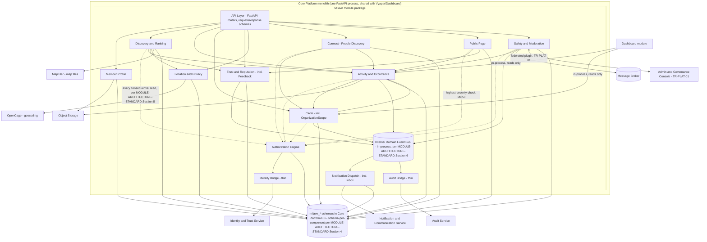

# Architecture — MOD02 Milavn

## Revision history
| Date | Change | Reason / Ref |
|---|---|---|
| 2026-09-13 | Initial version. Written retroactively — Step 7 (`07-tech-reqs.md`) had already produced 52 tech-req items against a working, but not yet ratified, component grouping (Identity/Profile, Discovery, Activity/Occurrence, Circle, Trust, Location/Privacy, Public Page, Notification Dispatch, Safety/Moderation) and raised the missing file as BLOCKER-002. This file resolves that blocker: it ratifies that grouping (refining it slightly — see §2.1), applies `/MODULE-ARCHITECTURE-STANDARD.md`'s generic patterns concretely, and reconciles TR-PLAT-01's Admin & Governance Console contract into the component diagram. | Product Manager's direction to close BLOCKER-002 before approving Step 7. |

## Purpose and scope

This file is Milavn's **concrete application** of `/MODULE-ARCHITECTURE-STANDARD.md` (the generic pattern every module's internal architecture follows) plus `/ARCHITECTURE.md` (the cross-module decisions: Milavn's container, its database, its integration edges) plus `/PRODUCT-GUARDRAILS.md` (the product invariants no internal design may contradict — most directly, "no popularity-primary ranking," "reputation never a public score/never purchasable," and "shared platform capabilities built once"). Read all three first if anything here is unclear about *why* a pattern is shaped the way it is — this file states *what Milavn's own components are*, not *why components should be structured this way in general* or *what the product must never do*, which are those files' jobs respectively.

Unlike Mangaly (built ahead of its own Step 7, because it was the pipeline's only active module), this file is produced *after* `07-tech-reqs.md` because Step 7 already needed a working component shape to write technical requirements against and correctly declined to invent one silently — it flagged the gap (BLOCKER-002) instead. This file now ratifies that shape as the real one, closing that blocker.

## 1. Milavn's placement in the platform (recap only — decided in `/ARCHITECTURE.md`, not here)

- **Container:** Core Platform (modular monolith, FastAPI) — a module *package* inside the same process as Vyapar and Dashboard, not its own deployable. Unlike Mangaly, Milavn has no isolated container or isolated database.
- **Database:** shared Core Platform DB (Postgres), with its own `milavn`-prefixed set of schemas (ADR-002's schema-per-module baseline, refined per §4 below into schema-per-component within that prefix).
- **Why not isolated:** Milavn's data (activities, participation, circles) does not carry Mangaly's regulatory/child-safety load — `/ARCHITECTURE.md`'s own container-mapping table places it in the lower-sensitivity group (Vyapar/Milavn/Dashboard) that shares the monolith by design (ADR-001).
- **Build order:** Milavn is not currently the platform's active build (Mangaly is, per ADR-016/017) — this file's §7 note (below) explicitly records that Milavn does **not** inherit Mangaly's "sole live surface" operational-priority adjustment.
- **External edges** (all already resolved in `/ARCHITECTURE.md`'s Dependency resolution and Shared concern tables, restated here so this file is self-contained; two rows are new, added by Step 7 and not yet reflected in `/ARCHITECTURE.md`'s own System Context — flagged explicitly):

| Edge | Direction | Pattern | Why |
|---|---|---|---|
| Web Client → Milavn | in | REST/JSON, HTTPS | Standard client-service call, same as every other Core Platform module. |
| Milavn → Core Platform DB (`milavn_*` schemas) | out, sync | Direct query, in-process | ADR-002, refined per §4 below. |
| Milavn → Identity & Trust Service | out, sync | REST, short-lived JWT | Base identity/auth (ADR-004). Milavn never forks its own login table (IA001). |
| Milavn → Object Storage | out, sync | Direct upload/fetch | Profile photos, activity cover images (FR003, FR013). |
| Milavn → Notification & Communication Service | out, async (Broker) | Publish event, service renders/sends | Important/Useful/Social/Opportunity notification classes (FR051–FR057, ADR-006). Milavn never blocks on delivery. |
| Milavn → Audit Service | out, async (Broker) | Publish audit event | Report submissions (FR061) and every moderation action dispatched through TR-PLAT-01 (ADR-011). |
| Milavn → Message Broker → Payment Services | out, async, optional, one-way | `benefit_eligible` event | Milavn never calls Payment Services synchronously (deferred, BR18/FR075). |
| Dashboard → Milavn | in, sync | In-process call, internal contract | Dashboard reads Milavn's data for registration reminders and community-activity surfacing (`/ARCHITECTURE.md`) — the one edge where Milavn is the *callee*, not the caller; the internal contract this exposes is IA004/IA026's own flagged open item, formalized in `07-tech-reqs.md` TR02/TR21. |
| Milavn ↔ Search | none (embedded) | — | Embedded Postgres full-text/filter search inside Milavn's own schemas, not a call to an external service (ADR-007/ADR-018) — same pattern as Mangaly. |
| Milavn ↔ AI Service | none, or conditional-only | — | Does not exist yet (ADR-009, deferred). FR060's "AI organizer actions respect human authorization boundaries" is a standing guardrail, not an active dependency. |
| Admin & Governance Console ↔ Milavn | out, sync (federated view) | REST, per TR-PLAT-01 | Milavn's moderation queue (FR065) is a plugin inside the one platform console (ADR-012), **not** its own admin app — and per IA065/TR-PLAT-01, Milavn is the module authoring that shared plugin contract itself, on current pipeline-position evidence (Vyapar has no Step 6/7 yet; Mangaly's Sealed Step 7 defines none). |
| Milavn → MapTiler (map-tile provider) | out, sync, external | REST/tile API | **New edge, not yet in `/ARCHITECTURE.md`'s System Context** — named by `07-tech-reqs.md` TR03 for FR005's Map discovery mode, flagged by `06-impact-analysis.md` IA005. Config-placeholder entry in `config/external_services.yaml`. |
| Milavn → OpenCage (geocoding/locality resolution) | out, sync, external | REST | **New edge, not yet in `/ARCHITECTURE.md`'s System Context** — named by `07-tech-reqs.md` TR29 for FR038's locality-hierarchy display, flagged by `06-impact-analysis.md` IA038. Config-placeholder entry in `config/external_services.yaml`. |

**Decision recorded here** (not a re-opening of `/ARCHITECTURE.md`, which stays silent on these): the two external-service rows above should be added to `/ARCHITECTURE.md`'s own System Context diagram the next time that file is revised, so it stays the single source of truth for the platform's full external-system inventory. Until then, this file and `07-tech-reqs.md` are the record of their existence.

## 2. Component architecture (C4 Level 3) — inside Milavn's module package

### 2.1 Component boundaries: source is silent, boundaries taken from the already-exercised FR/BR grouping

Per `/MODULE-ARCHITECTURE-STANDARD.md` §2, a module's own source documents should be checked first for a stated internal layering before inventing one. Milavn's source thesis states a product-level loop ("Discover → Participate → Connect → Contribute") but, unlike Mangaly's Master Requirements Input, does **not** commit to an internal technical-layering scheme — the source is silent at that level. Per §2's own instruction for exactly this case ("only where the source is silent should the component boundaries be invented fresh... prefer the fewest components that capture genuinely distinct technical responsibilities"), this file uses the grouping `06-impact-analysis.md` and `07-tech-reqs.md` already independently converged on twice, rather than inventing a third decomposition that would disagree with both:

- **Identity Bridge** (thin, no schema) — wraps Identity & Trust Service. Split out from Member Profile the same way Mangaly split its Identity Bridge, since it owns no Milavn-specific business logic.
- **Member Profile** — FR001–FR003.
- **Discovery & Ranking** — FR004–FR009, plus FR033 (trust as a ranking input, folded in here rather than kept in Trust & Reputation, since it is a ranking-formula concern, not a trust-computation one).
- **Activity & Occurrence** — FR010–FR019, FR058–FR060. The Activity/Occurrence data model (FR011, IA011's "highest blast-radius decision") lives here; this component is also the one Step 7a (ER Model) should treat with matching seriousness.
- **Circle** — FR020–FR029, including the minimal `OrganizationScope` entity (`07-tech-reqs.md` TR23) as a Circle-owned value, not a peer component — an explicit fold-in, since Organization exists only as a Calendar scope, never as its own management surface (Product Manager's discipline note).
- **Trust & Reputation** — FR030–FR032, FR034–FR037, plus FR066–FR069 (post-event feedback), folded in here because feedback's entire purpose (per BR15/FR067) is to feed reputation internally — it is not a peer capability with its own lifecycle independent of Trust.
- **Location & Privacy** — FR038–FR041.
- **Connect (People Discovery)** — FR042–FR045.
- **Public Page** — FR046–FR050. Kept as its own component (not folded into Activity & Occurrence) because it is Milavn's one component requiring a genuinely different technical treatment (server-rendered/crawlable, unauthenticated) per `07-tech-reqs.md` TR33 and IA046/IA048.
- **Notification Dispatch** — FR051–FR057. Hybrid, same pattern as Mangaly's Notification Bridge: thin pass-through to the platform Notification & Communication Service for actual delivery, but schema-owning for the persistent in-app inbox record FR086 (Notification Inbox Screen) requires.
- **Safety & Moderation** — FR061–FR065. Owns Report/Block records and the moderator-facing queue (UX20/UI20); implements the Milavn-side manifest + endpoints of TR-PLAT-01, but does not itself define that shared contract (that lives in the Admin & Governance Console container, per TR-PLAT-01 §"Constraints surfaced").
- **Authorization Engine** — cross-cutting chokepoint (§5 below), not sourced from any single FR range. Enforces FR021/FR023/FR025/FR029 (circle/calendar visibility), FR040/FR050 (privacy defaults, the highest-severity check in the module per IA050), FR056 (attendee-list visibility), and FR062 (block enforcement).
- **Audit Bridge** (thin, no schema) — forwards report submissions and every moderation action to the platform Audit Service, same genuinely-thin pattern as Mangaly's.
- **Prerequisite/scaffolding screens (FR076–FR088)** — same conclusion as Mangaly's own file reached for its equivalent FRs: these introduce no new backend component. FR076–FR080 (splash/auth) route entirely through Identity Bridge; FR081–FR084 (permission priming, nav shell, generic states) are client-side; FR085 (Settings) reads Member Profile + Location & Privacy; FR086 (Notification Inbox) reads Notification Dispatch's inbox schema; FR087 (Help/Support) reuses Safety & Moderation's Report mechanism; FR088 (logout/delete) routes through Identity Bridge for the platform-level deletion orchestration `06-impact-analysis.md` IA088 already named as a platform, not module, responsibility.

This yields **12 components** (2 thin bridges, 9 business-logic components, 1 cross-cutting chokepoint) — fewer than Mangaly's 14, consistent with Milavn's smaller BR count (18 vs. Mangaly's 20) and its lack of Mangaly's family/consent-heavy domain requiring extra layers (Mangaly's Home Circle, Compatibility Engine, Lifecycle & Outcomes have no Milavn equivalent).

### 2.2 Component diagram

Solid edges are direct in-process calls; dotted edges are the mandatory authorization check every consequential action routes through before touching data (`/MODULE-ARCHITECTURE-STANDARD.md` §5, the chokepoint pattern, applied here).

### 2.3 Component → BR/FR traceability

| Component | Owns (BRs) | Traces to FRs | Nature |
|---|---|---|---|
| Identity Bridge | — (Common Platform) | FR076–FR080, FR088 (thin wrapper only) | Thin bridge |
| Member Profile | BR01, BR02 | FR001–FR003, FR085 | Business logic |
| Discovery & Ranking | BR02 | FR004–FR009, FR033 | Business logic |
| Activity & Occurrence | BR03, BR04, BR13 | FR010–FR019, FR058–FR060 | Business logic |
| Circle | BR05, BR06 | FR020–FR029 | Business logic |
| Trust & Reputation | BR07, BR08, BR15 | FR030–FR032, FR034–FR037, FR066–FR069 | Business logic |
| Location & Privacy | BR09 | FR038–FR041 | Business logic |
| Connect (People Discovery) | BR10 | FR042–FR045 | Business logic |
| Public Page | BR11 | FR046–FR050 | Business logic |
| Notification Dispatch | BR12 | FR051–FR057, FR086 (inbox persistence only — delivery is Common Platform) | Hybrid — thin for delivery, schema-owning for inbox |
| Safety & Moderation | BR14 | FR061–FR065, FR087 (Help/Support reuses Report mechanism) | Business logic |
| Authorization Engine | BR09 (privacy), BR14 (blocking) | Cross-cutting enforcement — no owned FR range | Business logic (cross-cutting) |
| Audit Bridge | BR14 (report/moderation trail) | — (no owned FR; realizes FR061/FR065's audit obligation) | Thin bridge |
| — (explicitly not built) | BR16, BR17, BR18 | FR070–FR075 | Deferred — no component exists; enforced by absence, not by a component told to ignore it, same pattern as Mangaly's BR17/Agent-layer note |

FR076–FR084, FR088 (prerequisite/scaffolding screens) introduce no new backend component — see §2.1's explicit reasoning per FR.

## 3. Applying the generic standard's internal-architecture patterns here

Everything below is the concrete Milavn instance of `/MODULE-ARCHITECTURE-STANDARD.md`'s generic patterns — that file owns the reasoning for *why* each pattern exists; this section only records how it lands for this specific module.

| Generic pattern (`/MODULE-ARCHITECTURE-STANDARD.md`) | Milavn's concrete instance |
|---|---|
| §3 — Internal deployment shape: one process, modular internally | Milavn's 12 components (§2.2) are Python packages inside the Core Platform monolith's own process, under the same lint-enforced import-boundary discipline Vyapar and Dashboard's own packages must follow — no internal microservices, and no Milavn-specific process. |
| §4 — Data ownership: schema-per-component + RLS | `/ARCHITECTURE.md` ADR-002 already fixes one `milavn` schema at the module level; this file refines that one level further, per the generic standard, into one Postgres schema per schema-owning component: `milavn_profile`, `milavn_discovery`, `milavn_activity`, `milavn_circle`, `milavn_trust`, `milavn_locationprivacy`, `milavn_connect`, `milavn_publicpage`, `milavn_notification`, `milavn_safety` — ten schemas; Identity Bridge and Audit Bridge remain genuinely schema-less thin bridges. RLS is required given Milavn's real privacy sensitivity (approximate/precise location, block lists, moderation reports, private-circle membership) — an Authorization Engine-set session variable gates every schema's policies. **Both of §4's named failure modes must be confirmed in `07-tech-reqs.md`, not assumed**: Milavn's runtime database role must not own the tables its RLS policies restrict (a non-owning role, distinct from the migration/owner role), and the session context variable must be set with `SET LOCAL`, not plain `SET`, under whatever connection-pooling mode is selected — otherwise one request's authorization context can leak across pooled connections, exactly the failure mode Mangaly's own file already had to name explicitly. |
| §4b — Idempotent mutation endpoints | Milavn's client is mobile-first and expected to work under unreliable connectivity (standing project preference). Every client-queueable mutation gets a client-generated idempotency key at the API layer: Interested/Going toggle (FR015 — "the single most-repeated write in the entire app," IA015), Circle join/leave (FR020), Report submission (FR061), Post-event feedback submission (FR066). A retried request after a connectivity drop must return the original result, never silently create a duplicate. |
| §4c — One shared rate-limiting utility | Milavn's abuse-prone endpoints — Report submission (spam/harassment-via-reporting risk) and Circle creation (spam-circle risk) — both use the one shared, DB-backed, parameterized rate-limiting utility this project's standard requires, rather than two independently-built counters "following the same pattern." (OTP/login rate-limiting is a platform, Identity & Trust Service concern, not Milavn's own — see IA080.) |
| §5 — Authorization as a chokepoint | The Authorization Engine (§2.2) is that chokepoint. Every other component's public interface method that reads or writes consequential data takes an already-resolved authorization context, never a raw member ID. This directly enforces FR040/FR050's privacy-by-default rules (IA050 names a bypass here as the single highest-severity risk in the module — a public URL reaching non-public content) and FR062's block enforcement across every touchpoint (IA062). |
| §6 — In-process domain event bus | Activity & Occurrence, Circle, Trust & Reputation, and Safety & Moderation publish through the same in-process bus to Notification Dispatch and the Audit Bridge, using a transactional outbox so a cancellation notification (FR017, safety-relevant per IA017) or an audit entry for a moderation action (TR-PLAT-01's audit requirement) can never be silently lost mid-crash. The Circle-formation suggestion job (FR022) and waitlist-promotion job (FR058) are separate scheduled/batch processes, not event-bus reactions — `06-impact-analysis.md` IA022/IA058 already flagged these as a genuinely new kind of component for this module, whose own scheduling/failure semantics Step 7's TR17/TR39 must specify explicitly. |
| §7 — Coupling vs. operational-priority distinction | **Does not currently apply to Milavn.** Mangaly, not Milavn, is the platform's sole live user-facing surface (ADR-016/017) — Milavn inherits `/ARCHITECTURE.md`'s 99.5% Core Platform availability baseline with no adjustment, since it is not on any critical path and is not (yet) the product's only live value. This should be re-evaluated only if build order changes. |

## 4. Non-functional note

No adjustment to `/ARCHITECTURE.md`'s stated 99.5% Core Platform availability baseline is warranted for Milavn at this time — see §3's §7 row above.

## 5. Definition of Done

- Every FR (FR001–FR088) has a named component home or an explicit "no new component" reasoning (FR076–FR084, FR088) — no gap.
- The three deferred capability groups (BR16 external events, BR17 AI-native, BR18 commerce) are recorded as absent by design, not as a silent gap.
- Every generic pattern in `/MODULE-ARCHITECTURE-STANDARD.md` §§3–6 has a stated concrete instance in §3 above — none left as "applies, details TBD."
- TR-PLAT-01's Admin & Governance Console contract is reconciled into the component diagram (Safety & Moderation ↔ Admin Console edge) rather than left as a dangling Step 7 item.
- The two new external-service edges (MapTiler, OpenCage) are recorded here and flagged for `/ARCHITECTURE.md`'s own next revision.
- No decision in this file re-opens or contradicts a decision `/ARCHITECTURE.md` already made (container choice, database sharing, external integration patterns) — verified against ADR-001, ADR-002, ADR-004, ADR-006, ADR-007/ADR-018, ADR-009, ADR-011, ADR-012.
- No open blockers.

## Open blockers

| ID | Item | What's needed | From |
|---|---|---|---|
| (none) | — | — | — |

## Approval

Architect — [x] Approved — krishna kategaru, 2026-09-13
