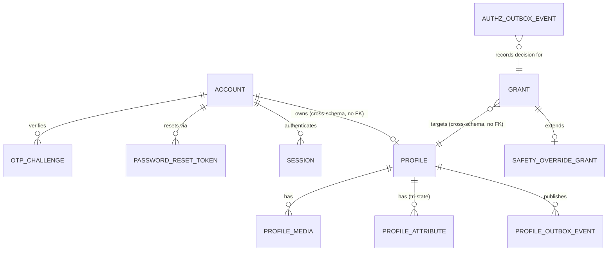
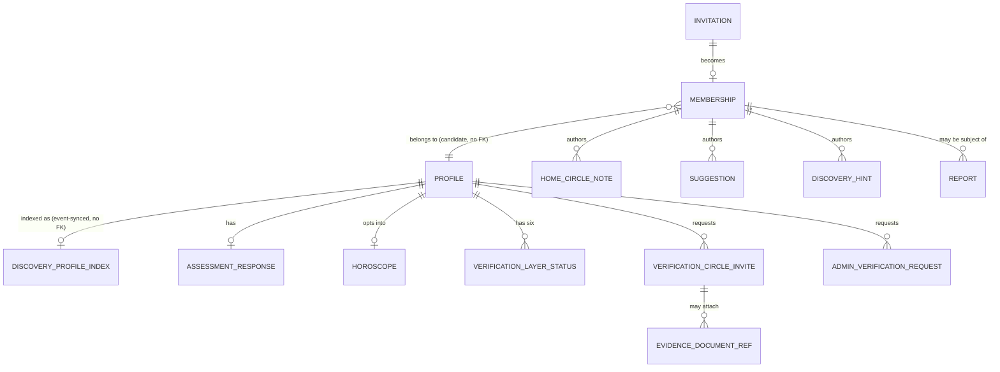
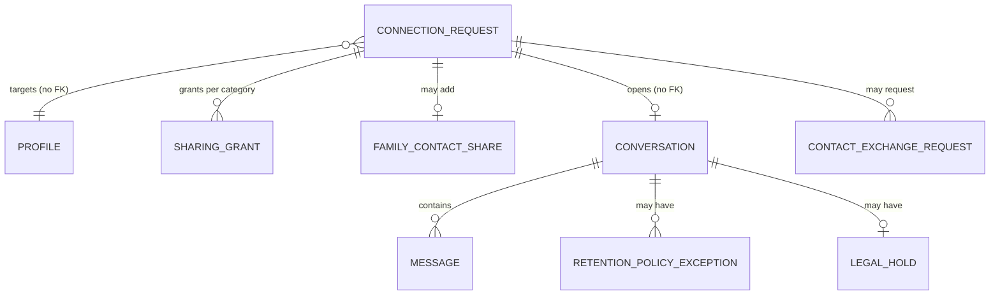
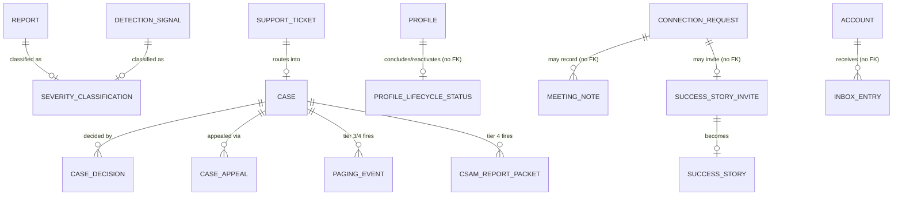

# 07a — ER Model — MOD03 Mangaly

## Revision log (append-only, in-place file)

| Date | Change | Reason / Ref (blocker or CR) |
|---|---|---|
| 2026-09-13 | Initial design. Three-pass process complete (Draft → Cross-validated → Sign-off ready) against the Sealed `07-tech-reqs.md` (102/102 TRs, 0 blockers), `architecture.md`'s fixed 14-component/12-schema decomposition, `/MODULE-ARCHITECTURE-STANDARD.md` §4/§4b/§4c/§5/§6, `v1-decisions.md`'s concrete V1 values, and `CODING-GUIDE.md`'s project structure. Full DB implementation (`07a-db-implementation/`) produced alongside. Not yet human-approved — status held at Ready for Review per this pipeline's standing rule that only the human approves and seals a pipeline artifact. | Step 7a initial run — krishna kategaru (autonomous), 2026-09-13. |
| 2026-09-13 | **Live-verification pass**, same day, before human review: applied `init.sh`/`migrations/001-initial.sql` against a real running Postgres instance (project's local dev server, `localhost:5433`, per root `.mcp.json` — a dedicated `mangaly` database, not the shared `forKhatridb`), not just reviewed on paper. Found and fixed three real defects the paper design missed: (1) `CREATE ROLE` inside the migration failed with "permission denied to create role" — role creation is cluster-wide and admin-only; moved role provisioning out of the migration entirely into `init.sh`'s own admin-connection step, migrations now only `GRANT` to pre-existing roles; (2) re-running the migration a second time failed on the first `CREATE POLICY` (Postgres has no `CREATE POLICY IF NOT EXISTS`) — fixed by preceding every one of the ~66 `CREATE POLICY` statements with a matching `DROP POLICY IF EXISTS`, confirmed by an actual second clean run with zero errors; (3) `mangaly_app` had no `USAGE` grant on `mangaly_identity` at all (a schema-level gap distinct from any RLS predicate) and the 11 `outbox_event` tables plus `retention_job_run` had RLS reasoned about in comments but never actually enabled — both fixed and re-verified live. Functional RLS behavior (not just "RLS is enabled") was then tested as the actual non-owning `mangaly_app` role: zero-row results with no session context, correct single-row results scoped to `SET LOCAL mangaly.account_id`/`mangaly.authz_context`, correct Home-Circle-grant-scoped visibility, confirmed `SET LOCAL` does not leak across transactions, and confirmed `mangaly_app` owns zero of the 61 tables. See `07a-db-implementation/README.md` "Live-verified, not just reviewed on paper" for the full list of what was and was not exercised. Status remains Ready for Review — this pass fixed defects the three internal passes' static review missed, it does not itself constitute human approval. | Live-verification pass — krishna kategaru (autonomous), 2026-09-13. |
| 2026-09-13 | **Critique-mindset review** (same standard applied to `07-tech-reqs.md`: folder structure, mutation correctness, data structures, loose coupling, correct system-design pattern usage, common utilities). Independently re-verified live-verification claims by direct inspection rather than trusting the prior pass's report: table count (61), RLS-enabled count (59 = 61 minus `mangaly_platform`'s 2 deliberate exceptions, correctly wired via the dynamic per-schema `outbox_event` loop plus explicit statements), zero drift between `schema.sql` and `migrations/001-initial.sql` (identical `CREATE TABLE` sets), zero cross-schema foreign keys, and internally-consistent seed data. Found one real, if minor, defect: `07a-db-implementation/README.md`'s manual "Rollback / start over" snippet hardcoded port `5432` (Postgres's generic default) instead of this project's actual `5433` — inconsistent with `.env.example`, `init.sh`'s `${DB_PORT}` usage throughout, and `init.sh`'s own correctly-parameterized auto-printed rollback command. Fixed. No other defect found. | Critique review — krishna kategaru (autonomous), 2026-09-13. |
| 2026-09-13 | **Sealed.** Approver re-verified the three-pass design, the live-verification claims (independently re-checked, not merely trusted), and the one fix above, before approving. Step 8 (Security & Performance) is cleared to begin — its own mandatory input is both `07-tech-reqs.md` and this file Sealed/Approved. | Approved — krishna kategaru, 2026-09-13. |
| 2026-09-13 | **Post-seal correction routed from Step 8 (SP102).** Step 8's STRIDE pass over TR102 found a real cross-account defect in this model's `mangaly_platform.idempotency_key` table: it declared `UNIQUE (idempotency_key, endpoint)` — a **global** key namespace — even though TR102 specifies the idempotency key is *client-generated* and the table already carried an `account_id` column. A lookup on `(idempotency_key, endpoint)` therefore matches another account's row, returning **account A's stored `response_snapshot` to account B** on any key collision or replay, and additionally lets one account block another's writes by burning keys. This model's own Pass-2 cross-validation row ("Idempotency mechanism specified for every mutable endpoint TR102 names — Pass, `UNIQUE (idempotency_key, endpoint)`") had recorded the constraint as correct, and the schema comment asserting "there is no 'another actor's row' concept to leak here" was wrong for this table specifically — `rate_limit_counter` genuinely has no per-account row concept, but `idempotency_key` stores a response belonging to exactly one account. Fixed by new migration `002-idempotency-account-scope.sql`: `UNIQUE (account_id, idempotency_key, endpoint)` plus an RLS policy keyed on `mangaly.account_id` as defense in depth beneath the middleware's own scoping, with `schema.sql` updated to match and its incorrect comment corrected. Verified live against the running Postgres instance as the non-owning `mangaly_app` role (account A sees its own row; account B sees zero for the identical key; B can still use that key for its own row; no session context returns zero), and the migration confirmed idempotent on re-run. The `mangaly_platform` "No RLS" justification is now table-by-table rather than blanket. This is the pipeline's downstream-finding mechanism working as designed — a Sealed artifact corrected by a named, traceable downstream finding rather than silently, or left standing because the file was already Sealed. | Step 8 finding SP102 — krishna kategaru (autonomous), 2026-09-13. |

## Sources read in full before drafting

`07-tech-reqs.md` (all 102 items, TR001–TR102), `architecture.md` (14-component
C4-L3 breakdown, §2.1–§3), `/MODULE-ARCHITECTURE-STANDARD.md` (§§1–8),
`v1-decisions.md` (DEC-V1-001 through DEC-V1-009, "What stays open," "Known
technical debt"), `CODING-GUIDE.md` (project structure, §1–§8),
`/ARCHITECTURE.md` (Container diagram, ADR-002/004/007/018), and targeted
re-reads of `02-functional-requirements.md` (FR001–FR102 headers plus FR002,
FR035, FR092–FR096 in full) and `01-business-requirements.md` (BR08's six
verification-layer list) to resolve two field-level details `07-tech-reqs.md`
referenced but did not itself enumerate (the discoverability-tier field list
already fixed at DEC-V1-001, and BR08's six named layer names — "account
authenticity, identity/age, selected profile facts, Home Circle relationship,
community/factual verification, and Mangaly operational verification").
`03-ux.md`, `04-ui.md`, and `05-test-scenarios.md` were confirmed structurally
1:1 with the FR set (identical numbering/screen inventory) via header
extraction; `07-tech-reqs.md` itself was already produced by looping over
every FR alongside its UX/UI/TS material (see that file's own revision
history), so this pass treats `07-tech-reqs.md` as the authoritative
distillation of that material for data-structure purposes, per this agent's
own brief ("07-tech-reqs.md — your primary input... every tech req informs
your ER model").

## Pass 1 — Draft: component/schema decomposition

`architecture.md` §3 fixes 12 schemas for the module's 14 components
(Identity Bridge and Audit Bridge are schema-less by design). This ER model
adds **two** schemas beyond that fixed list, each justified individually
below rather than silently invented — see "Assumptions and deviations from
`architecture.md`'s schema count" for the full reasoning:

- `mangaly_identity` — an **interim** credential/session store for Identity
  Bridge, required by TR092–TR095 (Sealed, Must-priority) even though
  `architecture.md` describes Identity Bridge as having "no schema of its
  own." This is `v1-decisions.md`'s own named "Known technical debt"
  (IA092), not a new architectural decision this file is making unilaterally.
- `mangaly_platform` — shared idempotency-key and rate-limit-counter tables
  (`/MODULE-ARCHITECTURE-STANDARD.md` §4b/§4c, TR102, TR037-canonical).
  Not a business-logic component's schema (doesn't add to or compete with
  `architecture.md`'s 12-schema business list) — the same infrastructure
  class as the in-process event bus, given a schema only because its state
  must actually persist across restarts/instances (TR037's own explicit
  reason a per-component or in-memory counter is disallowed).

Total: **14 schemas**, one PostgreSQL instance (`MangalyDB`), matching
`/ARCHITECTURE.md`'s Container diagram exactly (no new container, no new
database instance).

## ER diagrams

Fourteen schemas and ~60 tables do not fit legibly in one diagram — split by
functional cluster, matching how a reader would actually navigate the module.
Cross-schema references (dashed) are **not** enforced by a DB-level foreign
key (see Assumptions) — shown here to make the actual data flow visible.

### Cluster 1 — Identity, Authorization, Profile

### Cluster 2 — Home Circle, Discovery, Compatibility, Trust

### Cluster 3 — Connection & Sharing, Communication

### Cluster 4 — Safety, Lifecycle, Operations, Notification

## Entity/attribute → source requirement traceability

Every table below traces to a specific, Sealed TR (and, through it, an FR).
Full column-level DDL with inline `[TRxxx]` comments is in
`07a-db-implementation/schema.sql` — this table is the entity-level index
into that file, per the required output format.

### `mangaly_identity` (Identity Bridge — interim; see Assumptions)

| Table | Traces to | Sensitivity | Notes |
|---|---|---|---|
| `account` | TR092, FR092 | PII/credential | Interim technical debt (IA092). |
| `otp_challenge` | TR095, FR095 | Sensitive | Single-use, bounded validity. |
| `password_reset_token` | TR094, FR094 | Sensitive | Single-use, short TTL. |
| `session` | TR101, TR090, FR090/FR101 | Sensitive | Backs immediate logout revocation. |

### `mangaly_platform` (shared infra — not a business component)

| Table | Traces to | Sensitivity | Notes |
|---|---|---|---|
| `idempotency_key` | TR102, MODULE-ARCHITECTURE-STANDARD §4b | Low | One shared table for every endpoint TR102 names. |
| `rate_limit_counter` | TR037 (canonical), TR093, TR095, §4c | Low | One shared counter for verifier invites/login failures/OTP resend. |

### `mangaly_authz` (Authorization Engine — BR04, BR05)

| Table | Traces to | Sensitivity | Notes |
|---|---|---|---|
| `grant` | TR017, TR018, TR010, TR011 | High | Canonical single grant model; candidate_info/family_info as two independently-typed scopes (TR018). |
| `safety_override_grant` | TR024 | High | Own named, individually-audited grant type. |
| `outbox_event` | TR017 | — | Every grant/deny decision, same transaction. |

### `mangaly_profile` (Profile & Completeness — BR01)

| Table | Traces to | Sensitivity | Notes |
|---|---|---|---|
| `profile` | TR001, TR024, TR089 | PII | Existence tier + pause state + language preference. |
| `profile_media` | TR001, TR002, TR006 | PII/media | storage_ref only — TR006's signed URLs never stored. |
| `profile_attribute` | TR002, TR003, TR004, TR027 | PII | Tri-state (unset/declined/value); tier membership is application config (DEC-V1-001), not a DB column. |
| `outbox_event` | TR001, TR069 | — | ProfileCreated and other events. |

### `mangaly_home_circle` (Home Circle — BR02, BR03, BR13)

| Table | Traces to | Sensitivity | Notes |
|---|---|---|---|
| `invitation` | TR007, TR009 | PII | decline is a distinct write (TR009). |
| `membership` | TR008, TR010 | PII | Removal preserves history (status, not delete). |
| `home_circle_note` | TR016 | Sensitive | Family-only default; forwarded_at gates candidate visibility. |
| `suggestion` | TR014 | PII | Structurally separate from `connection_request`. |
| `discovery_hint` | TR029, DEC-V1-003 | Low (by design) | No name/photo/contact column — structural absence. |
| `report` | TR011 | Sensitive | False/inappropriate relationship claim. |
| `connection_home_circle_scope` | TR060, TR061 | PII | Sole per-connection scoping trigger. |
| `family_introduction` | TR062 | PII | Two independently-resolved exposure timestamps. |
| `outbox_event` | TR069 | — | |

### `mangaly_discovery` (Discovery & Ranking — BR06)

| Table | Traces to | Sensitivity | Notes |
|---|---|---|---|
| `discovery_profile_index` | TR021, TR022, TR025, TR029 | PII (subset) | Own FTS read model; no view_count/rejection_count column exists (TR022). |
| `outbox_event` | TR069 | — | |

### `mangaly_compatibility` (Compatibility Engine — BR07)

| Table | Traces to | Sensitivity | Notes |
|---|---|---|---|
| `assessment_response` | TR033 | Sensitive | Instrument-agnostic; instrument_key nullable until Product selects one. |
| `horoscope` | TR034 | Sensitive | Opt-in gated at query time, not convention. |
| `outbox_event` | TR069 | — | |

### `mangaly_trust` (Trust & Verification — BR08)

| Table | Traces to | Sensitivity | Notes |
|---|---|---|---|
| `verification_layer_status` | TR035, TR036, TR039 | PII | Six independent layers; no aggregate score column anywhere. |
| `verification_circle_invite` | TR037, DEC-V1-004 | PII | Idempotent per (profile, verifier, fact). |
| `admin_verification_request` | TR038 | PII | Unconditional fallback path, 1-hour SLA target. |
| `evidence_document_ref` | TR040 | Highest (raw docs) | Never exposed via Evidence-panel response model. |
| `outbox_event` | TR069 | — | |

### `mangaly_connection` (Connection & Sharing — BR09, BR10)

| Table | Traces to | Sensitivity | Notes |
|---|---|---|---|
| `connection_request` | TR042, TR043, TR044, TR045 | PII | No auto-expiry transition; no single-active-connection constraint. |
| `sharing_grant` | TR046, TR047 | PII | Row-per-category, own timestamp. |
| `family_contact_share` | TR048 | PII | Two independently-resolved AuthzContexts. |
| `outbox_event` | TR069 | — | |

### `mangaly_communication` (Communication — BR11, BR12)

| Table | Traces to | Sensitivity | Notes |
|---|---|---|---|
| `conversation` | TR049, TR055 | Sensitive | No seriousness/exclusivity column. |
| `message` | TR049, TR050, TR051 | Highest (message content) | One application-level read path beyond sender/recipient (TR051). |
| `retention_policy_exception` | TR053 | Sensitive | Scope: one conversation only. |
| `legal_hold` | TR054 | Sensitive | Structurally skips deletion while active. |
| `retention_job_run` | TR054 | Low | Failure-alerting, built independent of DPDP-gated scope question. |
| `contact_exchange_request` | TR057, TR058, TR059 | PII | Each channel independently gated (phone/email). |
| `outbox_event` | TR052, TR069 | — | Deepest test-investment component alongside Authorization Engine. |

### `mangaly_safety` (Safety Intelligence — BR14, BR20-reporting)

| Table | Traces to | Sensitivity | Notes |
|---|---|---|---|
| `report` | TR063, TR087 | Sensitive | Shared by in-app and post-meeting reporting (identical pipeline). |
| `detection_signal` | TR064, TR028 | Sensitive | No Home Circle/Trust reference anywhere (structural absence). |
| `severity_classification` | TR065, TR068 | Sensitive | Drives SLA clock per DEC-V1-006. |
| `outbox_event` | TR069 | — | |

### `mangaly_lifecycle` (Lifecycle & Outcomes — BR18, BR19, BR20-guidance)

| Table | Traces to | Sensitivity | Notes |
|---|---|---|---|
| `profile_lifecycle_status` | TR079, TR080, TR081 | PII | Sole write path is the conclude/reactivate endpoint. |
| `meeting_note` | TR086 | PII | Manual-only. |
| `success_story_invite` | TR082, TR083 | PII | Independent, revocable per-party consent. |
| `success_story` | TR084 | PII (allow-listed) | automated_scan_passed required before publish. |
| `outbox_event` | TR081, TR069 | — | Sole publisher of `mangaly.activity_summary` to Dashboard (MOD05). |

### `mangaly_operations` (Operations — BR16)

| Table | Traces to | Sensitivity | Notes |
|---|---|---|---|
| `case` | TR072, TR073, TR074 | High | One state machine for all case types. |
| `case_decision` | TR072 | High | |
| `case_appeal` | TR075 | High | Reviewer-independence is a soft preference, not a constraint. |
| `operator_role_scope` | TR076 | High | No `*`/all-cases enum value can exist. |
| `paging_event` | TR065, DEC-V1-009 | High | Tier 3/4 auto-fire. |
| `csam_report_packet` | TR065, DEC-V1-009 | Highest (legal) | Rule 11(2) source-material handover timestamp. |
| `support_ticket` | TR100 | PII | Safety-classified tickets route into `case`. |
| `outbox_event` | TR076, TR069 | — | 100% admin-action coverage, lint-enforced. |

### `mangaly_notification` (Notification Bridge — inbox only)

| Table | Traces to | Sensitivity | Notes |
|---|---|---|---|
| `inbox_entry` | TR098 | PII (summary) | Independent of push-delivery success. |

## Data ownership (schema-per-component)

| Schema | Owning component | RLS required? | Primary tables |
|---|---|---|---|
| `mangaly_identity` | Identity Bridge (interim) | Yes (self-only) | account, otp_challenge, password_reset_token, session |
| `mangaly_platform` | — (shared infra) | No (opaque keys, no cross-actor row) | idempotency_key, rate_limit_counter |
| `mangaly_authz` | Authorization Engine | Yes | grant, safety_override_grant |
| `mangaly_profile` | Profile & Completeness | Yes | profile, profile_media, profile_attribute |
| `mangaly_home_circle` | Home Circle | Yes | invitation, membership, home_circle_note, suggestion, discovery_hint, report |
| `mangaly_discovery` | Discovery & Ranking | Yes | discovery_profile_index |
| `mangaly_compatibility` | Compatibility Engine | Yes | assessment_response, horoscope |
| `mangaly_trust` | Trust & Verification | Yes | verification_layer_status, verification_circle_invite, evidence_document_ref |
| `mangaly_connection` | Connection & Sharing | Yes | connection_request, sharing_grant, family_contact_share |
| `mangaly_communication` | Communication | Yes | conversation, message, legal_hold, contact_exchange_request |
| `mangaly_safety` | Safety Intelligence | Yes | report, detection_signal, severity_classification |
| `mangaly_lifecycle` | Lifecycle & Outcomes | Yes | profile_lifecycle_status, meeting_note, success_story |
| `mangaly_operations` | Operations | Yes | case, case_decision, case_appeal, paging_event, csam_report_packet |
| `mangaly_notification` | Notification Bridge | Yes | inbox_entry |

Identity Bridge's *authorization* function and Audit Bridge remain genuinely
schema-less, matching `architecture.md` §2.1 exactly — Audit Bridge forwards
every event to the platform Audit Log Store and keeps no local copy.

## Cross-validation results (Pass 2)

| Check | Result | Notes |
|---|---|---|
| Every FR/TR with a data implication has a corresponding ER element | Pass | All 102 TRs traced; see per-schema tables above. TR077/TR078 (deferred BR17) correctly have no table — confirmed by inspection that no other table carries an Agent-identity or Agent-scope column. |
| Every ER element traces to a requirement (no orphans) | Pass | Every table cites at least one TR. No speculative table added beyond the two infrastructure schemas, both independently justified above. |
| Schema organization follows `architecture.md`'s fixed 12-schema business decomposition | Pass, with two named additions | `mangaly_identity` and `mangaly_platform` are additions to, not a competing redecomposition of, the fixed list — both justified individually (see Assumptions), neither reassigns an existing component's schema. |
| RLS policies designed for every sensitive data entity | Pass | All 13 business/identity schemas have RLS enabled at creation time in `schema.sql`; `mangaly_platform` is the one deliberate, justified exception (no cross-actor row concept). |
| Idempotency mechanism specified for every mutable endpoint TR102 names | Pass | `mangaly_platform.idempotency_key`, single shared table, `UNIQUE (idempotency_key, endpoint)`. |
| Rate-limiting is one shared utility, not duplicated | Pass | `mangaly_platform.rate_limit_counter`, called by TR037/TR093/TR095 alike. |
| Outbox pattern present for every business-logic component that publishes | Pass | 11 `outbox_event` tables, one per publishing schema (TR069's "all 11 schema-owning business-logic components"), each in the same schema/transaction as the state change it describes. |
| No cross-schema database-level FK (schema ownership integrity) | Pass | Verified by inspection of `schema.sql` — every cross-schema reference is a plain, indexed `uuid` column with no `REFERENCES` clause into another schema. |
| Structural absences build correctly, not just documented | Pass | `discovery_hint` has no name/photo/contact column (TR029); `mangaly_safety` tables have no column referencing `mangaly_home_circle`/`mangaly_trust` (TR064/TR066); no `view_count`/`rejection_count`/trust-score column exists anywhere in the schema (TR022/TR039). |
| Cross-module dependencies declared in `/ARCHITECTURE.md`/`modules.md` | Pass | The one cross-module data-adjacent edge (`mangaly.activity_summary` → Dashboard/MOD05) is event-only, not a shared table/DB — `mangaly_lifecycle.outbox_event` is its sole publisher (TR081), matching the async, privacy-filtered pattern `/ARCHITECTURE.md` already fixed. No table in this schema is queried by, or grants a DB-level connection to, any other module's container. |
| Every NOT NULL/UNIQUE/CHECK constraint is justified by a requirement | Pass | E.g. `account_has_identifier` (FR092's "phone or email"), `UNIQUE(profile_id, verifier_account_id, fact_reference)` (TR037's idempotency), `case_type_scope` typed as the enum itself with no wildcard member (TR076), `tier BETWEEN 1 AND 4` (DEC-V1-006's four tiers). No default/unjustified constraint found. |

No orphans found in either direction. No cross-module dependency gaps found.

| Live-verification check (post-Pass-3, same-day) | Result | Notes |
|---|---|---|
| `init.sh` applies cleanly against a real Postgres instance from empty | Pass | 14 schemas, 61 tables, zero errors. |
| Migration is genuinely idempotent (re-run against an already-applied DB) | Pass (after fix) | `CREATE POLICY` has no `IF NOT EXISTS` — found failing on first re-run, fixed with `DROP POLICY IF EXISTS` before every policy. |
| Non-owning runtime role (TR017) actually enforced | Pass | `mangaly_app` owns 0/61 tables, confirmed by direct query, not asserted from DDL text. |
| RLS actually restricts access when queried as `mangaly_app` (not the owner) | Pass (after fix) | Two real gaps found and fixed: missing `USAGE` grant on `mangaly_identity`; RLS never enabled on 11 `outbox_event` tables + `retention_job_run`. |
| Idempotency-key / rate-limit-counter tables usable end to end | Pass | Live INSERT/SELECT confirmed as `mangaly_app`. |
| `SET LOCAL` pooling-safety semantics | Pass (structural) | Confirmed a value set in one transaction does not leak to the next statement on the same session; a real connection-pooler-in-transaction-mode test is explicitly out of scope here (no pooler in front of local Postgres) — carried forward to Step 8/9 per TR017's own release-blocking requirement. |

## Assumptions and deviations from `architecture.md`'s schema count

1. **`mangaly_identity` schema (interim).** `architecture.md` §2.1 states
   Identity Bridge has "no Mangaly-owned business logic and no schema of its
   own." TR092–TR095 (Sealed, Must-priority, approved 2026-09-13) explicitly
   require Mangaly to build its own minimal credential/session store because
   Mangaly is the first module in build order and no Common Platform
   Identity & Trust Service exists yet to delegate to (ADR-016/017). This is
   not a re-opening of `architecture.md` — it is `v1-decisions.md`'s own
   named "Known technical debt" (resolving IA092), and this ER model treats
   the later, more specific, Sealed statement (TR092) as authoritative on
   this one narrow point, exactly as the tech-reqs file itself already did.
   **Migration plan**, per `v1-decisions.md`: this schema is retired and its
   live rows migrated into a future Common Platform Identity module once one
   exists — recorded here explicitly so it is planned, not rediscovered.
2. **`mangaly_platform` schema.** Neither `architecture.md`'s 12-schema list
   nor any individual TR names a schema for idempotency-key or rate-limit
   state, but `/MODULE-ARCHITECTURE-STANDARD.md` §4b/§4c and
   `CODING-GUIDE.md`'s project structure both fix `idempotency/` and
   `rate_limiting/` as shared, cross-cutting modules — the same
   infrastructure class as `events/` (the in-process bus), which also has no
   business-schema home. Since this state must be genuinely persistent
   (survive a process restart, work across instances — TR037's own stated
   reason against an in-memory counter), it needs a schema; `mangaly_platform`
   is that home, owned by no single business component, consistent with
   "one shared implementation, never duplicated per component."
3. **Cross-schema references carry no database-level FOREIGN KEY.** A real
   FK from, e.g., `mangaly_connection.connection_request.target_profile_id`
   to `mangaly_profile.profile.id` would require granting cross-schema
   `REFERENCES`/read access and would let Connection & Sharing's own DDL
   silently encode a dependency on Profile's internal row lifecycle —
   exactly what `/MODULE-ARCHITECTURE-STANDARD.md` §4's "no cross-schema
   join written by any component other than the schema's own owner" rule
   forbids. Referential integrity across schemas is therefore an
   application-layer guarantee (the owning component's own `interface.py`),
   not a database one; within one schema (same owning component), real FK
   constraints with an explicit cascade rule are used throughout.
4. **`mangaly_discovery.discovery_profile_index` is an eventually-consistent
   read model, not a live cross-schema query.** TR025 requires Postgres FTS
   "inside this schema," which is only possible if Discovery holds its own
   copy of the searchable text — this copy is kept in sync by subscribing to
   Profile's domain events (the same in-process bus pattern
   `/MODULE-ARCHITECTURE-STANDARD.md` §6 already establishes for
   Notification/Audit/Operations), not by Discovery querying
   `mangaly_profile` directly. This is a deliberate, bounded exception to
   TR005's general "no cached/derived value that could drift" caution —
   TR005 warns against a component re-deriving *its own* business logic from
   a cache; this is a different, standard CQRS-style pattern (a read model
   owned entirely by its own consuming component, populated by the same
   event bus every other cross-cutting reaction already uses).
5. **`mangaly_profile.profile_attribute` uses a generic
   (category, attribute_key, state, value) shape**, not one literal column
   per field. FR002's own Assumptions state "exact field schema per category
   is implementation-stage"; DEC-V1-001 fixes which fields belong to which
   *tier*, not a fixed DDL shape. A generic tri-state table satisfies TR002's
   structural requirement (declined is a first-class state, never collapsed
   to NULL) without hardcoding ~25 individual columns for fields the source
   material itself says may still be refined — avoiding both under-
   specification (a bare JSON blob with no tri-state guarantee) and
   over-engineering (a rigid wide table for a field list not yet finalized).
   Tier membership (existence/discoverability/enhanced) is intentionally an
   application-config mapping, not a DB column, for the same reason TR003
   keeps `is_discoverable()` a single function rather than duplicated logic —
   one source of truth for tier membership.
6. **Outbox tables are per-schema, not one shared table.** TR069 requires
   "all 11 schema-owning business-logic components" to publish via outbox;
   since the guarantee is "same transaction as the state change," and the
   state change happens inside the publishing component's own schema, the
   outbox row must be in that same schema to get real transactional
   atomicity from one `BEGIN...COMMIT` — a shared cross-schema outbox table
   would technically work in one physical Postgres instance but would
   violate the same "no cross-schema write by any component other than the
   schema's own owner" principle a shared FK would.
7. **Safety category taxonomy (`mangaly_safety.report.category` /
   `detection_signal.signal_type`) is stored as `text`, validated against
   DEC-V1-006's named taxonomy at the application layer, not a hardcoded
   Postgres enum.** DEC-V1-006 names examples per tier but the source
   material does not enumerate a closed, numbered list of exactly 15
   categories anywhere this pass could locate verbatim; TR068 already fixes
   the taxonomy as "a single versioned configuration object" both Safety and
   Operations read from — this ER model defers to that same configuration
   object rather than hardcoding a DB enum that could drift from it.
8. **RLS predicates are structurally correct and real, but representative,
   not the complete BR04 permission matrix.** TR017 itself states "exact
   permission matrix/taxonomy remains implementation-stage." Every policy in
   `schema.sql` uses genuine predicates (self-ownership via
   `mangaly_authz.is_self()`, scope grants via `mangaly_authz.has_scope()`,
   or an `operator_role` check) — none is a placeholder `USING (true)` except
   `discovery_hint` (deliberately broad-read, per DEC-V1-003 — it is designed
   to be visible to any Discovery viewer) and two Home-Circle join tables
   where the underlying participants' own tables already carry the real
   restriction. Step 8 re-verifies every policy against the fully-specified
   permission matrix once BR04's own detail work completes.
9. **`mangaly_identity`'s RLS keys on `mangaly.account_id`, not
   `mangaly.authz_context`.** Identity Bridge resolves *before* the
   Authorization Engine's fuller chain (`architecture.md` §2.2: `AuthZ -->
   Identity`), so a simpler, earlier-available session variable is used for
   this one schema. The narrow, audited exception this requires — an
   exact-identifier-only lookup function for login/signup/OTP/reset, which
   necessarily run before any session variable exists — is named explicitly
   in `schema.sql` (`mangaly_identity.lookup_by_identifier()`) and flagged to
   Step 8 for STRIDE review, per this file's own Definition of Done.
10. **`mangaly.operator_role` session variable** (used by every
    Operations-adjacent RLS policy) is a second, narrower context variable
    the Authorization Engine sets alongside `mangaly.authz_context` when the
    resolved actor holds an Operations role — not a new authorization
    concept, just the DB-level predicate form of TR076's "no wildcard role"
    structural rule.

## Approval

Database Architect / Tech Lead — [x] Approved — krishna kategaru, 2026-09-13
