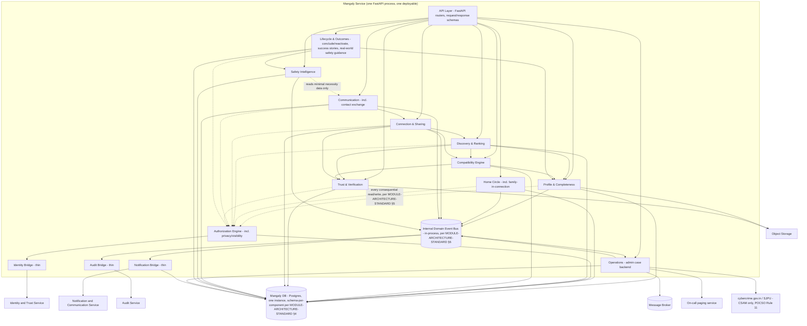

# Architecture — MOD03 Mangaly

## Revision history
| Date | Change | Reason / Ref |
|---|---|---|
| 2026-09-12 | Initial version. Written because Mangaly is, in actual practice, the only module currently proceeding through this pipeline (Steps 1-5 Sealed; `/ARCHITECTURE.md` ADR-016/017/018 already record this build-order reality at the project level). | Chief Architect — krishna kategaru (autonomous), 2026-09-12. |
| 2026-09-12 | Trimmed. The four internal-architecture decisions this file originally carried (internal deployment shape, schema-per-component data ownership, authorization chokepoint, in-process domain event bus) were, on review, not actually Mangaly-specific — they were general patterns that happened to be written while building Mangaly first. Extracted them to `/MODULE-ARCHITECTURE-STANDARD.md` so every future module applies the same pattern instead of each reinventing it, which is what actually makes later cross-module combination easy. This file now only keeps what's genuinely Mangaly-specific: its placement recap, its own component list, and its traceability. | Chief Architect — krishna kategaru (autonomous), 2026-09-12. |
| 2026-09-12 | Impact Analysis follow-up: addressed every architecture-level finding `06-impact-analysis.md` (Step 6) raised. Added two external edges (on-call paging service; cybercrime.gov.in/SJPU CSAM reporting per POCSO Rule 11 — DEC-V1-009 resolves IA065/IA068/IA074). Corrected Notification Bridge from purely thin to schema-owning for its in-app inbox record (`mangaly_notification`, resolves IA098) — delivery itself stays a thin Common Platform pass-through. Also caught and fixed a pre-existing internal inconsistency while doing this: Operations was mislabeled "thin bridge" in §2.1 while the traceability table already correctly called it "Business logic" — corrected to match, since BR16's case/decision/appeal data is genuinely Mangaly-owned. Component count corrected from a stale "13" to the accurate 14 (13 source-cited layers, with Connection+Sharing merged, plus Audit Bridge as the cross-cutting 14th) throughout. Added the RLS pooling-safety and idempotent-mutation-endpoint requirements (`/MODULE-ARCHITECTURE-STANDARD.md` §4/§4b) to §3's pattern-application table. | Impact Analysis follow-up — krishna kategaru (autonomous), 2026-09-12. |

## Purpose and scope

This file is Mangaly's **concrete application** of `/MODULE-ARCHITECTURE-STANDARD.md` (the generic pattern every module's internal architecture follows) plus `/ARCHITECTURE.md` (the cross-module decisions: Mangaly's container, its database, its integration edges). Read both of those first if anything here is unclear about *why* a pattern is shaped the way it is — this file states *what Mangaly's own components are*, not *why components should be structured this way in general*, which is the generic standard's job.

Normally this level of detail is Step 7's `07b-component-diagram.md`, produced after Tech Reqs. It is being produced now, ahead of that, because Mangaly is the pipeline's active module and downstream steps need it as an input, not an eventual byproduct.

## 1. Mangaly's placement in the platform (recap only — decided in `/ARCHITECTURE.md`, not here)

- **Container:** `MangalyService` (FastAPI/Python) — its own process, its own isolated Postgres `MangalyDB`, its own network policy. Not part of the Core Platform modular monolith.
- **Why isolated:** the platform's highest privacy/regulatory load among community-facing modules (family data, controlled communication) — ADR-001, ADR-002, ADR-011. This was never a function of ship order (ADR-017), which is why it holds even though Mangaly is shipping first, alone, before the modules the original plan expected to ship first.
- **Build order:** the first module in actual build order (ADR-016) — a load-bearing fact for this file, since it means Mangaly cannot assume the Core Platform monolith, Payment Services, or a dedicated Search Service exist yet when it goes live.
- **External edges** (all already resolved in `/ARCHITECTURE.md`'s Dependency resolution and Shared concern tables — restated here only so this file is self-contained for a reader who hasn't opened that one):

| Edge | Direction | Pattern | Why |
|---|---|---|---|
| Web Client → Mangaly Service | in | REST/JSON, HTTPS | Standard client-service call. |
| Mangaly Service → Identity & Trust Service | out, sync | REST, short-lived JWT | Base identity/auth/Level-1-2 trust (ADR-004). Mangaly never forks its own login table. |
| Mangaly Service → Object Storage | out, sync | Direct upload/fetch | Profile photos, video introduction, verification evidence (BR01, BR08). |
| Mangaly Service → Notification & Communication Service | out, async (Broker) | Publish event, service renders/sends | Connection requests, messages, safety alerts (ADR-006) — Mangaly never blocks on delivery. |
| Mangaly Service → Audit Service | out, async (Broker) | Publish audit event | Every BR15-relevant action (ADR-011). |
| Mangaly Service → Message Broker → Payment Services App | out, async, one-way | `benefit_eligible` event | Mangaly never calls Payment Services synchronously and never writes a Coupon record itself. |
| Mangaly Service → Message Broker → Dashboard | out, async, one-way | `mangaly.activity_summary` event, privacy-filtered | The one edge chosen async specifically *because* a synchronous pull would open an implicit read-path into the platform's most sensitive store. |
| Admin & Governance Console → Mangaly Service | out, sync (federated view) | REST | Mangaly's admin case-queue view is a plugin inside the one platform console (ADR-012), not its own admin app. |
| Mangaly Service → Search Service | **none in V1** | — | Embedded Postgres full-text search inside Mangaly's own schema, not a call to an external service (ADR-007, re-confirmed by ADR-018). |
| Mangaly Service → AI Service | **none, or conditional-only** | — | AI Service does not exist yet (ADR-009, deferred). FR028/FR064's "if an AI signal is used, label it as inference" language is conditional — nothing in this module's build requires AI Service to exist. |
| Operations component → On-call paging service | out, sync (webhook/API) | Auto-triggered the moment a case is classified Tier 3/4 | Resolves `06-impact-analysis.md` IA065/IA068/IA074's finding that DEC-V1-006's severity taxonomy named no actual mechanism to reach its most severe exits — see `v1-decisions.md` DEC-V1-009. Specific vendor is a Step 7 procurement choice. |
| Operations component → National Cyber Crime Reporting Portal (cybercrime.gov.in) / SJPU / local police | out, external, legal | Immediate, parallel to internal block — not sequenced after investigation | Mandatory under POCSO Rules 2020 Rule 11 for suspected CSAM; Rule 11(2) additionally requires handing over the material and its source, not merely notifying. Confirmed via live research, `v1-decisions.md` DEC-V1-009. |

## 2. Component architecture (C4 Level 3) — inside the Mangaly Service container

### 2.1 Component boundaries: taken from Mangaly's own source language, not re-derived

Per `/MODULE-ARCHITECTURE-STANDARD.md` §2 (use a module's own source document's stated internal layering before inventing one), Mangaly's Master Requirements Input already commits to an internal architecture principle — the module is "one coherent capability built from internal, thin, replaceable layers: identity, profile, Home Circle, authorization, discovery, compatibility, trust, connection, sharing, communication, safety, notifications, operations" (§30). The component diagram below is built directly from that list, not a second, independently-derived decomposition from the 20 BRs.

Three fold-ins to that list, recorded explicitly per the generic standard's own requirement that deviations never be silent:
- **Privacy/visibility (BR05)** is folded into the **Authorization** layer — BR05 itself states privacy is "a system property," and its mechanism (searchable-vs-visible, family-boundary enforcement) *is* an authorization decision, evaluated by the same chain FR017 defines.
- **Family involvement in an established connection (BR13)** is folded into the **Home Circle** layer — it is Home Circle collaboration behavior scoped to one specific connection, not a new capability class.
- **Identity** is kept as a genuinely *thin bridge* component — no Mangaly-owned business logic and no schema of its own; it only translates to the platform Identity & Trust Service.
- **Operations is corrected here to full business-logic status**, not a thin bridge: BR16's admin case queue, decisions, and appeals are real Mangaly-owned data (schema-owning, per §3) — the original draft of this file inconsistently called it "thin" in this list while the traceability table (§2.3) already correctly called it "Business logic." This section now matches that table rather than contradicting it.
- **Notifications is a hybrid, not a purely thin bridge**, corrected per `06-impact-analysis.md` IA098's finding: the underlying push/SMS/email *delivery* mechanics are Common Platform (unchanged), but FR098 requires a persistent, per-user, in-app inbox record that survives independently of whether a push notification was ever delivered — that record needs a schema-owning home, and the Notification Bridge is the natural owner of it (it already receives every notification-worthy event over the internal bus). It therefore owns a `mangaly_notification` schema (§3) for inbox entries specifically, while remaining a thin pass-through for the actual send/delivery call.
- **Accountability (BR15)** is a cross-cutting concern, not a peer layer — every other component participates in it by emitting events (§2.2), so drawing it as one box among fourteen equal boxes would misrepresent it as optional. Its own realization, the Audit Bridge, is the one component that stays genuinely thin and schema-less end to end — it forwards to the platform Audit Log Store (ADR-011) rather than keeping a local copy.

### 2.2 Component diagram

Solid edges are direct in-process calls; dotted edges are the mandatory authorization check every consequential action routes through before touching data (`/MODULE-ARCHITECTURE-STANDARD.md` §5 — the chokepoint pattern, applied here).

### 2.3 Component → BR/FR traceability

| Component | Owns (BRs) | Traces to FRs | Nature |
|---|---|---|---|
| Identity Bridge | — (Common Platform) | FR006, FR092–FR095 (thin wrapper only) | Thin bridge |
| Profile & Completeness | BR01, BR18 (lifecycle) | FR001–FR006, FR089, FR079–FR081 | Business logic |
| Home Circle | BR02, BR03, BR13 | FR007–FR016, FR060–FR062 | Business logic |
| Authorization Engine | BR04, BR05 | FR017–FR024 | Business logic (cross-cutting enforcement point) |
| Discovery & Ranking | BR06 | FR025–FR029, FR096 | Business logic |
| Compatibility Engine | BR07 | FR030–FR034 | Business logic |
| Trust & Verification | BR08 | FR035–FR041 | Business logic |
| Connection & Sharing | BR09, BR10 | FR042–FR048 | Business logic |
| Communication | BR11, BR12 | FR049–FR059 | Business logic |
| Safety Intelligence | BR14, BR20 (reporting path) | FR063–FR068, FR085–FR088 | Business logic |
| Lifecycle & Outcomes | BR18, BR19, BR20 (guidance/note) | FR079–FR088 | Business logic |
| Operations | BR16 | FR072–FR076 | Business logic (admin backend) |
| Notification Bridge | BR09/BR11/BR13/BR14/BR16-sourced events (inbox persistence only — delivery itself is Common Platform) | FR098 | Thin bridge for delivery; schema-owning (`mangaly_notification`) for the in-app inbox record — see §2.1 |
| Audit Bridge | BR15 | FR069–FR071 | Thin bridge (no local audit UI — BR15's own non-goal) |
| — (explicitly not built) | BR17 | FR077–FR078 | Deferred — no component exists; FR078's "zero Discovery input tied to Agent status" is enforced by the *absence* of any Agent-aware code path in Discovery, not by a component that then has to be told to ignore it |

Every FR added by Step 3 for prerequisite screens (FR090, FR091, FR097, FR099–FR102) is UI/shell-level and does not introduce a new backend component — FR090/FR091/FR097 are handled entirely client-side or by the Identity Bridge/API layer; FR099–FR102 are thin Settings/Help/offline-resilience concerns that read from existing components (Profile for language preference, Home Circle for the Settings shortcut) rather than owning new business logic.

## 3. Applying the generic standard's internal-architecture patterns here

Everything below is the concrete Mangaly instance of `/MODULE-ARCHITECTURE-STANDARD.md`'s generic patterns — that file owns the reasoning for *why* each pattern exists; this section only records how it lands for this specific module.

| Generic pattern (`/MODULE-ARCHITECTURE-STANDARD.md`) | Mangaly's concrete instance |
|---|---|
| §3 — Internal deployment shape: one process, modular internally | One FastAPI process; the 14 components in §2.2 (the 13 source-cited layers, with Connection+Sharing merged into one and Audit Bridge added as the 14th, cross-cutting realization — see §2.1) are Python packages under lint-enforced import-boundary discipline. No internal microservices. |
| §4 — Data ownership: schema-per-component + RLS | One schema per schema-owning component in `MangalyDB` (e.g. `mangaly_profile`, `mangaly_authz`, `mangaly_trust`, `mangaly_operations`, `mangaly_notification` — see §2.1) — twelve schemas total (Profile, Home Circle, Authorization, Discovery, Compatibility, Trust, Connection & Sharing, Communication, Safety, Lifecycle, Operations, and Notification's inbox table; only Identity and the Audit Bridge remain genuinely schema-less thin bridges). RLS policies on every schema key off a session variable the Authorization Engine sets. **Both of §4's named failure modes apply directly here and must be confirmed in Step 7's Tech Reqs, not assumed**: MangalyService's runtime database role must not own the tables its RLS policies restrict, and the `mangaly.authz_context` session variable must be set with `SET LOCAL` under whatever connection-pooling mode Step 7 selects — this is not optional hardening, it is what makes the RLS layer real rather than a no-op (per `06-impact-analysis.md` IA017's finding). |
| §4b — Idempotent mutation endpoints | Every client-queueable mutation Mangaly's offline-resilience requirement (FR102) implies — message send, profile save, connection request/response, sharing grant — accepts a client-generated idempotency key at the API layer, returning the original result on a repeat rather than re-executing (per `06-impact-analysis.md` IA102's finding that this was a real, unnamed gap). |
| §5 — Authorization as a chokepoint | The Authorization Engine (§2.2) is that chokepoint. Every other component's public interface method takes an already-resolved `AuthzContext`, never a raw actor ID. This directly enforces FR017's four named non-grant scenarios and is the component Step 5's TS038–TS043 already assume this shape for. |
| §6 — In-process domain event bus | Profile, Home Circle, Connection, Communication, Safety, and Operations all publish through the same in-process bus (§2.2's `Events` node) to the Notification Bridge, Audit Bridge, and Operations, using a transactional outbox so an audit entry can never be silently lost mid-crash — directly supporting FR069/FR052's reconstructability requirement. |
| §7 — Coupling vs. operational-priority distinction | See §4 below — Mangaly is the one module currently exercising this note. |

## 4. Non-functional note specific to Mangaly's current build order

`/ARCHITECTURE.md`'s Non-functional baselines table sets Mangaly's availability target at 99.5% monthly, reasoned from architectural coupling alone ("isolated by design... not on any other module's critical path, so no higher target is imposed by architecture"). That reasoning is correct as far as it goes, but it evaluates only *technical* coupling. Given ADR-016/017's own finding — Mangaly is currently the platform's only live user-facing module — there is a separate, *business* consideration worth recording here rather than silently assuming architecture's 99.5% figure also settles operational priority: while no other container's uptime *depends on* Mangaly, the product's entire user-facing value currently *is* Mangaly, so an outage has full-product impact even though it has zero architectural blast radius elsewhere. This does not change the technical target — 99.5% remains architecturally correct — but Step 8 (Security & Performance) and Step 13 (Monitoring) should weight Mangaly's actual operational response priority accordingly rather than treating it as "just another isolated container" on the strength of this table alone.

## 5. Definition of Done

- Every one of the 13 source-cited internal layers (or its explicit fold-in, per §2.1), plus the Audit Bridge as the 14th, cross-cutting realization, has a named component and a traced BR/FR set — no BR or FR is without a component home, including the ones Step 3 added (FR090–FR102).
- The one deliberately unbuilt capability (BR17/Agent layer) is recorded as absent by design, not as a silent gap.
- Every generic pattern in `/MODULE-ARCHITECTURE-STANDARD.md` §§3-6 has a stated concrete instance in §3 above — none left as "applies, details TBD."
- No decision in this file re-opens or contradicts a decision `/ARCHITECTURE.md` already made (container choice, database isolation, external integration patterns) — verified against ADR-001, ADR-002, ADR-004, ADR-006, ADR-007/ADR-018, ADR-009, ADR-011, ADR-016, ADR-017 directly.
- No open blockers.

## Open blockers

| ID | Item | What's needed | From |
|---|---|---|---|
| (none) | — | — | — |

## Approval

Chief Architect — [x] Approved — krishna kategaru (autonomous), 2026-09-12
