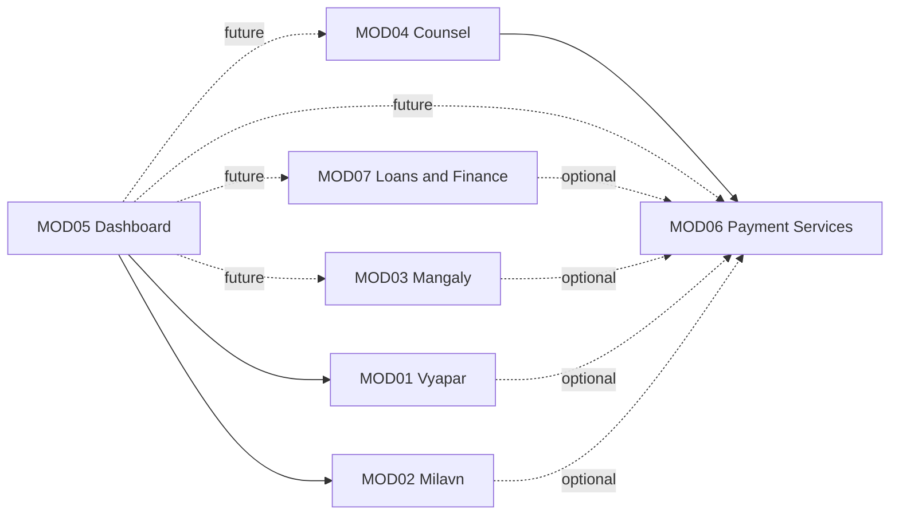

# Modules — ForKhatri

## Revision history
| Date | Change | Reason / Ref |
|---|---|---|
| 2026-09-06 | Initial draft: full module decomposition (7 business modules), data-ownership assignment, dependency map, and V1/V2/V3/parked release sequencing with scoring rationale. | Step 0, autonomous execution (pinned preference: no clarifying questions; decide and document reasoning in-line). Source: Master Product Requirements v1.0, Complete High-Level Business Requirements, Founder Execution Roadmap. |
| 2026-09-06 | Reviewed against module-reviewer's Definition of Done (capability-to-module mapping, explicit in/out of scope, acyclic dependency graph, single data owner per shared entity, anti-pattern table, open blockers). All six checks pass; no ambiguity found that rises to a genuine unresolvable business-judgment gap. Sealed. | Step 0 gate, autonomous mode (reviewer-agent). See reviewer notes below for the specific split-boundary reasoning independently re-derived (not merely confirmed) during this pass: Vyapar/Counsel "Professional" duality, Dashboard's business-capability status vs. layer-alignment risk, and Payment Services' bill-pay + coupon/benefit bundling. |

## Problem statement summary

ForKhatri is a technology-driven community ecosystem for the Khatri community
(explicitly framed as a prototype for a later, broader community-development
model). It connects members on shared heritage/culture/values/experience —
not just ancestry — and uses automated verification, a tiered trust/identity
model, evidence-based reputation, and (eventually) AI to solve six named
structural problems: unequal access to networks, lack of trusted information,
members being cheated via exploited trust, lack of professional guidance,
weak real-world community interaction, and lack of structured community
support.

The source documents already name seven candidate business capabilities
(Vyapar, Milavn, Mangaly, Counsel, Dashboard, Payment Services, Loans &
Finance) plus a common platform foundation (identity, auth, trust,
reputation infra, notifications, search, payments infra, AI infra,
analytics, security, privacy, audit — explicitly *not* a business module,
to be resolved by the Solution Architecture Agent next). My reading is that
this decomposition is not something to re-invent: the capability boundaries
are already correct and non-overlapping in the source material. My actual
job in this step is (a) confirm each of the seven holds up against the split
test and anti-patterns, (b) assign unambiguous data ownership everywhere two
modules could plausibly claim the same entity, (c) produce an acyclic
dependency graph, and (d) — per this step's explicit hard constraint — decide
and justify which subset ships in V1, deferring the rest, rather than
treating "build all 7" as the plan. That last part is the part with real
judgment risk, so I show my scoring work below rather than asserting a
conclusion.

If this restatement is wrong, everything below is built on a misreading —
but nothing in the three source documents suggests a different capability
split than the one already named, so I am not flagging a divergence here.

## Modules

### MOD01 — Vyapar
**Scope:** Business and professional discovery; business and professional
profiles; business/job/employment opportunity listings; business enquiries;
networking; business partnerships; reviews and business-domain reputation
signals; verified-listing promotions. Independent Level-3 verification of
business identity, business ownership, professional credentials/licenses
where applicable, and contact/service legitimacy.
**Out of scope:** In-app payment collection for business transactions (V1:
enquiries/leads only; off-platform payment; on-platform payment deferred
until MOD06 Payment Services ships and can be integrated). Consultation
scheduling/paid-advice workflows (that is MOD04 Counsel's domain, even
though some Vyapar professionals may also register as Counsel experts —
see Shared Concerns). Cross-module "fair exposure" ranking across the whole
platform (Vyapar owns its own in-module discovery ranking; MOD05 Dashboard
owns the cross-module surfacing layer — see Shared Concerns).
**Primary users:** Entrepreneurs, business owners, professionals,
freelancers, service providers, job seekers, employers, customers, business
partners.
**Depends on:** None.
**Depended on by:** MOD05 Dashboard (reads Vyapar listings/opportunities to
surface them).
**Data owned:** BusinessProfile, ProfessionalProfile (Vyapar context),
BusinessListing, JobOpportunity/BusinessOpportunity, BusinessEnquiry,
Partnership, BusinessReview, Promotion, Vyapar-domain verification records
(business identity/ownership/license/professional-credential).
**Rationale:** Directly answers two of the six named core problems (unequal
access to networks, lack of exposure) with the lowest regulatory load of any
candidate module (no financial-instrument or family/matrimonial-sensitive
data). Independently specifiable — its BRs never need to reach into another
module's internals. Non-trivially sized (7 distinct capability clusters) and
not oversized (well within the ~5–8 BR guideline).
**Est. BR count:** 7

### MOD02 — Milavn
**Scope:** Community meetups, professional gatherings, workshops, social/
interest-based events, event discovery, registration, participation;
verification of organizers, events, and venues/partners.
**Out of scope:** Matrimonial matchmaking (MOD03). Paid professional
consultation (MOD04). In-app payment collection for ticketed/premium events
(V1: registration and free/organizer-managed paid events only; in-app
payment integration deferred to when MOD06 ships).
**Primary users:** Community members seeking real-world connection, event
organizers, workshop facilitators, venue/partner providers.
**Depends on:** None.
**Depended on by:** MOD05 Dashboard (reads events for registration
reminders and community-activity surfacing).
**Data owned:** Event, EventRegistration, OrganizerProfile (Milavn-context
verification), Venue/PartnerRecord (event context).
**Rationale:** Directly answers the "weak real-world community interaction"
problem — the source docs are explicit that this is the module meant to
convert passive membership into meaningful relationships. Low regulatory/
technical complexity, no data-ownership overlap with any other module
(Event/EventRegistration are distinct from Counsel's Appointment and from
Vyapar's BusinessListing).
**Est. BR count:** 6

### MOD03 — Mangaly
**Scope:** Matrimonial profiles, family participation, partner preferences,
match discovery/recommendations, interest management, controlled/privacy-
respecting communication, matrimonial-specific privacy controls, premium
matchmaking services. Independent Level-3 verification of identity, age,
education, profession, marital status, and relevant family information —
**exact verification depth is explicitly deferred to this module's own
Business Requirements step, which must run a dedicated legal/privacy
analysis before finalizing BRs** (per source doc: "the exact verification
model shall be determined through legal, privacy and operational
analysis"). This is a scoping note for MOD03's own BR agent, not an open
blocker of this file — the module's boundary and data ownership are already
unambiguous regardless of how deep that verification analysis lands.
**Out of scope:** General (non-matrimonial) networking (MOD01/MOD02).
Payment/coupon issuance (MOD06 owns Coupon/Benefit as an entity; Mangaly
only emits benefit-eligible events).
**Primary users:** Members and participating family members seeking
matrimonial matches.
**Depends on:** None.
**Depended on by:** MOD05 Dashboard (future — read-only, privacy-filtered
activity summaries only, e.g. "new activity in Mangaly," never match
details); optionally feeds MOD06 Payment Services with benefit-trigger
events (soft integration, not required for either module to function).
**Data owned:** MatrimonialProfile, FamilyParticipationRecord,
PartnerPreference, Interest, MatchRecommendation, Mangaly-domain
verification records (identity/age/education/profession/marital-status/
family-info).
**Rationale:** Culturally central to the community (the source documents
give it the most detailed treatment of any module) and high differentiation,
but it carries the heaviest privacy/family-data burden of any module short
of Loans & Finance's regulatory burden — sensitive personal and family data,
controlled-communication requirements, and a verification model that isn't
even fully specified yet pending dedicated legal analysis. See V1/V2/V3
scoring below for why this is sequenced after the trust foundation is
proven elsewhere, not because it is unimportant.
**Est. BR count:** 8 (upper end of guideline — kept as one module rather
than split further because every one of its capabilities is inseparable
from the others in actual matrimonial workflows; profile, preference,
discovery, communication and privacy all reference the same core
MatrimonialProfile entity and splitting them would violate the
"independently specifiable" test in the other direction — each fragment
would constantly need the others' internals).

### MOD04 — Counsel
**Scope:** Expert/professional discovery, expert profiles, consultation
requests, appointment management, professional communication, service
feedback, professional reputation (Counsel-domain), paid consultation.
Verification of identity, qualifications, certifications, licenses, and
professional experience appropriate to the advisory domain (legal, career,
business, finance, education, technology, other approved domains). Hard
constraint carried into BRs: Counsel must never present an unverified
opinion as professional advice.
**Out of scope:** General business/professional discovery for commercial
services or employment (MOD01 — a member can hold both a Vyapar
professional profile and a separate Counsel expert profile; see Shared
Concerns for why these are deliberately distinct entities, not a shared-
model violation). Actual movement of money (MOD06 owns the Transaction
entity; Counsel only initiates a payment via Payment Services and stores
the returned reference).
**Primary users:** Members seeking legal/career/business/finance/education/
technology guidance; verified professionals/experts offering consultation.
**Depends on:** MOD06 Payment Services (paid consultation requires a
payment capability to exist).
**Depended on by:** MOD05 Dashboard (future).
**Data owned:** ExpertProfile (Counsel-context), ConsultationRequest,
Appointment, ConsultationFeedback, Counsel-domain professional-reputation
signals, Counsel-domain verification records
(qualification/certification/license/experience).
**Rationale:** Answers the "lack of professional guidance" problem directly,
but it is a two-sided marketplace with a cold-start problem (no verified
experts, no member trust in advice yet) and carries real liability exposure
around "unverified opinion presented as advice" — both are best de-risked
after the platform has already proven its identity/trust model works via
lower-risk modules. Its hard dependency on Payment Services also makes it
strictly sequence-after that module.
**Est. BR count:** 7

### MOD05 — Dashboard
**Scope:** Unified personalized entry point to ForKhatri; personalization
(location, language, profession, interests, activity history, explicit
preferences); local information intelligence (surfacing government
schemes, public notices, health/medical camps, blood donation, educational/
social programs, scholarships, employment/training opportunities — sourced,
categorized, dated, geo-tagged, expired/archived); cross-module opportunity
surfacing (jobs, business, training, scholarships pulled from other
modules); member-activity visibility (requests, applications, appointments,
transactions, invitations — read-only aggregation); trust-status visibility
(verification/reputation/feedback, read-only); prioritized notifications;
the platform's "fair exposure" ranking engine for what Dashboard itself
surfaces (relevance, trust, quality, availability, capability, contribution
— never simply payment or popularity — with commercial promotion visually
distinguished from organic results).
**Out of scope for V1 (deliberately trimmed):** Full AI-driven, multi-
source-scraped, auto-deduped, auto-translated local-intelligence ingestion
pipeline — V1 ships with a lightweight, largely curated/seeded local-
intelligence content set and simple relevance/expiry rules; the full
automated ingestion/dedup/obsolescence-detection AI pipeline is a V2+
enhancement layered onto the same owned entity, not a new module. Also out
of scope: authorship of Notification records (platform-level shared infra;
Dashboard only renders/prioritizes), authorship of any other module's
domain entities (Dashboard is a read-only aggregator of those), and each
module's own in-module search/discovery ranking (each module owns that
internally; Dashboard's fair-exposure engine only governs what Dashboard
itself chooses to surface on the unified feed — see Shared Concerns for why
this distinction matters).
**Primary users:** All members, as the default operating surface of the
platform.
**Depends on:** MOD01 Vyapar, MOD02 Milavn (V1). Extends to depend on MOD03
Mangaly, MOD04 Counsel, MOD06 Payment Services, MOD07 Loans & Finance as
each ships (each addition is a Dashboard enhancement release, tracked via
change request, not a new module).
**Depended on by:** None — Dashboard is a pure consumer/aggregator; no
other module's core function requires Dashboard to exist (per source doc:
"the underlying business capabilities should not depend on a particular
user interface").
**Data owned:** LocalInformationItem (externally-sourced information only —
distinct from MOD02's member-organized Event), PersonalizationProfile
(Dashboard-specific preference layer, distinct from the core identity
profile owned by the platform foundation), DashboardFeedConfiguration /
fair-exposure ranking rules for the unified feed.
**Rationale:** Explicitly not "a home page" in the source material — it is
the mechanism that makes the trust model, fair-opportunity principle, and
"utility over engagement" principle visible and real to a member on day
one. Named directly in the founder roadmap's own V1 reasoning. Kept as one
module rather than splitting Local Intelligence out separately: the local-
intelligence content only has a home because Dashboard's personalization/
ranking logic gives it one, and a standalone Local Intelligence module
would immediately need to re-implement Dashboard's fair-exposure and
personalization logic — a shared-model violation in the other direction.
**Est. BR count:** 6 (V1-trimmed scope; will grow as it extends to
additional modules in V2/V3, tracked as change requests against this same
module rather than new modules).

### MOD06 — Payment Services
**Scope:** Everyday bill/service payment (utility, mobile, internet, DTH,
insurance, education, other supported services): bill discovery, payment,
transaction status, receipts, history, refunds. Cross-module member
benefits/coupon ecosystem: coupon and benefit issuance, discounts, partner
offers, redemption.
**Out of scope:** The underlying payment gateway/rails integration, ledger,
and PCI-scope reduction tooling itself is platform-level "payments
infrastructure" (shared concern, resolved by Solution Architecture) —
Payment Services is the business-capability layer built on top of that
infrastructure (bill-pay UX, coupon/benefit business rules), not the rails
themselves. Does not decide what counts as a "benefit-eligible event" in
another module (e.g., what Mangaly interaction earns a coupon is Mangaly's
business rule; Payment Services only mints/redeems the resulting Coupon
once told to).
**Primary users:** All members needing everyday bill payment; merchants/
partners offering benefits.
**Depends on:** None as a hard dependency. Optionally consumes benefit-
trigger events emitted by MOD01 Vyapar, MOD02 Milavn, MOD03 Mangaly (soft/
optional integration — none of those modules requires Payment Services to
function, and Payment Services' core bill-pay function does not require
them either).
**Depended on by:** MOD04 Counsel (hard — paid consultation requires this
module to exist first), MOD05 Dashboard (future, read-only), MOD07 Loans &
Finance (soft, for future disbursement/EMI integration).
**Data owned:** PaymentTransaction (bill-pay context), Bill, Coupon,
Benefit, PartnerOffer, merchant/partner payment-account records. Payment
Services is the **sole** owner of Coupon/Benefit — every other module that
participates in the benefits ecosystem only emits an event; it never writes
a Coupon record directly.
**Rationale:** High long-term revenue potential and real everyday utility,
but the source docs explicitly warn ForKhatri should not compete primarily
as "another payment application," and the coupon ecosystem's whole value
proposition depends on other benefit-generating modules (Mangaly, Vyapar)
already existing and producing benefit events — which they won't yet in
V1. Sequencing this after the community-facing modules avoids both the
differentiation risk and the chicken-and-egg problem, while still shipping
early enough (V2) to unblock Counsel's hard dependency on it.
**Est. BR count:** 6

### MOD07 — Loans & Finance
**Scope:** Financial product/loan discovery, eligibility assessment,
application initiation, application tracking, financial-partner referral,
financial education/enquiries.
**Out of scope:** Acting as, or representing itself as, a regulated lender
or financial institution — hard compliance constraint carried forward
explicitly into this module's own Impact Analysis and Security &
Performance steps, per the source brief. Loan disbursement/collection
mechanics beyond what a licensed financial partner performs.
**Primary users:** Members seeking financial products; verified/compliant
financial partners.
**Depends on:** None as a hard business-module dependency (relies on the
platform foundation's identity/KYC infrastructure, not on another business
module). May integrate with MOD06 Payment Services for disbursement/EMI in
a later iteration (soft).
**Depended on by:** MOD05 Dashboard (future — application-status
notifications, per the source doc's own cross-module example).
**Data owned:** FinancialProduct (partner-catalog record), LoanApplication,
EligibilityAssessment, FinancialPartnerRecord (Loans & Finance-context
partner validation/KYC).
**Rationale:** Explicitly flagged in the source material as carrying the
heaviest regulatory load of any candidate module (hard "must not represent
itself as a regulated lender" constraint, full KYC/eligibility/consent/
partner-validation chain). Also the least ready operationally — it requires
established, vetted financial-partner relationships that don't yet exist
and shouldn't be rushed to unblock an earlier release. Sequenced last.
**Est. BR count:** 7

## Inter-module dependency map

Convention: `A --> B` reads "A depends on B." Solid edges are hard
dependencies (must ship no later than the dependency); dotted edges are
planned/soft extensions for later waves, shown for completeness.

Acyclic check: MOD05 depends on everything else (directly or eventually);
nothing depends on MOD05. MOD04 depends on MOD06; MOD06 depends on nothing
hard. MOD07 depends on nothing hard. MOD01/MOD02/MOD03 depend on nothing
hard. No cycle exists at any release wave.

**Reviewer re-check (independent):** traversed every edge, hard and soft,
looking specifically for a back-edge into MOD05 or a hard-dependency loop
between MOD04/MOD06. None found — MOD06 has zero hard inbound requirements
from MOD04 in the reverse direction, and none of MOD01/MOD02/MOD03/MOD07
has any edge, hard or soft, pointing at MOD05. Graph is acyclic. Confirmed
independently, not merely re-asserted from the drafting agent's own claim.

## Release Sequencing (V1 / V2 / V3) — reasoning and scoring

Per this step's explicit hard constraint, I did not default to "ship all 7
modules." I scored each candidate against the founder roadmap's own stated
criteria (Phase 5: community value, user demand, trust impact, revenue
potential, differentiation, technical complexity, operational complexity,
regulatory complexity) and against the Master PRD's explicit V1 success
bar: the first release must prove (1) Trust — people create legitimate
identities and interact, (2) Utility — members get real value, and (3)
Community Effect — members begin helping/connecting with each other, before
the platform expands further.

| Module | Community value | User demand | Trust impact | Revenue potential | Differentiation | Technical complexity | Operational complexity | Regulatory complexity |
|---|---|---|---|---|---|---|---|---|
| Vyapar | High | High | High | Med (needs traction first) | High | Med | Med | Low |
| Milavn | High | High | Med | Low initially | High | Low–Med | Low | Low |
| Dashboard (trimmed) | High | High | High | Low (indirect) | Very High | Med (trimmed for V1) | Med (curated content ops) | Low |
| Mangaly | High | High | High (if done right); High risk if rushed | High (longer-term) | High | Med–High | High | High (family/privacy data; verification model not yet finalized) |
| Counsel | Med–High | Med (two-sided cold start) | High (liability-sensitive) | Med (needs liquidity both sides) | Med–High | Med | Med–High | Med (professional-liability adjacent) |
| Payment Services | Med | Med | Low–Med | High (long-term) | Low (explicitly warned against in source docs) | Med–High | Med | Med–High (payment/KYC-adjacent) |
| Loans & Finance | Med–High (long-term) | Med | Med | Med | Med | Med | High (partner onboarding) | High (explicit hard regulatory constraint) |

**V1 — Vyapar + Milavn + Dashboard (trimmed local-intelligence/fair-exposure
scope), on top of the platform foundation (identity/trust/auth — not a
module, built by Solution Architecture next).**
Both Vyapar and Milavn score high on community value, trust impact and
differentiation while carrying the lowest regulatory/technical complexity
of any candidates — and, critically, they are complementary rather than
redundant: Vyapar proves the "opportunity/utility" leg (capable people and
businesses become discoverable) and Milavn proves the "community effect"
leg (real-world connection happens), which together map directly onto two
of the three things the Master PRD says V1 must prove. Dashboard is what
makes the platform's trust model (verification status, fair exposure,
evidence-classified information) *visible* to a member on day one rather
than an abstract backend property — without it, Vyapar and Milavn are just
two disconnected apps. Trimming Dashboard's local-intelligence scope to
curated/seeded content plus simple ranking rules (deferring the full AI
ingestion pipeline) keeps its V1 technical/operational complexity in line
with the rest of the wave. This matches the founder roadmap's own worked
example, but the conclusion here is reached independently from the scoring
table, not assumed from that example.

**V2 — Payment Services, then Counsel, then Mangaly** (order within V2
matters because Counsel hard-depends on Payment Services; Mangaly has no
dependency and can run its own BR/legal-privacy track in parallel starting
in V2, potentially slipping to V3 if that legal analysis surfaces a
blocking issue — a decision for MOD03's own Business Requirements step, not
this one). By V2, the platform's Level 1/Level 2 identity/trust foundation
is already proven via V1's real usage, which directly de-risks Counsel's
liability-sensitive advice model (there is now a base of verified members,
some of whom are plausible Counsel-expert candidates) and gives Mangaly's
verification work a proven trust substrate to build its own heavier,
domain-specific Level-3 verification on top of, rather than needing to
prove the whole trust model itself under the added weight of family/
privacy sensitivity.

**V3 — Loans & Finance.** Explicitly the heaviest regulatory load of any
candidate ("must not represent itself as a regulated lender" is a hard
constraint, not a design preference) and the least operationally ready
(requires vetted financial-partner relationships that take real time to
establish). Nothing about it needs to block or be blocked by V1/V2 work;
sequencing it last is a pure risk-management choice, not a data-dependency
one.

**Parked / no current plan:** None of the 7 named modules are parked
outright — all are in V1/V2/V3. If a future need identifies an eighth
capability not covered above, it should go through this same Step 0 process
as a change request against this file, not be silently added to an existing
module.

## Shared concerns

These are cross-cutting items no single business module should own, and
this file does not resolve them — resolution (which container owns each,
what pattern it uses) is explicitly the Solution Architecture Agent's job
in `/ARCHITECTURE.md`, immediately after this file is approved. Flagging
them here so architecture work starts from the same picture:

- **Unified member identity, authentication, Level-1/Level-2 trust
  (platform identity + community identity).** Not owned by any business
  module — every module layers its own Level-3 domain verification on top
  of this shared core (source doc's Trust Identity Model). This is the
  single most load-bearing shared entity in the whole platform; get its
  ownership boundary right before any module BR work references it.
- **Common reputation infrastructure.** The scoring/aggregation engine is
  shared platform infra; each module owns the write-side of its own
  domain-specific reputation *signal* entity (Vyapar → BusinessReview,
  Milavn → EventFeedback, Counsel → ConsultationFeedback, Mangaly → its own
  interaction feedback). No module ever writes another module's feedback
  entity — the shared engine only reads across them to compute
  context-specific reputation (a person trusted professionally is not
  automatically trusted matrimonially, per source doc).
- **Notifications & communication infrastructure.** Shared platform
  capability; Dashboard renders/prioritizes but does not author
  Notification records; every module that needs to notify a member calls
  the shared infra rather than building its own.
- **Search infrastructure.** Shared indexing/query layer; each module owns
  its own in-module ranking rules built on top of it. Distinct from
  Dashboard's fair-exposure engine, which governs only what Dashboard
  itself chooses to surface on the unified feed — these are two different
  ranking concerns that must not be conflated into one "the" ranking
  algorithm.
- **Payments infrastructure (rails/gateway/ledger) vs. Payment Services
  (module).** The gateway integration, transaction ledger and PCI-scope
  reduction tooling are shared infra used by any module that moves money
  (Payment Services' bill-pay, Counsel's consultation fees, eventually
  Loans & Finance's disbursement). Payment Services the module is the
  business-capability layer (bill-pay UX, coupon/benefit rules) built on
  top of that shared infra, not the infra itself. Architecture must decide
  where the line actually sits.
- **AI infrastructure and the informational/operational/financial-risk
  action-authorization tiers.** Not owned by any module; each module that
  wants an AI-assistant surface (long-term direction per source docs)
  defines which of its own actions fall into which tier, but the
  understand→authorize→execute→record→confirm model itself is shared.
- **Multilingual (English/Hindi/Telugu at launch) architecture.** Explicit
  day-one requirement across UI, content, search, notifications, AI, forms
  — not something any one module should implement independently.
- **Security, privacy, audit/accountability.** Platform-level, with
  controls proportional to each module's risk level (explicitly higher for
  Mangaly and Loans & Finance than for Vyapar/Milavn).
- **Administration/governance console.** Central platform governance
  (policies, global trust standards, serious disputes) vs. module-level
  domain administration — architecture needs to decide whether this is one
  admin surface or federated per module.
- **The "Professional" concept spans two modules by design, not by
  accident.** Vyapar's ProfessionalProfile (commercial/business-service
  identity, verified for business legitimacy) and Counsel's ExpertProfile
  (advisory-credential identity, verified for qualification/license/
  experience) are deliberately distinct entities with distinct owners and
  distinct verification purposes — a member may hold both. This is called
  out explicitly so it is not later "discovered" as an apparent shared-
  model violation; it isn't one, but Solution Architecture should decide
  whether a common "verified credential" sub-record is worth sharing as
  infra even though the two profile entities themselves stay separate.
- **Tech stack is already fixed** (Python/FastAPI backend, React/TypeScript
  frontend, Postgres — recorded in `/IMPLEMENTATION-TEST-STANDARDS.md`) and
  is not revisited by this decomposition; noted here only so Architecture
  doesn't need to re-derive it from this file.

## Decisions and assumptions resolved autonomously (not open blockers)

Per standing instruction to decide rather than pause for clarification,
these interpretive calls were made in this file rather than raised as
blockers:

1. Local Intelligence is scoped as a capability inside Dashboard (MOD05),
   not a standalone module — see MOD05 rationale.
2. Mangaly's exact Level-3 verification depth is explicitly left to that
   module's own BR step (with a mandated legal/privacy analysis first),
   consistent with the source document's own instruction — this is a
   scoping note, not an ambiguity in this file's module boundaries.
3. V1 = Vyapar + Milavn + Dashboard (trimmed), chosen via the scoring table
   above rather than assumed from the founder roadmap's own worked example
   (which happens to reach the same conclusion).
4. "Professional" is modeled as two distinct entities across Vyapar and
   Counsel by design (see Shared Concerns) — not treated as a shared-model
   anti-pattern.

## Anti-pattern check

| Check | Result |
|---|---|
| No module shares an unowned model with another | Pass — every entity that appears in more than one module's scope (Coupon/Benefit, "Professional," reputation signals, LocalInformationItem vs. Event) has exactly one declared writer; see per-module "Data owned" and Shared Concerns. |
| No unjustified over-fragmentation | Pass — kept the source material's own 7-capability decomposition rather than splitting further; each module's estimated BR count sits at 6–8, within the target range, and each rationale explains why it isn't merged into a neighbor. |
| No module is layer-aligned | Pass — every module name is a business capability (Vyapar, Milavn, Mangaly, Counsel, Dashboard, Payment Services, Loans & Finance); no module is named after a technical layer, and the shared technical layers (identity, search, payments rails, AI infra, notifications) are explicitly kept out of the module list and pushed to Shared Concerns / Solution Architecture. |
| Every shared entity has one declared owner | Pass — see Shared Concerns and per-module Data Owned sections; Coupon/Benefit → MOD06 only; reputation signal entities → the module that generated the interaction; Notification → platform infra, not any module. |

## Open blockers

None. (See "Decisions and assumptions resolved autonomously" above for the
interpretive calls made in place of raising blockers, per this project's
standing autonomous-execution instruction.)

## Reviewer notes (module-reviewer, autonomous mode)

Reviewed against the module-agent's own Definition of Done, from a fresh
context (this reviewer did not draft the file). Findings:

1. **Capability-to-module mapping** — every named capability in the three
   source documents lands in exactly one module; no gaps or overlaps found.
   Cross-checked the six named structural problems against module
   rationale: "unequal access to networks" and "lack of exposure" →
   Vyapar; "weak real-world community interaction" → Milavn; "lack of
   professional guidance" → Counsel; "lack of trusted information" and
   "lack of structured community support" → Dashboard's local-information-
   intelligence capability plus the shared trust/verification core
   (platform foundation, correctly not claimed as a business module here);
   "members being cheated via exploited trust" → the Level-3 verification
   layered into every module plus the shared trust core. None of the six
   is left unmapped.
2. **In-scope/out-of-scope** — present and specific for all 7 modules.
3. **Dependency graph** — traced independently (see note under the
   dependency map above); acyclic confirmed.
4. **Data ownership** — every entity named in more than one module's
   context (Coupon/Benefit, Professional/ExpertProfile,
   LocalInformationItem vs. Event, reputation signals) has exactly one
   declared writer, with the non-owning module(s) explicitly described as
   emitting events or reading read-only.
5. **Anti-pattern table** — independently re-evaluated, not just re-read;
   all four rows genuinely pass (see specific split-boundary reasoning
   below, applying this gate's elevated-risk instruction to look for
   splits being rubber-stamped rather than independently justified).
6. **Open blockers** — none; Mangaly's deferred verification-depth analysis
   is correctly scoped as a note for that module's own BR step, not an
   ambiguity in this file's boundaries.

Per this gate's elevated-risk instruction, three boundary calls were
independently re-derived rather than simply confirmed:

- **Vyapar ProfessionalProfile vs. Counsel ExpertProfile.** These could
  plausibly have been merged into one "verified professional" entity with
  a role flag. Kept separate because the verification *purpose* differs
  materially (commercial/business legitimacy vs. advisory
  qualification/license/liability) and the two modules have different
  monetization and liability postures (leads/enquiries vs. paid,
  liability-bearing advice). A shared "verified credential" sub-record is
  correctly left as an open question for Architecture rather than
  pre-decided here. Independent conclusion: the split holds.
- **Dashboard as a business module vs. an orchestration/UI layer.** This
  is the one place layer-alignment risk is real, since Dashboard's job is
  substantially aggregation. It survives the anti-pattern only because it
  has genuine owned entities of its own (LocalInformationItem,
  PersonalizationProfile, fair-exposure ranking rules) that are not
  read-only views of other modules' data, and because the source PRD
  treats it as a first-class capability, not an interface. Independent
  conclusion: the split holds, but this is the boundary most worth
  re-checking again once MOD05's own BRs are written, since scope creep
  here (Dashboard quietly starting to own logic that belongs to another
  module) is the most likely failure mode of this whole decomposition.
- **Payment Services bundling everyday bill-pay with the cross-module
  coupon/benefit ecosystem.** These are two different business mechanics
  (a payment utility vs. a cross-module loyalty/marketing mechanism) that
  could have been split. Kept together because both are inherently
  monetary-instrument concerns naturally co-located with payment rails,
  and because a standalone coupon module would have no independent
  existence — it would just be a thin shell around Payment Services'
  ledger/rails access with no BRs of its own. Independent conclusion: the
  bundling is defensible, but flagged here (not as a blocker) so it is
  re-examined if MOD06's own BR step finds the coupon/benefit rules
  growing complex enough to justify a future split — that would be a
  change request against this file, not a silent scope change inside
  MOD06.

No check failed. No ambiguity was found that rises to a genuine
unresolvable business-judgment gap requiring escalation to a human. Sealed.

## Approval
Solution Architect: [x] Approved — reviewer-agent (autonomous mode), 2026-09-06
Product Manager: [x] Approved — reviewer-agent (autonomous mode), 2026-09-06

*(Autonomous-mode note: both approvals above were recorded by
`module-reviewer` as `approved_by: reviewer-agent (autonomous mode)` — not
by a human — per this project's standing autonomous-execution instruction.
Drafted by `module-agent`; reviewed and sealed by `module-reviewer` on
2026-09-06.)*
