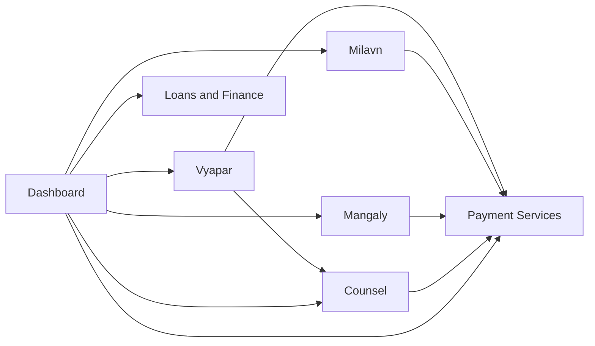

# Modules — ForKhatri

## Revision history
| Date | Change | Reason / Ref |
|---|---|---|
| 2026-09-09 | Initial Step 0 draft for ForKhatri as a whole (7 modules: Vyapar, Milavn, Mangaly, Counsel, Dashboard, Payment Services, Loans & Finance). Mangaly is treated as exactly one module and its internal boundaries are not re-derived here. | Scoping correction — a prior run incorrectly treated "Mangaly" as the entire ForKhatri project and split it into 10 sub-modules; that artifact was wrong and has been deleted. This run decomposes the full ForKhatri business per its own high-level docs, with Mangaly's module-level boundary already decided by the human product owner. |
| 2026-09-11 | Correction pass (per the Step 0 agent's updated loop-discipline process — re-reading related previous output before treating any item as settled): found this file's Open blockers section was stale. BLOCKER-001 (Payments infrastructure boundary) had already been resolved by the Solution Architecture Agent's `/ARCHITECTURE.md` (Sealed 2026-09-06, ADR-008) but this file still listed it as open — marked resolved with the actual resolution cited, so a reader of this file alone isn't misled into thinking the question is still live. BLOCKER-002 (Loans & Finance regulatory posture) remains genuinely unresolved (no legal/regulatory decision exists in any source document or in `/ARCHITECTURE.md`) — left open, but its scope was clarified: it gates only MOD07's own Step 1, not the rest of the pipeline, and `/ARCHITECTURE.md` already isolated MOD07's container/database in anticipation of it. | Loop-discipline re-verification pass — krishna kategaru (autonomous), 2026-09-11. |

## Problem statement summary

ForKhatri is not a single product but a community-operating ecosystem for
the Khatri community: one unified member identity and trust framework
underneath several independently-run business capabilities ("modules"),
each with its own users, verification model, revenue model, and KPIs, all
surfaced to the member through a personalized Dashboard and (eventually) a
unified AI assistant. The source documents themselves already name seven
Core Modules — **Vyapar** (business/professional ecosystem), **Milavn**
(community meetups/events), **Mangaly** (matrimonial ecosystem), **Counsel**
(paid professional guidance/consultation), **Dashboard** (personalized
entry point + local-information intelligence + fair-exposure surfacing),
**Payment Services** (bill payments + a cross-module benefits/coupon
ecosystem), and **Loans & Finance** (financial-product discovery and
application referral) — sitting on top of a common, non-module "platform
foundation" (identity, authentication, authorization, trust/reputation
infrastructure, notifications, payments infrastructure, search,
personalization, AI, security, privacy, audit) that no single business
module owns.

This restatement treats Mangaly as **one** of those seven sibling modules,
per explicit instruction: its internal boundaries (profile, Home Circle,
discovery, trust/verification, connection, sharing, communication, safety,
etc.) are the responsibility of Mangaly's own downstream Business
Requirements step, driven directly by
`Mangaly_Master_Requirements_Input_v1.0.md`, and are not re-derived or
re-split here. This file's job is to decompose the **rest** of ForKhatri's
business into the remaining sibling modules, using the same
capability-boundary method, and to place Mangaly correctly alongside them
as a single module-level entry.

If this restatement diverges from the intended scope, that should be
flagged before the module boundaries below are relied upon — in
particular the "Core Modules" list itself is treated here as strong,
explicit evidence of the correct capability seams (it is stated
identically in both the Complete High-Level Business Requirements
document §12 and the Master Product Requirements Document §9), not as an
assumption invented by this decomposition.

## Modules

### MOD01 — Vyapar
**Scope:** Trusted business and professional discovery ecosystem: business
profiles; professional/freelancer listing profiles; business + professional
discovery/search; customer discovery; business enquiries; business
networking and partnership requests; employment/business opportunity
listings originated by ForKhatri business members; business-specific
Level-3 verification (business identity, ownership, license, professional
credentials, contact/service legitimacy); reviews and in-module reputation
signals; verified-listing promotion, clearly distinguished from organic
discovery.
**Out of scope:** Structured, paid, appointment-based advisory delivery
(→ MOD04 Counsel); community meetups/events (→ MOD02 Milavn); actually
capturing/settling payment (→ MOD06 Payment Services — Vyapar only
initiates a collection request); externally-sourced government/public/NGO
opportunity or scheme information not originated by a Vyapar member
(→ MOD05 Dashboard's Local Information Intelligence); matrimonial-context
family/professional information (→ MOD03 Mangaly).
**Primary users:** Entrepreneurs, business owners, professionals,
freelancers, service providers, job seekers, employers, customers, business
partners.
**Depends on:** MOD06 (Payment Services) — subscription/promotion/service
payment collection; MOD04 (Counsel) — optional referral of a business
problem into formal consultation.
**Depended on by:** MOD05 (Dashboard) — reads Vyapar listings and
opportunities for cross-module surfacing (read-only).
**Data owned:** BusinessProfile, ProfessionalListingProfile,
BusinessVerificationRecord (Level-3), Enquiry, PartnershipRequest,
JobListing/BusinessOpportunityListing (member-originated only),
Review, Vyapar-scoped ReputationSignal, PromotionPlacement.
**Rationale:** Distinct target users, distinct revenue model
(subscriptions/verified listings/promotions/lead generation), distinct
verification model (business ownership/licensing), and a self-contained
discovery/networking workflow that never needs to reference Counsel's
appointment workflow or Milavn's event workflow to be specified. Matches
the source documents' own explicit "Core Module" designation (BRD §13,
PRD §18).
**Est. BR count:** 7 (verification; business profile; professional
profile; discovery/search; networking & partnerships; opportunity listings
& enquiries; reviews/reputation/promotion).

### MOD02 — Milavn
**Scope:** Community meetups, professional gatherings, workshops, and
social/interest-based events; event creation and organizer management;
event discovery, registration and participation; organizer/event/venue
verification; post-event feedback and community-engagement signals.
**Out of scope:** Matrimonial family/candidate discovery (→ MOD03 Mangaly);
paid one-on-one professional advisory sessions (→ MOD04 Counsel);
business-to-business discovery/networking not tied to a specific event
(→ MOD01 Vyapar); actual payment capture for paid/ticketed events
(→ MOD06 Payment Services); externally-sourced local announcements not
created by a Milavn organizer (→ MOD05 Dashboard's Local Information
Intelligence).
**Primary users:** Event organizers, community members/participants,
venue and event partners.
**Depends on:** MOD06 (Payment Services) — paid/ticketed events,
sponsorships, premium-networking fees.
**Depended on by:** MOD05 (Dashboard) — reads events for
discovery/reminder surfacing (read-only).
**Data owned:** Event, EventRegistration/Participation,
OrganizerVerificationRecord, EventFeedback.
**Rationale:** A distinct real-world-relationship capability with its own
verification model (organizer/venue) and revenue model (event
fees/sponsorship/premium networking, BRD/PRD §34/§46), independently
specifiable without referencing Vyapar's or Mangaly's internals.
**Est. BR count:** 5 (organizer/event/venue verification; event creation &
management; discovery & registration/participation; community
engagement/feedback; monetization — paid events/sponsorship).

### MOD03 — Mangaly
**Scope:** Trusted matrimonial ecosystem for members and families, exactly
as defined in `docs/PreStartResearch/Mangaly_Master_Requirements_Input_v1.0.md`:
matrimonial profiles; Home Circle (family/relative collaboration and
authorization context); contextual, least-privilege authorization; broad
discovery for candidates and authorized family participants;
compatibility/matching signals (never a bare similarity or popularity
score); evidence-based trust and verification specific to matrimonial
information; the connection-request → selective-sharing → communication →
optional contact-exchange → family-involvement flow; safety intelligence;
Mangaly-scoped admin/operations; a future professional "Mangaly Agent"
layer.
**Out of scope:** Dating/swipe mechanics, public biodata directories, AI
spouse selection, public reputation/rating of participants, forced phone
exchange or forced family involvement, family surveillance, persistent
conventional chat history as a core feature (per the source document's own
explicit Non-Goals, §3); the general business/professional, event, or
financial capabilities of the other six modules.
**Primary users:** Candidate, Parent, Sibling/relative/trusted family
member, Guardian (where legitimate), community verifier, Mangaly
admin/verifier, future Mangaly Agent.
**Depends on:** MOD06 (Payment Services) — premium membership, enhanced
matchmaking, and professional matchmaking service fees / benefit-coupon
flows (BRD §19, PRD §25).
**Depended on by:** MOD05 (Dashboard) — may surface a benefit/notification
originating from Mangaly activity only to the extent the member has
explicitly authorized it; Mangaly's sensitive matrimonial content itself is
never exposed to Dashboard by default (Privacy by Design, BRD §33; and
Mangaly's own Authorization/Privacy sections, §7–§8).
**Data owned:** MatrimonialProfile, HomeCircle & Relationship records,
ConnectionRequest/Acceptance, SelectiveSharingGrant, VerificationCircle /
MatrimonialVerificationRecord, MangalyCommunicationEvent (minimal/ephemeral,
per the source document's own retention principle, §18), MangalySafetyIncident
/Report, MangalyAdminAction.
**Rationale:** Already decided as a single module by the human product
owner; this is not re-derived here. Mangaly's own master requirements
document explicitly frames itself as one coherent capability built from
internal "thin, replaceable layers" (identity, profile, Home Circle,
authorization, discovery, compatibility, trust, connection, sharing,
communication, safety, notifications, operations — §30) that are
implementation-stage concerns, not separate Step-0 business-capability
modules in their own right. Splitting Mangaly at this level would both
contradict that document's own stated architecture principle and the
explicit instruction governing this run. Mangaly's Business Requirements
are produced directly from `Mangaly_Master_Requirements_Input_v1.0.md` by
its own Step 1 agent. The existing `.claude/feature-workflow/managaly/`
folder is the working area for that downstream, module-internal pipeline;
it is referenced here for context only and is not created, modified, or
duplicated by this file.
**Est. BR count:** Likely 10–15+, which exceeds the standard 5–8 sizing
guideline used for every other module in this file. This is a deliberate,
human-directed exception (see Rationale above), not a boundary judgment
made by this decomposition, and is called out explicitly rather than
silently smoothed over.

### MOD04 — Counsel
**Scope:** Verified professional/expert discovery for structured guidance
(legal, career, business, finance, education, technology, other approved
domains); expert profiles and qualification/credential/license
verification; consultation requests and appointment scheduling;
consultation-specific communication; post-consultation feedback and
professional reputation; initiating consultation-fee collection.
**Out of scope:** General business/professional directory presence and
networking not tied to a paid advisory engagement (→ MOD01 Vyapar);
event-based gatherings (→ MOD02 Milavn); actual payment capture/settlement
(→ MOD06 Payment Services); matrimonial guidance (→ MOD03 Mangaly).
**Primary users:** Members seeking guidance; verified professionals/experts
across legal, career, business, finance, education, and technology domains.
**Depends on:** MOD06 (Payment Services) — consultation fee collection.
**Depended on by:** MOD05 (Dashboard) — reads appointment/consultation
status for surfacing (read-only); MOD01 (Vyapar) — may refer a business
problem into Counsel.
**Data owned:** ExpertProfile, ExpertVerificationRecord (qualifications,
licenses, certifications — a distinct entity from Vyapar's
BusinessVerificationRecord), ConsultationRequest, Appointment,
ConsultationFeedback.
**Rationale:** A distinct workflow (request → appointment → paid session →
feedback) and a distinct trust model (formal professional
credentials/licenses, BRD §16/PRD §21) from Vyapar's general
business/professional discovery. The same real person may hold both a
Vyapar business listing and a Counsel expert profile; ownership is split by
**entity**, not by person — Vyapar owns ProfessionalListingProfile, Counsel
owns ExpertProfile — which avoids the "shared model, no boundary"
anti-pattern (see Shared concerns).
**Est. BR count:** 6 (expert verification; expert profile & discovery;
consultation request & appointment management; consultation communication;
feedback & reputation; fee-collection linkage / service quality).

### MOD05 — Dashboard
**Scope:** The central personalized entry point aggregating each member's
own activities, verification/reputation status, and notifications across
all other modules (strictly read-only aggregation — Dashboard never writes
to another module's domain data); **Local Information Intelligence** —
sourcing, categorizing, geo/time-tagging, and lifecycle-managing
(expiry/archival/revalidation) externally-originated local information
(government schemes, public notices, health/medical camps, blood-donation
drives, scholarships, training programs) that is *not* created by any
ForKhatri business module; a **Fair Exposure** ranking capability governing
how cross-module opportunities and recommendations are surfaced
(relevance/trust/quality-based, explicitly not purely commercial or
popularity-based, per BRD §17/§24, PRD §24); prioritized notification
surfacing.
**Out of scope:** Creating or owning any other module's underlying business
record (a business listing, an event, a matrimonial profile, a
consultation, a loan application, a payment); in-module ranking/search
within a single module (e.g. Vyapar's own business-search ranking stays in
Vyapar) — Dashboard's Fair Exposure Engine governs cross-module surfacing
only, not any module's internal search.
**Primary users:** All ForKhatri members, as the default personalized
landing/home experience.
**Depends on:** MOD01 (Vyapar), MOD02 (Milavn), MOD03 (Mangaly —
benefit/notification surfacing only, subject to Mangaly's own privacy
rules), MOD04 (Counsel), MOD06 (Payment Services), MOD07 (Loans &
Finance) — all read-only.
**Depended on by:** none.
**Data owned:** LocalInformationItem (the sourced/categorized/geo-tagged/
time-boxed external content and its lifecycle state — this is Dashboard's
own data, distinct from any module's member-originated opportunity
listing), PersonalizationProfile/Preference (member-level dashboard
personalization settings), FairExposureRankingPolicy, NotificationPriorityQueue
(the prioritization logic/state itself; the underlying notification-delivery
mechanism is a shared platform concern — see Shared concerns).
**Rationale:** Explicitly named as a Core Module in both source documents
(BRD §17–§18, PRD §22–§24) with real data-owning capabilities of its own —
the Local Information Intelligence sourcing/lifecycle pipeline and the
Fair Exposure ranking policy are genuine business logic and genuine owned
data, which is what distinguishes this module from a rejected
"aggregation/API/UI layer." This is nonetheless the most fragile boundary
in this decomposition (a Dashboard that quietly re-implements another
module's ranking or business rules would collapse into a layer) and is
called out explicitly in Open blockers/Shared concerns for re-checking once
its own BRs are drafted.
**Est. BR count:** 6 (unified personalized aggregation; Local Information
Intelligence sourcing & lifecycle; cross-module opportunity surfacing;
trust/reputation visibility surface; notification prioritization; fair
exposure ranking engine).

### MOD06 — Payment Services
**Scope:** Bill-payment and service-payment capabilities (utility, mobile,
internet, DTH, insurance, education, other supported services); transaction
status, receipts, history, refunds; a cross-module member benefits/coupon
ecosystem — issuing, tracking, and redeeming coupons/discounts/partner
offers triggered by eligible activity in any other module, via a generic
benefit-issuance contract that does not require Payment Services to
understand another module's internal business rules; partner/merchant
commission relationships.
**Out of scope:** The generic payment-processing/gateway infrastructure
that other modules may need to collect their own fees (subscription,
consultation, event, membership) may or may not be this module's own build
versus a separate shared platform capability — see BLOCKER-001; loan/
financial-product application processing (→ MOD07 Loans & Finance).
**Primary users:** Members paying bills or redeeming benefits; partner
merchants/service providers.
**Depends on:** none (business-module level).
**Depended on by:** MOD01 (Vyapar), MOD02 (Milavn), MOD03 (Mangaly), MOD04
(Counsel) — each calls Payment Services' generic payment-collection and/or
benefit-issuance capability without Payment Services needing to depend back
on any of them; MOD05 (Dashboard) — reads transaction/benefit status for
surfacing.
**Data owned:** BillPaymentTransaction, Receipt, RefundRecord,
Coupon/Benefit, PartnerMerchantAccount.
**Rationale:** An explicitly named, revenue-bearing capability (BRD §19,
PRD §25) whose entities (Transaction, Coupon) must have a single owner
precisely *because* four other modules trigger benefit issuance into it —
without one owning module, "Coupon" would become a shared-model-no-boundary
violation the moment two modules each tried to define what a coupon is.
**Est. BR count:** 5 (bill payment processing; transaction
history/receipts/refunds; benefit/coupon issuance & redemption;
partner/merchant integration; compliance/transaction security).

### MOD07 — Loans & Finance
**Scope:** Loan and financial-product discovery; eligibility assessment;
application initiation and tracking; financial-partner referral
management; financial education content; financial enquiries.
**Out of scope:** Actually underwriting, disbursing, or servicing a loan —
performed by the verified financial partner, not ForKhatri, per the
source documents' explicit constraint that "ForKhatri shall not assume
regulated financial roles without the required authorization" (BRD §20,
PRD §26); bill payments/coupons (→ MOD06 Payment Services).
**Primary users:** Members seeking financial products; verified financial
partners.
**Depends on:** none (business-module level).
**Depended on by:** MOD05 (Dashboard) — reads application status for
surfacing/notification.
**Data owned:** FinancialProductListing, EligibilityAssessment,
LoanApplication (the ForKhatri-side application/tracking record only — not
the underlying loan itself, which the financial partner owns),
FinancialPartnerAccount, FinancialPartnerVerificationRecord (KYC/
eligibility/partner validation).
**Rationale:** A distinct regulatory posture (referral/marketplace model,
not a lender), distinct verification model (KYC/financial eligibility),
and distinct revenue model (partner/referral commissions) from every other
module; independently specifiable without referencing another module's
internals.
**Est. BR count:** 6 (financial product/loan discovery; eligibility
assessment; application initiation & tracking; partner referral
management; financial education; KYC/compliance verification).

## Inter-module dependency map

Acyclic: Payment Services (MOD06) has four incoming business-module edges
and zero outgoing business-module edges (it never needs another module's
internals to fulfill its own BRs — it only exposes a generic
collection/benefit-issuance contract). Dashboard (MOD05) has six outgoing
edges and zero incoming edges (it is a pure read-side aggregator that
nothing else depends on). The single MOD01→MOD04 edge (Vyapar referring a
business problem to Counsel) does not close a cycle since Counsel has no
edge back to Vyapar. No cycle exists.

## Shared concerns

- **Identity, authentication, authorization, and the platform-level trust/
  reputation framework** — explicitly a "Common Platform" capability in
  both source documents (BRD §29, PRD §55), not owned by any single
  business module. Each module layers its own Level-3 domain-specific
  verification on top of this (BRD §11.2, PRD §11). Resolution (which
  container owns identity/trust infrastructure, how modules consume it)
  belongs in `/ARCHITECTURE.md`.
- **Notification delivery mechanism** — Dashboard owns notification
  *prioritization logic*, but the underlying send/delivery
  infrastructure (push, SMS, email, in-app) is listed as a Common Platform
  capability (BRD §29). Needs an architecture-level owner.
- **Payments infrastructure vs. the Payment Services module** — see
  BLOCKER-001 below; this is the single most consequential unresolved
  boundary question in this decomposition, since it changes what four
  modules' "Depends on Payment Services" edges concretely mean.
  Vyapar/Counsel "Professional" vs "Expert" duality — a single real person
  may simultaneously be a Vyapar ProfessionalListingProfile and a Counsel
  ExpertProfile. This file resolves it at the *entity* level (each module
  owns a differently-named, differently-purposed record), but the
  architecture step should confirm no shared table/model quietly re-merges
  them, and should decide whether/how the two profiles cross-link for a
  member who holds both.
- **AI assistant, multilingual support, search, security, and privacy** —
  all explicitly Common Platform capabilities (BRD §29, PRD §55) that every
  module consumes but none owns; not modeled as modules here per the
  layer-alignment anti-pattern, and left for `/ARCHITECTURE.md` to resolve
  concretely.
- **Audit/accountability logging** — a platform-level cross-cutting
  requirement (BRD §11.3, §32; PRD §13, §37) that every module's
  consequential actions must feed, but which no single business module
  owns.

## Anti-pattern check
| Check | Result |
|---|---|
| No module shares an unowned model with another | Pass — every entity that appears relevant to more than one module (Coupon/Benefit, Event, Professional/Expert, Opportunity vs. LocalInformationItem) is given exactly one named owning module above. |
| No unjustified over-fragmentation | Pass — the 7-module split matches the source documents' own explicit "Core Modules" enumeration (BRD §12, PRD §9) rather than an invented finer split; Mangaly is deliberately kept as a single module despite exceeding normal BR sizing, per explicit human direction rather than fragmenting it. |
| No module is layer-aligned | Pass — Dashboard is the one module at risk of reading as a technical aggregation layer; it is kept in-scope only because it owns real data and logic (Local Information Intelligence's sourcing/lifecycle pipeline, the Fair Exposure ranking policy), which is called out explicitly for re-verification once its BRs are drafted (see Open blockers). |
| Every shared entity has one declared owner | Pass — see the "Data owned" field of every module above; no entity appears as owned in more than one module. |

## Open blockers
- [x] BLOCKER-001 (RESOLVED 2026-09-11): **Payments infrastructure
  boundary.** Resolved by the Solution Architecture Agent's `/ARCHITECTURE.md`
  (Sealed 2026-09-06): the generic payment-gateway/ledger/PCI capability is
  a separate, shared **Payments Infrastructure Service** (its own container,
  its own isolated `PaymentsLedgerDB`, ADR-008), distinct from the
  **Payment Services App** business module. Vyapar, Milavn, Mangaly, and
  Counsel each depend on the Payment Services App (a business-to-business
  API call for fee collection / benefit issuance); Payment Services App in
  turn depends on the shared Payments Infrastructure Service for the actual
  money movement. Every module's "Depends on Payment Services" edge in this
  file therefore means the former (an API call to the Payment Services
  module), not shared platform middleware. This file was inconsistent with
  the already-Sealed architecture decision until this correction — the
  blocker is closed, not re-litigated here.
- [ ] BLOCKER-002: **Loans & Finance regulatory posture.** The source
  documents state ForKhatri "shall not assume regulated financial roles
  without the required authorization" and "shall not represent itself as a
  regulated lender... unless the appropriate regulatory authorization
  exists" (BRD §20, PRD §26), but do not state which posture (pure
  lead-generation/referral marketplace vs. a licensed/partnered
  arrangement) ForKhatri will actually take. This materially affects the
  module's scope — specifically whether it ever owns an application
  *decision* or only a referral/tracking record — and needs legal/
  regulatory input before MOD07's Business Requirements step, analogous to
  the legal/privacy verification-depth question Mangaly's own master
  requirements input already flags for itself (§13.3–§13.4, §27).
  **Scope of this blocker (added on 2026-09-11 re-verification):** this
  gates only MOD07 (Loans & Finance)'s own Step 1 — it does not block any
  other module's progress through the pipeline, and `/ARCHITECTURE.md`
  (Sealed) already isolates MOD07 into its own container/database
  specifically because of this unresolved regulatory load (see
  `/ARCHITECTURE.md`'s MOD07 row, ADR-001's deployment-topology decision to
  isolate "modules... with a genuine security/compliance/scaling driver,"
  and ADR-011's tiered security controls naming Loans & Finance's isolated
  database explicitly), so no architecture rework is needed once this is
  resolved — only MOD07's own BRs are waiting on it.

## Approval
Solution Architect: [ ] Approved — name, date
Product Manager: [ ] Approved — name, date
